[TOC]

# 第一章 引论

# 1.1 PMBOK 指南

- 是“指南”而非“具体的方法论”
- 只针对“单个项目”，不针对项目集、项目组合
- “普遍认可”（大多数时候适用于大多数项目）
- “良好实践”（能够提高很多项目成功的可能性）
- “裁剪”（确定过程、输入、工具、技术、输出和生命周期阶段的恰当组合）
- 项目管理业界定义的最重要的价值观：责任、尊重、公正、诚实

# 1.2 基本要素

## 1.2.1 项目

### 什么是项目

**项目：**是为了创造独特的产品、服务或成果而进行的临时性工作

**项目 3 大分类：**

- **研发项目：**目的是开发新产品，如研发手机、汽车、游戏
- **交付项目：**为满足客户需求而提供的服务，如建筑施工、软件定制开发、广告策划
- **变革项目：**企业流程、制度、组织架构等的改变，如信息化、敏捷转型、兼并重组

### 项目的特征

**独特性：**

项目所创造的产品或服务在一定的程度或在某些方面与其他的产品和服务相比较，有明显的差别（独特性带来不确定性）。开展项目是为了通过可交付成果达成目标。

**不确定性**：项目就是在不断变化，风险如影随形，只能渐进明细。

**临时性：**

项目有明确的起点和终点。“临时性”并不一定意味着项目的持续时间短。虽然项目是临时性工作，但其交付成果可能会在项目的终止后依然存在。（项目临时，结果持久）

### 项目终止的几种情况

- 达成项目目标（做完了）
- 不会或不能达到目标（做不完）
- 项目资金缺乏或没有可分配资金（没钱做了）
- 项目需求不复存在（客户要求终止、组织管理层要求终止、战略或优先级变更致使终止）（不用做了）
- 无法获得所需人力或物力资源（没资源做了）
- 法律或便利原因终止（不让做了）

### 项目驱动变更

从商业角度来看，项目旨在推动组织从一个状态（当前状态）转到另一个状态（将来状态），从而达成特定目标。

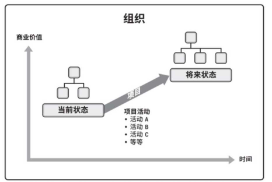

### 项目创造商业价值

项目的成果能够为相关方带来的效益，效益可以是有形的、无形的或两者兼有

**有形效益：**货币资产、股东权益、固定设施、工具、市场份额等

**无形效益：**商誉、品牌认知度、公共利益、战略一致性等

## 1.2.2 项目管理的重要性

### 什么是项目管理

将知识、技能、工具与技术应用于项目活动，以满足项目的要求。

- 项目是组织创造价值和效益的主要方式
- 为了在全球经济中保持竞争力，公司日益广泛利用项目管理，来持续创造商业价值
- 有效和高效的项目管理应被视为组织的战略能力
- 有效的项目管理可以帮助：管理制约因素（例如范围、质量、进度、成本、资源）；平衡制约因素对项目的影响（例如范围扩大可能会增加成本或延长进度）

### 什么是项目集和项目组合

**项目集：**是一组相互关联且被协调管理的“项目、子项目集和项目集活动”，以便获得分别管理所无法获得的利益（1+1>2 的效果）

**项目组合：**是指为了实现战略目标而组合在一起管理“项目、项目集、子项目组合和运营工作”，他们不一定彼此依赖或者相关

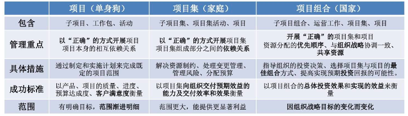

### 什么是项目运营

**运营：**是一种生产重复性结果的持续性工作。项目往往来自运营，又服务于运营。

项目与运营会在产品生命周期的不同时点交叉。在每个交叉点，可交付成果及知识在项目与运营之间转移，以完成工作交接。

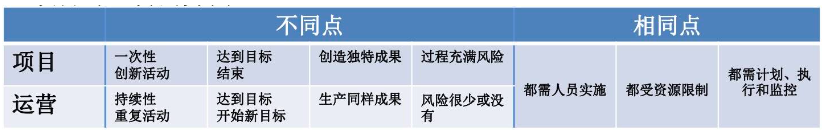

### 什么是组织项目管理 OPM

**OPM：**为实现战略目标而整合项目组合、项目集和项目管理与组织驱动因素的框架。OPM 旨在确保组织开展正确的项目并合适地分配关键资源。

### 项目管理的关键要素

- **项目生命周期**
- **项目阶段**
- **阶段关口**
- **项目管理过程**
- **5 大过程组**
- **10 大知识领域**

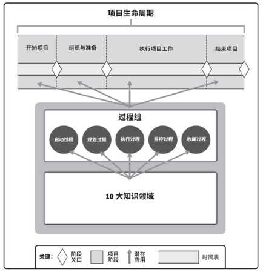

### 项目管理过程

是为了完成预定的产品、成果或服务而执行的一系列相互关联的行动和活动。

每个过程都有各自的输入、工具和技术以及相应输出（ITTO）

- **输入（Input）：**将要遵照执行的文档或可文档化的事项
- **工具和技术：**把输入转变成成输出的机制
- **输出（Output）：**一个过程的结果，可以是文档或可文档化的事项

项目管理过程可分为 5 个项目管理过程组：启动、规划、执行、监控、收尾（五大过程组）。

### 项目管理知识领域

按所需知识内容来定义和项目管理领域。可分为十大知识领域：

项目**整合**管理、项目**范围**管理、项目**进度**管理、项目**成本**管理、项目**质量**管理、项目**资源**管理、项目**沟通**管理、项目**风险**管理、项目**采购**管理、项目**相关方**管理

## 1.2.3 项目生命周期

项目从启动到完成所经历的一系列阶段。这些阶段之间的关系可以是顺序、迭代或交叠进行。项目生命周期可以是：预测型、适应型

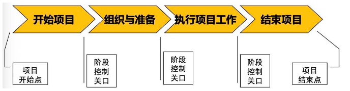

**项目通用生命周期：**开始项目、组织与准备、执行项目工作、结束项目。所有项目都呈现该通用的生命周期。

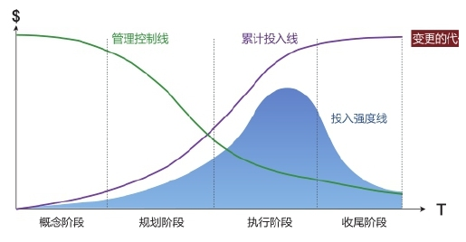

项目生命周期与资金投入

**成本与人力投入：**项目开始时“缓慢增加”，在“执行工作”期间达到最高，项目快结束时“迅速回落”

**风险与不确定性、相关方的影响力、变更的数量：**项目开始时最大，后续“逐步降低”

**变更的代价、风险的影响：**项目开始时最小，后续“显著增高”

### 什么是开发生命周期

项目生命周期内与产品、服务或成果的开发相关的一个或多个阶段。

开发生命周期可以是：预测型、迭代型、增量型、适应型、混合型

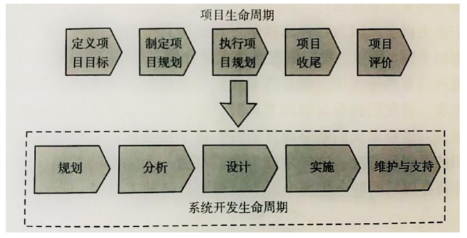

**预测型生命周期（瀑布型、计划驱动）：**范围、进度、成本在早期阶段就确定。

按计划执行、一次交付。适用：充分了解产品，有厚实的行业基础。

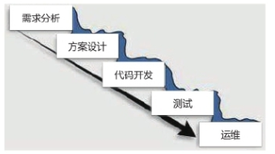

**迭代和增量型**

**迭代型生命周期：**范围在早期确定，但时间及成本估算将随项目团队对产品理解的不断深入而定期修改（重复的循环）。

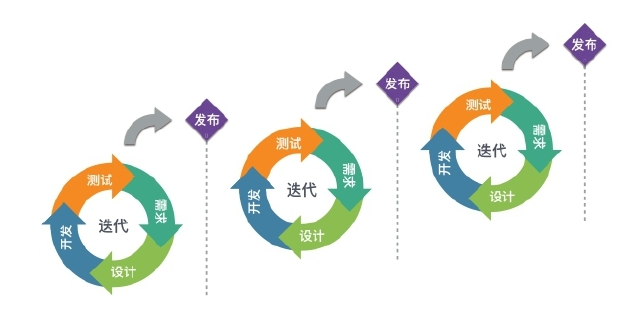

**增量型生命周期：**在预定的时间区间内渐进增加产品功能的一系列迭代来产出可交付成果（渐进地增加）。只有在最后一次迭代之后，可交付成果具有了必要和足够的能力，才能被视为完整的。

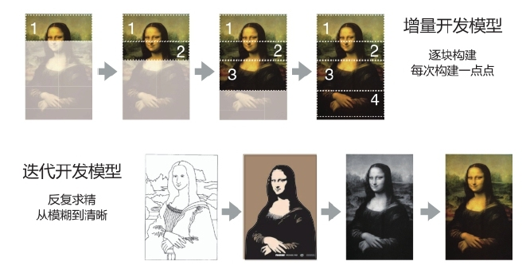

**敏捷型生命周期（适应型、变更驱动）：**详细范围在迭代开始之前就得到了定义和批准。

**较小的增量、快速迭代、每次交付最有价值的东西。**

**频繁交付、相关方持续参与**

**适用：需要应对快速变化的环境，需求和范围难以事先确定**

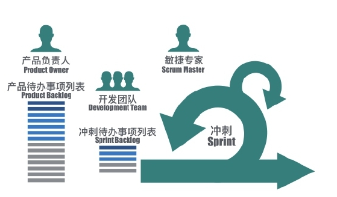

**几种开发生命周期比较：**

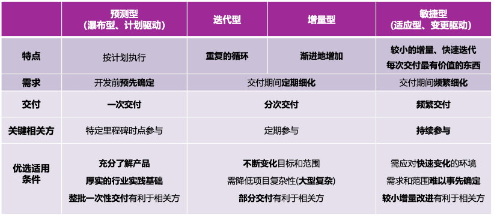

**生命周期与使用场景**

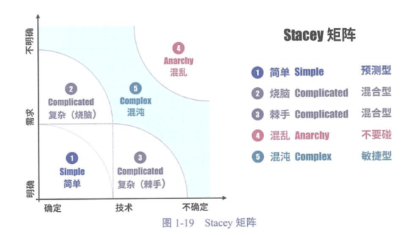

1区：需求明确，技术确定，这类项目为简单项目，选择预测型开发模式。

2区：技术确定，需求不明确，这类项目为复杂项目中的烧脑项目，建议采用混合型开发模式。

3区：需求明确，技术不确定，这类项目为复杂项目中的棘手型项目。例如：无人驾驶技术，需求是明确的，但是技术不成熟。关于这类项目我建议采用混合型开发模式。例如：针对软件部分团队可采用敏捷开发；针对硬件部分，团队可采用迭代开发。

4区：需求和技术都不明确，属于混乱状态项目，不建议碰。

5区：需求还在挖掘，技术也在探索中，这属于混沌状态的项目，最好采用敏捷开发。

### 什么是产品生命周期

一个产品从概念、交付、成长、成熟到衰退的整个演变过程的一系列阶段。

典型的产品生命周期一般可分为四个阶段：投入期、成长期、成熟期和衰退期。

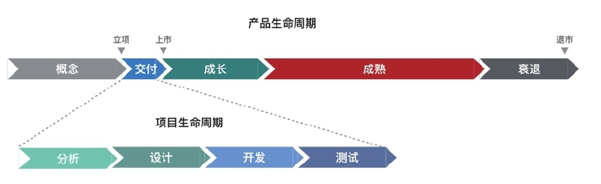

### 项目阶段

一组具有逻辑关系的项目活动的集合，通常以一个或多个可交付成果的完成为结束。

项目阶段的其中一个关键组成部分是阶段审查。

阶段的属性是可测量且独立的，属性包括：阶段名称、阶段数量、持续时间、资源需求、阶段的准入标准、阶段的退出标准.

**如何划分项目阶段**

- 根据项目的自然特征
- 根据管理的便利
- 根据决策点（例如资金决策、继续/终止项目、里程碑审查）
- 矩阵型组织根据部门
- 根据组织、行业的最佳实践

### 阶段关口

**审查：**把项目绩效与项目进展与下列文件进行比较

- 项目商业论证
- 项目章程
- 项目管理计划
- 效益管理计划
- ...

**决策：**根据审查结果，制定如下决策

- 进入下个阶段
- 整改后进入下个阶段
- 结束项目
- 停留在当前阶段
- 重复阶段或某个要素

**阶段关口：**也可被称为阶段审查、阶段门、关键决策点、阶段入口、阶段出口。

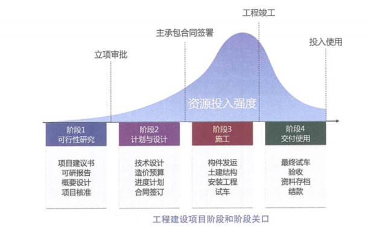

## 1.2.4 项目管理商业文件

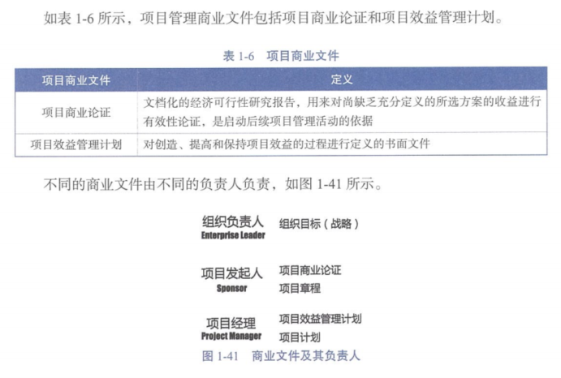

项目商业文件产生的顺序：

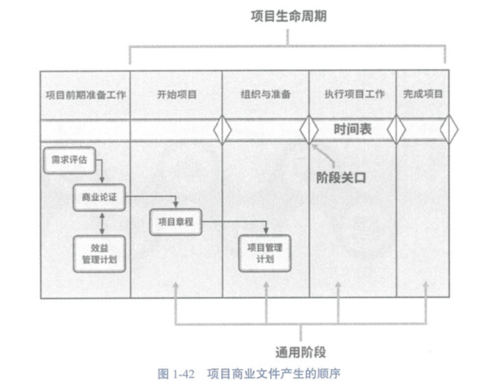

### 项目商业论证

指文档化的经济可行性研究报告，用例对尚缺乏充分定义的所选方案的收益进行有效性论证，是启动后续项目管理活动的依据。

商业论证列出了项目启动的目标和理由。它有助于在项目结束时根据项目目标衡量项目是否成功。

- **商业分析师：**进行商业论证分析
- **项目发起人：**负责项目商业论证文件的制定和维护
- **项目经理：**负责提供建议和见解，确保各文件中的成功标准相一致，与组织的目的和目标保持一致。

商业论证可包括记录以下内容：

1. 业务需要；2. 形式分析；3. 推荐；4. 评估；

### 项目效益管理计划

**项目效益管理计划：**描述了项目实现效益的方式和时间，以及应制定的效益衡量机制。

**项目效益：**为发起组织和项目预期受益方创造价值的行动、行为、产品、服务或成果的结果。

**项目效益计划可能包括记录以下内容：**

1. 目标效益；2. 战略一致性；3. 实现效益的时间；4. 效益负责人；5. 测量指标；6. 假设； 7. 风险。

