[TOC]

# 第七章 项目成本管理

# 项目成本管理的核心概念

项目成本管理**重点关注完成项目活动所需资源的成本**，但同时也应考虑项目决策时对项目产品、服务或成果的使用成本、维护成本和支持成本的影响。

不同的相关方会在不同的时间、用不同的方法测算项目成本。

项目成本管理的目标是“能够按预算完成项目”。有效的成本管理可以充分利用资源，提升项目绩效，促进项目成功。

# 项目成本分类

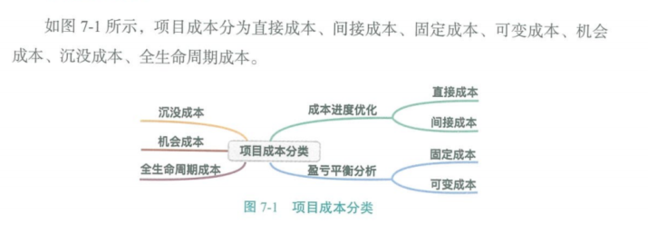

# 项目成本管理的趋势和新兴实践

对挣值管理（EVM）进行扩展，引入挣得进度（ES）的概念

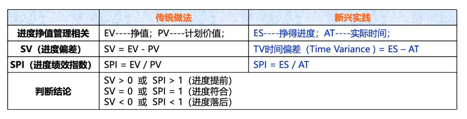

# 在敏捷和适应型环境中需要考虑的因素

对易变性高、范围并未完全明确、经常发生变更的项目，可以采用轻量级估算方法快速生成对项目人力成本的高层级预测，在出现变更时容易调整预测。

详细的估算适用于采用准时制的短期计划。

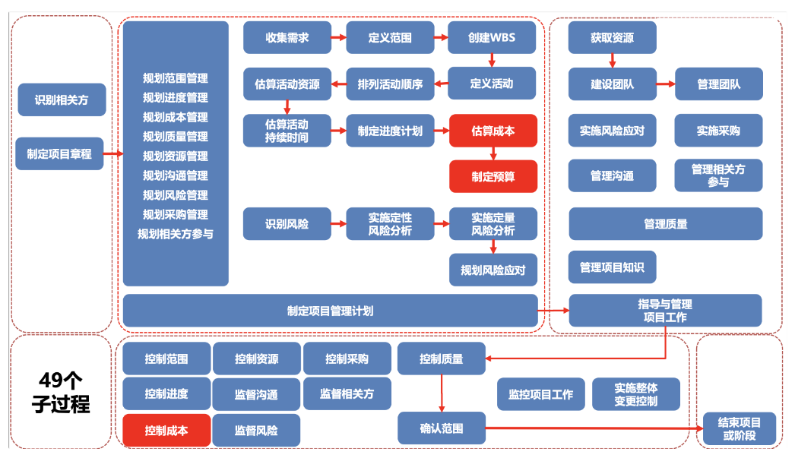

# 项目成本管理过程之一：规划成本管理（规划过程组）

**规划成本管理：**确定如何估算、预算、管理、监督和控制项目成本的过程。

**本过程的作用：**在整个项目期间为如何管理项目成本提供指南和方向。

## 输出：成本管理计划

**成本管理计划：**描述如何规划、安排和控制项目成本（成本管理计划中无成本）

**包含的内容：**

- **计量单位：**每种资源的计量单位。比如：时间计量用“人天”，数量计量用吨、千米等等。
- **准确度：**为活动成本估算规定一个可接受的区间（如 ±10%），其中可能包括一定数量的应急储备。
- **精确度：**根据活动范围和项目规模，设定成本估算向上或向下取整的程度。
- **组织程序链接：**在项目成本核算中使用的 WBS 组件，称为控制账户（CA）。每个 CA 都有唯一的编码或账号，直接与执行组织的会计制度相联系。
- **控制临界值：**项目执行中，采取某种措施前，允许出现的最大成本偏差。通常用偏离基准计划中的参数的某个百分数来表示。
- **绩效测量规则：**需要规定用于绩效测量的挣值管理（EVM）规则或其他测量规则。

# 项目成本管理过程之二：估算成本（规划过程组）

**估算成本：**对完成项目工作所需资源成本进行近似估算的过程。

**本过程的作用：**确定项目所需的资金。

成本估算是在某特定时点，根据已知信息做出的成本预测。

- 在估算成本时，需要识别和分析可用于启用与完成项目的备选成本方案
- 需要权衡备选成本方案并考虑风险，如比较自制成本与外购成本、购买成本与租赁成本及多种资源共享方案，以优化项目成本。

**成本估算的单位：**

- - 某种货币单位（美元、人民币等）。（通常使用）
  - 其他计量单位（人天等）。（为了消除通货膨胀的影响）

在项目生命周期中，项目估算的准确性将随着项目的进展而逐步提高。

**估算的准确性：**

- 粗略量级估算（ROM）：-25% ~ +75%。如：在启动阶段进行估算。

- 确定性估算：-5% ~ +10%。

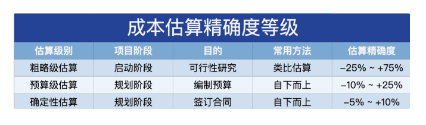

进行成本估算，应考虑向项目收费的全部资源（如特殊的：通货膨胀补贴、融资成本或应急成本等）

## 输入：项目文件：项目进度计划

**活动持续时间估算就会对成本估算产生影响：**

若项目预算中包括融资成本（如**利息**）

- 若资源消耗取决于活动持续时间的长短（如**管理费**）
- 若成本估算中包含时间敏捷型成本（如价格随季节波动的材料）

## 工具与技术：类比估算

**参照过去，估算当前。也是一种专家判断、也是整体估算、也是自上而下的。**

关键词：成本低、耗时少、准确性低、详细信息不足时、需要快速得到结果时、启动阶段时

工具与技术：参数估算

利用历史数据之间的统计关系和其他变量来估算。回归分析是典型的参数估算。

关键词：统计关系、参数模型、基础数据

## 工具与技术：自下而上估算

估算个体，逐层汇总。

自下而上估算的准确性及其本身所需的成本，通常取决于单个活动或工作包的规模和复杂程度。

## 工具与技术：三点估算 PERT

关键词：考虑不确定性与分析、提高估算准确性。

## 工具与技术：数据分析 - 储备分析

**应急储备**针对“已知 - 未知”风险，应急储备包含在基准中，项目经理有权使用。

随着项目信息越来越明确，可以动用、减少或取消应急储备。

应急储备是成本基准的一部分，也是项目整体资金需求的一部分。

## 工具与技术：数据分析 - 质量成本（略）

建立**应急储备，应对“已知 - 未知”风险**。为应对某些风险预留的时间。应急储备在最终的基准中项目经理可以直接使用，不需要走变更流程。

预留**管理储备，应对“未知 - 未知”风险**。管理储备不在基准中，项目经理需要走变更流程申请。

## 输出：成本估算

**成本估算：**包括对完成项目工作可能需要的成本、应对已识别风险的应急储备。

## 输出：估算依据

支持性文件应清晰、完整地说明成本估算是如何得出的。

# 项目成本管理过程之三：制定预算（规划过程组）

**制定预算：**汇总所有单个活动或工作包的估算成本，建立一个经批准的成本基准的过程。

**本过程的作用：**确定成本基准，可据此监督和控制项目绩效。

- 项目预算包括经批准用于项目的全部资金。
- 成本基准是经过批准且按时间段分配的项目预算，包括应急储备，但不包括管理储备。

## 输入：商业文件

**商业论证：**识别了项目成功的关键因素，包括财务成功因素。

**效益管理计划：**包括目标效益，例如净现值计算、实现效益的时限，以及与效益有关的测量指标。

## 输入：协议

需要考虑将要或已经采购的产品、服务或成果的成本，以及使用的协议信息。

## 工具与技术：成本汇总

**成本汇总：**汇总路线：活动的成本估算 → 工作包 → 控制账户 → 整个项目。

## 工具与技术：数据分析

**管理储备**针对“未知 - 未知”风险，管理储备不包含在基准中，项目经理使用前需要提出变更请求。

- 管理储备不包括在成本基准中，但属于项目总预算和资金需求的一部分。
- 如果动用管理储备，动用的管理储备应该被纳入基准中，从而导致成本基准变更。

## 工具与技术：历史信息审核

审核历史信息有助于进行参数估算或类比估算

## 工具与技术：资金限制平衡

**资金限制平衡：**在既定的资金限制下，确保项目各阶段、各部位和整个项目有足够的资金，可能会导致进度计划的改变。

可以通过在项目进度计划中添加强制日期来实现。

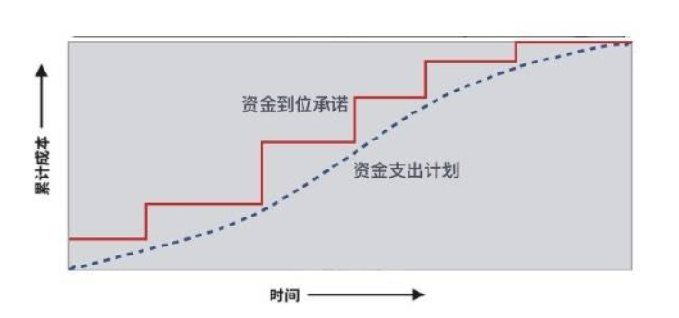

## 输出：成本基准

成本基准：成本基准是经过批准、按时间段分配的项目预算。包括应急储备，但不包括管理储备。

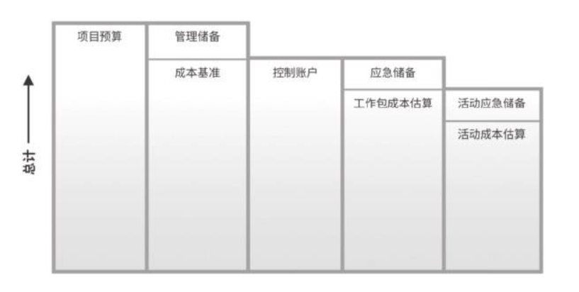

**自下而上指定项目预算的过程：**

1. 用“成本汇总”，把活动或工作包的成本逐层向上汇总到控制账户和整个项目。
2. 用“数据分析”、“历史信息审核”和“专家判断”，对汇总的结果进行验证和调整。
3. 采用“资金限制平衡”，根据资金限制平衡资金支出，确保项目有资金保证。形成“成本基准”。
4. 成基准 + 管理储备 = 项目预算。

## 输出：项目资金需求

**项目资金需求：**成本基准 + 管理储备。项目资金通常以阶梯状的形态，增加而非连续的方式投入。

成本基准中包括预计的支出，也包括预计的债务。

由于成本基准中的成本估算与进度活动直接关联，因此就可以按时间段分配成本基准，得到一条 S 曲线。

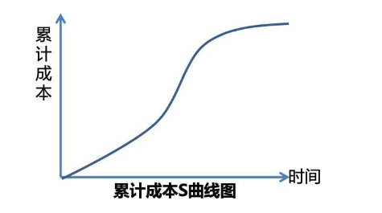

进度角度追求所有活动最早开始；成本角度追求所有活动最晚开始，形成如下香蕉图。

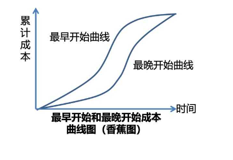

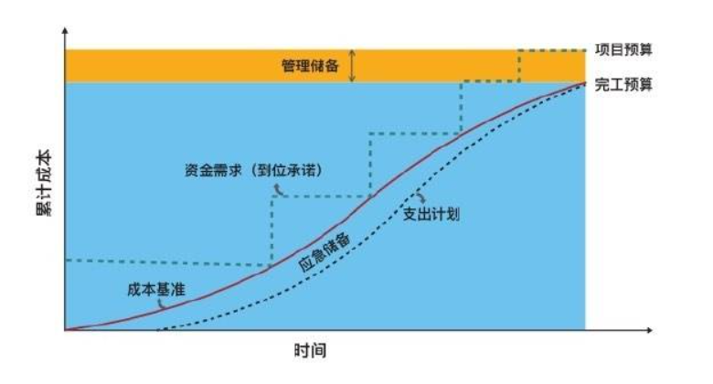

# 项目成本管理过程之四：控制成本（监控过程组）

**控制成本：**监督项目状态，以更新项目成本，管理成本基准变更的过程。

**本过程的作用：**在整个项目期间保持对成本基准的维护。

- 在成本控制中，应重点分析项目资金支出与相应完成的实际工作之间的关系。
- 有效成本控制的关键在于管理经批准的成本绩效。

## 输入：项目管理计划

需要使用其中的成本基准、成本管理计划、绩效测量基准等。

## 输入：项目资金需求

包含预计支持的预计债务

## 输入：工作绩效数据

包含关于项目状态的数据，例如哪些成本已批准、发生、支付和开具发票。

**挣值四个基本数据英文全称**

**BAC** = Budget at Completion：完工预算（不考虑管理储备）。成本基准（一般不会变，如要修改需要走变更流程）

**PV** = Planned Value：计划价值。到目前为止，计划做多少

**EV** = Earned Value：挣值。到目前为止，目前已经做了多少

**AC** = Actual Cost：实际成本。到目前为止，实际化了多少

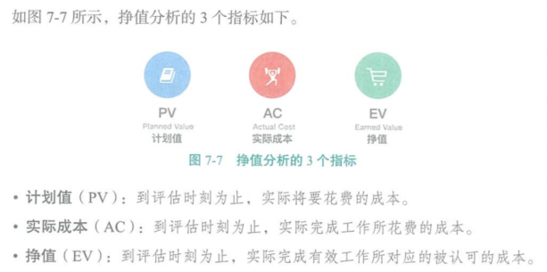

## 工具与技术：挣值分析（EVA）- BAC、AC、PV、EV

**BAC**（完工预算）：全部计划工作的预算价值，就是成本基准。

- - BAC = 完工时的 PV 的总和
  - BAC = EV 就表明项目已完工

**PV**（计划价值）：截止到某个时间点，计划完成工作的预算价值。

- - PV（别称 BCWS）= 计划工作量 ✖️ 预算单价

**EV**（挣值）：截止到某个时间点，实际完成工作的预算价值。

- - EV（别称 BCWP）= 实际工作量 ✖️ 预算单价

**AC**（实际成本）：截止到某个时间点，实际化了多少钱。

- - AC（别称 ACWP）= 实际工作量 ✖️ 实际单价

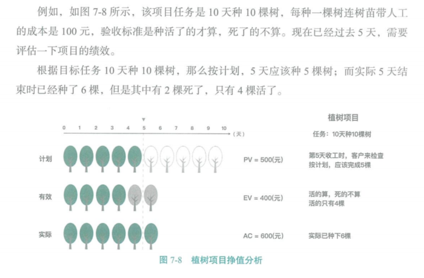

## 工具与技术：偏差分析 - SV、CV、SPI、CPI

**SV**（进度偏差）= EV - PV

- SV **> 0**：当前进度提前
- SV **= 0**：当前进度符合预期
- SV **< 0**：当前进度落后

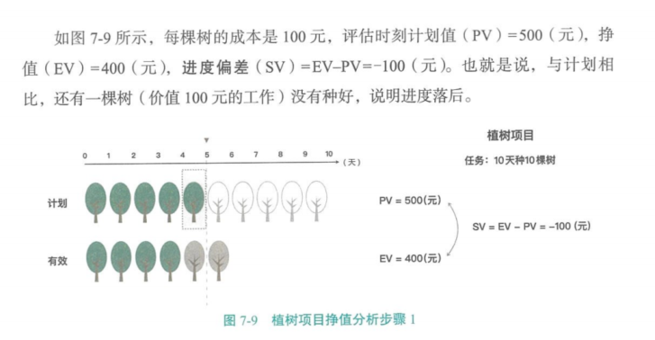

**CV**（成本偏差） = EV - AC

- CV **> 0**：当前成本节约
- CV **= 0**：当前成本符合预算
- CV **< 0**：当前成本超支

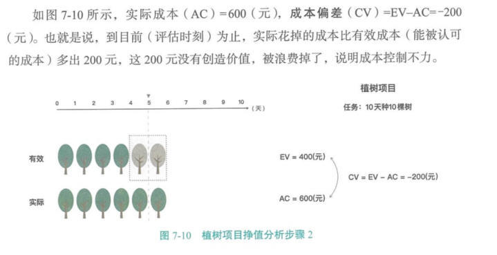

**SPI**（进度绩效指数） = EV / PV

- SPI **> 1**：进度提前
- SPI **= 1**：进度符合预期
- SPI **< 1**：进度落后

**CPI**（成本绩效指数）= EV / AC

- CPI **> 1**：成本节约
- CPI **= 1**：成本符合预期
- CPI **< 1**：成本超支

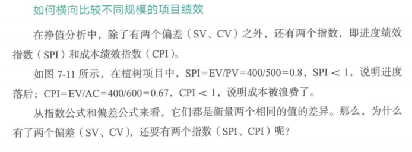

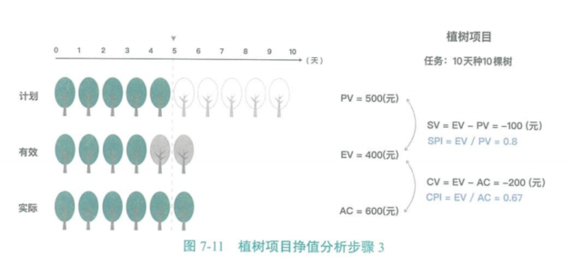

> **评估两个项目规模不同的项目绩效时，不能使用偏差。需要使用指数对比，不管项目规模大小。**

**挣值曲线及预测作用**

到了某时间点，计划值（PV）、实际成本（AC）、挣值（EA）可能都不同。

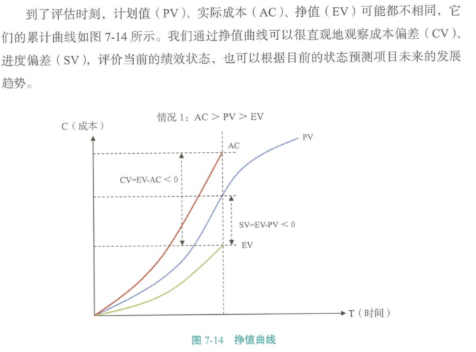

**挣值曲线预测**

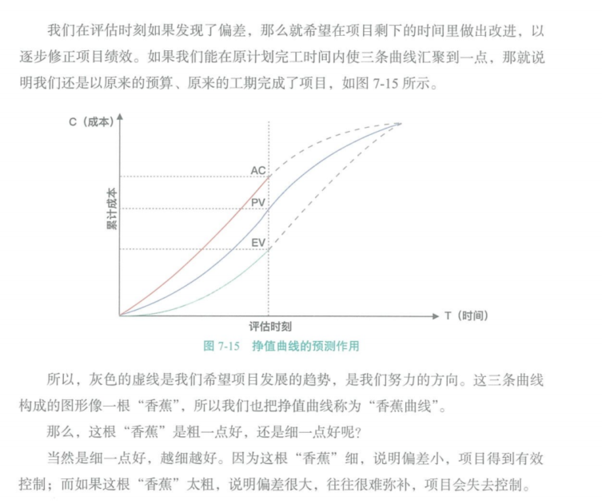

灰色的虚线是我们希望项目发展的趋势，是我们的方向。

这三条曲线结构的图形像一根“香蕉”，所以我们也把挣值曲线称为“香蕉曲线”。

- 

- - “香蕉”越细，说明偏差越小，项目得到有效控制。
  - “香蕉”越粗，说明偏差越大，往往很难弥补，项目会失去控制。

**偏差的含义**

进度偏差（SV）以货币为单位，可以直接由公式 SV = EV - PV 计算获得，不需要再转换成时间。挣值分析的本质是要同时对照进度偏差和成本偏差来衡量绩效，而且只有单位一致，才可以比较。

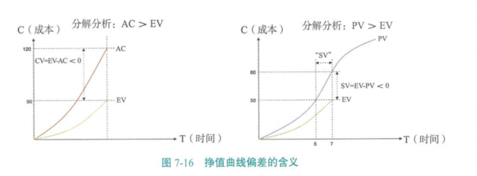

**挣值曲线的 6 中情况**

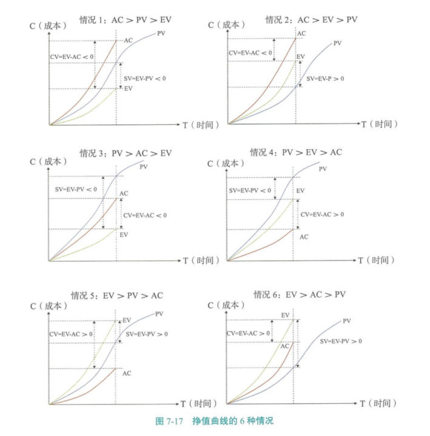

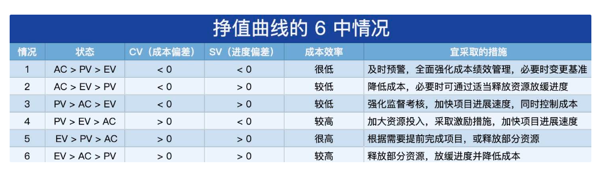

## 工具与技术：预测 - EAC 的四种计算公式

**EAC（完工估算）：**完工预期的总成本

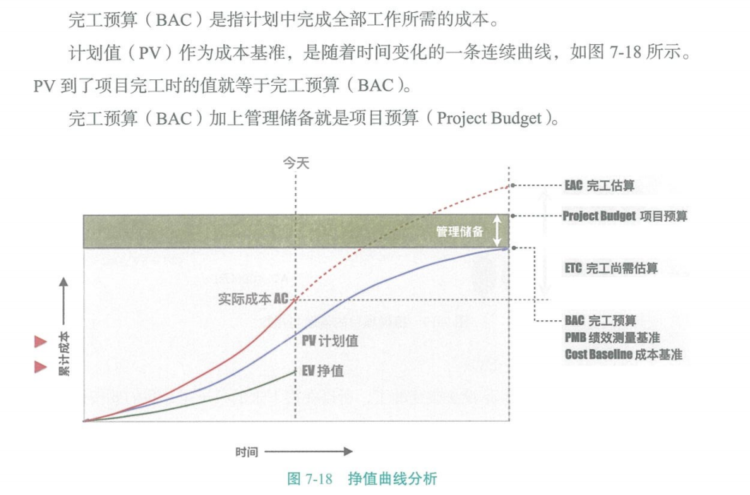

- 非典型（剩余工作按照计划的绩效继续）：**EAC** = AC + ( BAC - EV ) / 1 **= AC + BAC - EV**

- 典型（剩余工作按照当前的绩效继续）：**EAC** = AC + ( BAC - EV ) / CPI **= BAC / CPI**

- 特殊绩效：剩余工作同时受 CPI 和 SPI 的影响：**EAC =** AC + ( BAC -EV ) **/ ( CPI ✖️ SPI )**

- - EAC = AC + 自下而上重新估算的 ETC

**公式记忆法：**

- - BAC - EV = 剩余工作的预算价值
  - EAC = AC + ( BAC - EV ) / 绩效

## 工具与技术：完工尚需绩效指数 - TCPI

**完工尚需绩效指标（To Complete Performance Index，TCPI）**是为了实现具体的管理目标（如 BAC 或 EAC），剩余工作的实施必须达到的成本绩效指标。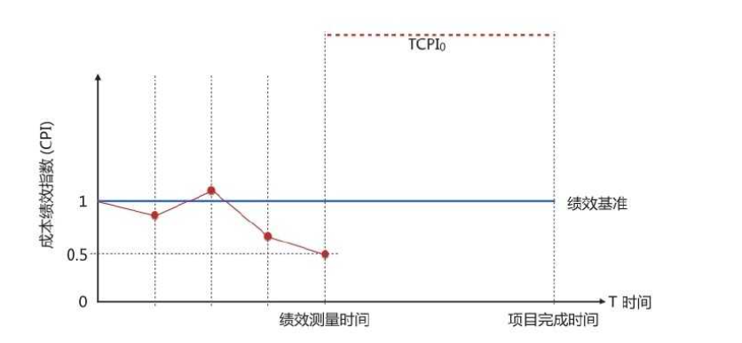

TCPI（完工尚需绩效指数） = 剩余工作的预算价值 / 剩余预算

- - TCPI = ( BAC -EV ) / ( BAC - AC ) 若 BAC 可行情况下
  - TCPI = ( BAC -EV ) / ( **EAC** -AC ) 若 BAC 不可行情况下，用 EAC 代替

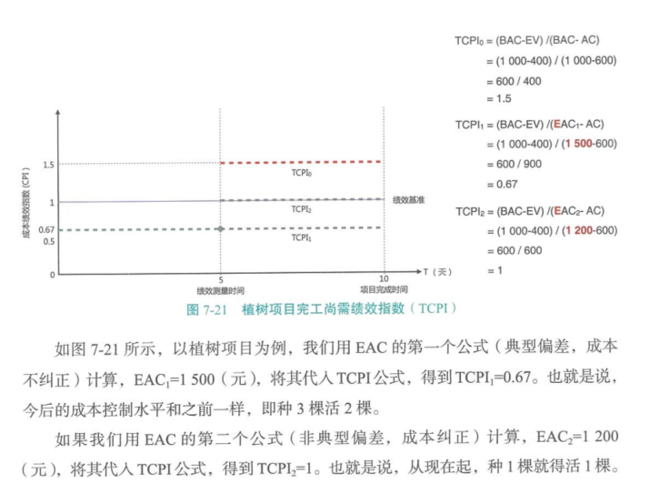

植树项目完工尚需绩效指标

**公式记忆法：**

CPI = EV / AC，TCPI 前面多一个 T，后面分子分母分别多一个 BAC，**T**CPI = ( **BAC -** EV ) / ( **BAC -** AC )

- TCPI **> 1**：很难完成，通常项目不可行。
- TCPI **= 1**：正好完成
- TCPI **< 1**：很容易完成

TCPI 意思是剩余工作没用一块钱需要干多少事，这个值越小越好。

## 工具与技术：完工偏差（VAC）

**完工偏差**是完工预算（BAC）与完工估算（EAC）之间的差值：VAC = BAC - EAC

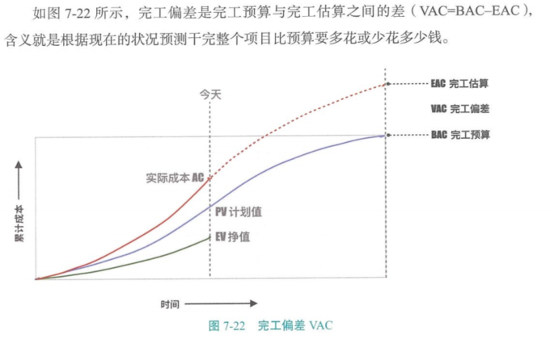

**挣值管理总结**

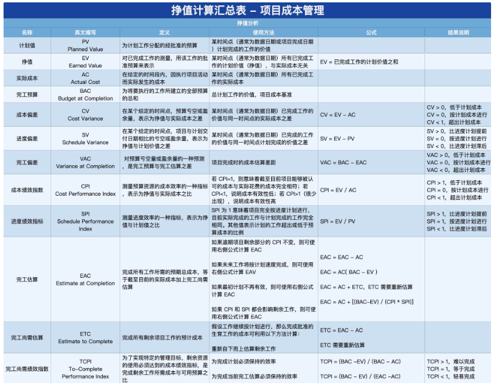

## 工具与技术：储备分析

在控制成本过程中，可以采用储备分析来监督项目中应急储备和管理储备的使用情况。从而判断是否还需要这些储备，或者是否需要增加额外的储备。

如果已识别的风险没有发生，就可能要从项目预算中扣除未使用的应急储备，为其他项目或运营腾出资源。

**成本的类型**

- **直接成本（Direct Cost）：**直接可以归属于项目工作的成本。例如，项目团队专职人员的差旅费、工资。
- **间接成本（Indirect Cost）：**来自一般管理费用科目、或多个项目分摊。例如，管理费用、水电费、房租。
- **固定成本（Fixed Cost）：**不岁产量、工作量或时间的变化而变化的非重复成本。例如，打印机、扫描仪等固定资产采购费用。
- **可变成本（Variable Cost）：**随着产量、工作量或时间而变的成本，又称为变动成本。例如，原材料、人工费、墨盒、A4打印纸等耗材费用。
- **全生命周期成本（Life Cycle Cost，LCC）：**在产品经济有效使用期间所发生的与该产品有关的所有成本。例如，设计、生产、运维、处置。
- **沉没成本（Sunk Cost）：**任何已发生的成本，与是否合理无关。在决定是否继续某个出了问题的项目时，不应该考虑沉没成本。
- **机会成本（Opportunity Cost）：**因为选择一个项目而放弃另一个项目，另一个项目可能带来的利益。

**财务概念**

- **净现值（NPV）：**投资方案所产生的的现金净流量以资金成本为贴现率折现之后与原始投资额现值的差额（时间段内报酬现值的总和减去原始投资额）。正值中越大越好；NPV > 0：接受项目；NPV < 0：拒绝项目
- **内部收益率（IRR）：**净现值等于零时的折现率，代表了项目抗风险（通货膨胀等）能力的大小。越大越好
- **投资回报率（ROI）：**年平均利润/投资总额 * 100%，不考虑货币时间价值，年平均利润是全部的理论。越大越好
- **效益成本比（BCR）：**项目投资与效益之间的关系比率，收益/投资。大于 1 中越大越好；BCR > 1：接受项目；BCR < 1：拒绝项目
- **投资回收期（PP）：**从项目的投建之日起，用项目所得的净收益偿还原始投资所需要的年限。不考虑货币时间价值。越短越好

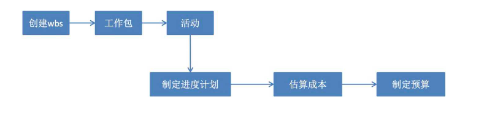

