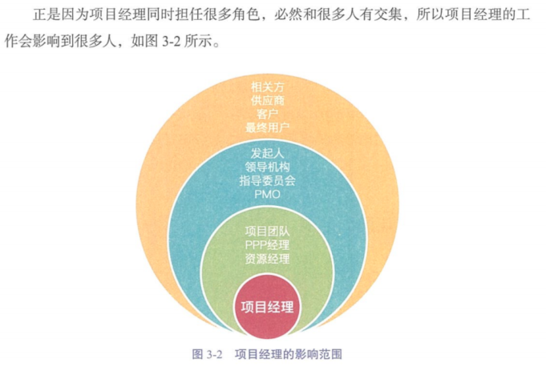
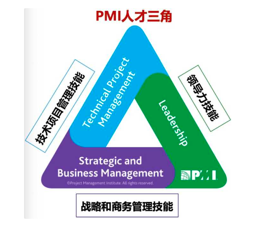
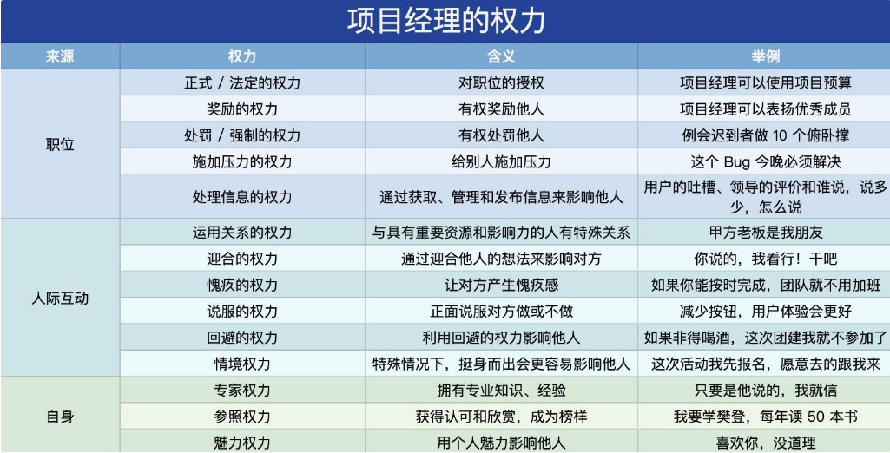
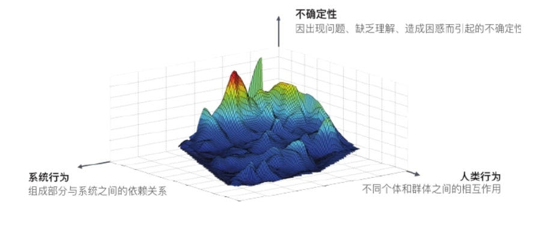

[TOC]

# 第三章 项目经理的角色

# 3.1 什么是项目经理

**项目经理：**由执行组织委派，领导团队实现项目目标的个人。

- 项目经理：专注项目目标的达成
- 职能经理：专注某个职能领域或业务单元的管理和监督
- 运营经理：专注业务的高效性

项目经理无需承担项目中的每个角色，但应具备项目管理知识、技术知识、理解能力和相关经验。

项目经理通过沟通向项目团队提供领导、规划和协调的职能。项目经理的沟通分实时沟通（会议、口头沟通等）和非实时沟通（书面沟通、文档计划等）。

# 3.2 项目经理的影响力范围

**项目：**

- 领导项目团队实现项目目标和相关方的期望
- 利用可用资源，以平衡相互竞争的制约因素
- 充当项目发起人、团队成员与其他相关方之间的沟通者，包括提供指导和展示项目成功的愿景

**组织：**

- 积极地与其他项目经理互动
- 扮演强有力的倡导者角色，与项目发起人合作处理内部的政治和战略问题
- 提高自己在组织内的总体项目管理能力和技能

**行业：**

- 时刻关注行业的最新发展趋势
- 思考这一信息对当前项目是否有影响或可用

**专业学科：**

- 持续的知识传递和整合

**跨领域：**

- 指导和教育其他专业人员项目管理方法
- 担任非正式的宣传大使

# 3.3 项目经理的能力

**PMI 人才三角**

**技术项目管理技能：**有效运用项目管理知识实现项目集或项目的预期成果的能力。

**战略和商务管理技能：**纵览组织概况并有效协商和执行有利于战略调整和创新的决策和行动的能力。

**领导力技能：**指导、激励和带领团队的能力（协商、抗压、沟通、解决问题、批判性思考、人际关系技能）

**领导者的品质和技能：**

有远见、积极乐观、管理关系和冲突、正确沟通、终身学习结果导向、关注重要事情、能运用批判性思维。

**卓越领导者的五种行为习惯：**

- **率先垂范：**明确自己的价值观，使英东与价值观保持一致，为他人树立榜样。
- **共启愿景：**展望未来，想象令人激动的各种可能。描绘共同愿景，感召他人为共同愿景而奋斗。
- **挑战陈规：**通过掌握主动权和从外部获取创新的方法来寻求改进的机会。进行尝试和冒险，不断取得小小的成功，从实践中不断学习。
- **授权于人：**通过建立信任和增进关系来促进合作，通过增强团队成员的自主意识和发展潜力来增强他们的实力。
- **鼓舞人心：**通过表彰来认可他人的贡献，通过创造一种集体主义精深来庆祝价值的实现。

## 了解项目经理的几种权力（Power）

## 了解项目经理的几种领导力风格

- **放任型：**或称“无为而治”，允许团队自主决策和设定目标，有利于创新
- **交易型：**关注目标、反馈和成就以确定奖励，例外管理
- **服务型：**服务优先于领导，出处为他人着想；关注他人的成长、学习、发展、人际关系、团体与合作
- **变革型：**通过理想化特质和行为、鼓舞性激励、促进创新和创造，以及个人关怀提高追随者能力
- **魅力型：**精神饱满、热情洋溢、充满自信、说服力强、能够激励他人
- **交互型：**结合了交易型、变革型和魅力型的特点

# 3.4 执行整合

整合是项目经理的核心工作，项目尽力必须具备整合这一核心技能。

**专注内容：**

- **一个宗旨：**以成功交付项目并为客户/用户创造价值为宗旨

- **两个角色：**

- - 团队外，整合发起人、公司高级管理层、相关方的需求，使项目成果与战略目标相一致。
  - 团队内，整合不同专业、不同背景的团队成员，使其协调一致，交付价值。

- **三个层面：**

- - 过程层面整合：梳理、裁剪配置项目管理的 49 个过程
  - 认知层面整合：梳理、裁剪、配置十大知识领域，应用已有的知识，积累新的知识。
  - 背景层面整合：梳理、裁剪、配置跨组织、跨行业、跨文化环境因素

- **四个对象：**

- - 整合资源：包括人、资金、设备、材料等
  - 整合需求：从需求的“众口难调”到“达成共识”
  - 整合信息：从信息的“纷繁复杂”到“清晰有序”
  - 整合方法：包括工具、技术、方案等

- **五个满意：**用户满意、投资人面议、合作伙伴满意、团队成员满意、领导满意

## 整合与复杂性

复杂性的三个维度是系统行为、不确定性、人类行为。

