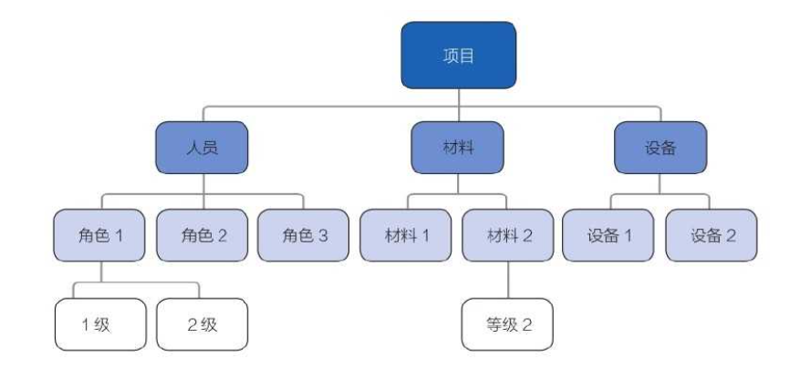
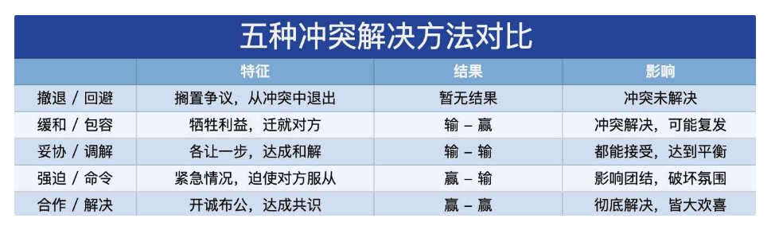

[TOC]

# 第九章 项目资源管理

# 常用的激励理论

**马斯洛：需求层次理论**

人有五个层次的需求，从低到最高等级依次是：生理需求、安全需求、社交需求、尊重需求、自我实现需求。通常，人们只有在较低层次的需求得到满足后，才会追求较高层次的需求。

**赫兹伯格：双因素理论**
有两类因素（保健因素和激励因素）会决定人的行为。

**保健因素：**是导致不满足感的因素，这些因素做得好，不会提高激励，做的不好，就会损害激励。比如：工作环境或条件、工资、同事或上下级之间的关系、个人生活、安全、地位、职务等。相当于马斯洛需求层次理论的较低层次的需求（生理需求、安全需求、社交需求）

**激励因素：**是导致满足感的因素，能够战争起激励作用的。比如，成就感、责任感、得到任何和赞赏、挑战性和兴趣、发展前途、个人成长等。相当于马斯洛需求层次理论的较高层次的需求（尊重需求、自我实现需求）

**麦格雷戈：X 理论和 Y 理论**

**麦格雷戈的 X 理论：**认为人是消极懒惰的，缺乏进取心，总是逃避责任（传统管理偏向此“人性本惰”论）

**麦格雷戈的 Y 理论：**认为人是积极的，愿意进步，愿意承担责任（现代管理偏向此“人性本善”论）

X 理论认为只能用低层次的需求进行激励；Y 理论认为人更应该收到高层次需求的激励。

**大内：Z 理论**

**大内的 Z 理论：**主要观点是：终身雇佣制、缓慢的评价和晋升、分散与集中决策、含蓄的控制但检测手段明确正规、融洽管理人员与员工的关系，让员工得到多方面的锻炼。

**弗鲁姆：期望理论**

**弗鲁姆的期望理论：**一种行为倾向的强度取决于个人对这种行为可能带来的结果的期望度，以及这种结果对个人的吸引力。

M = V ✖️ E：M - 激励；V - 行动结果的价值评价；E - 行动结果的期望值；

比如：一个人认为努力工作会带来成功的结果，而这种成功又会带来相应的回报，他就会受到激励努力工作。

**麦克利兰：成就动机理论**

**麦克利兰的成就动机理论：**个人在不同程度上有这三种需要：成就需要、权力需要、亲和需要。管理者应该根据个人更重视的需要来制定激励措施，例如：为成就需要者设立具有挑战性但可实现的目标；为权力需要者提供较能提现地位的工作环境；为亲和需要者提供合作而非竞争的工作环境。

**边际福利、额外待遇、光环效应**

**边际福利：**所有员工都可享受的福利，与员工的业绩好坏没有直接关系。用来保障员工的经济安全性，使他们无后顾之忧。属于保健因素。如，五险一金、基础培训等。

**额外待遇：**给某些员工的特殊奖励，主要用来激励优秀员工。属于激励因素。如：固定的停车位、靠窗的办公室、与总经理一起吃午饭等。

**光环效应**：因一个人在某个方面表现好，人们就理所当然地认为他在其他方面也会表现好。要防止光环效应。如：指定一个优秀的技术专家当项目经理。

**了解项目经理的管理风格**

- 独裁型（专制型）：领导管理严格；独自决断
- 民主型（参与型）：团队成员参与决策；项目上用的最多
- 放任型（自由型）：对员工放任自由；进行松散式管理

**了解项目经理的几种权力**

# 项目资源管理的核心概念

## **两大类资源**

**团队资源：**即人力资源。项目团队成员可能具备不同的技能，可能是全职或兼职的，可能随项目进展而增加或减少。

**实物资源：**包括设备、材料、设施和基础设施。

## 项目经理的定位

**管理者：**负责启动、规划、执行、监控和关闭等个阶段的项目管理。负责建设高效的团队。

**领导者：**负责积极培养团队的技能和能力。负责提高并保持团队的满意度和积极性。

**职业道德：**

- - 自己：留意并支持职业与道德行为。
  - 团队：确保所有成员都遵守这些行为。

# 项目资源管理的趋势和新兴实践

## **项目管理风格的变化**

## 几种实践

**资源管理方法**

- 出现了：精益管理、准时制（JIT）生产、Kaizen（持续改善）、全员生产维护（TPM）、约束理论。

**情商（EI）**

- 项目经理应提升：内在（如自我管理和自我意识）；外在（如管理）

**自组织团队**

- 由通用的专才而不是主题专家组成，无需集中管控运作。PM 为团队创造环境、提供支持并信任团队。

**虚拟团队/分布式团队**

- 优势：项目团队可分布在不同地理位置区域；可将在家办公的、行动不便者或残疾人纳入团队。
- 挑战：沟通

## 在敏捷和适应型环境中需要考虑的因素

最大限度地集中和协作的团队结构（如拥有通才的自组织团队）有利于易变性高的项目。

协作型团队的优势：

1. 1. 促进不同工作活动的加速整合
   2. 改善沟通
   3. 增加知识分享
   4. 提供工作分配的灵活性

由于易变性高的项目在实物和人力资源规划的可预测性方面要低得多，因此快速供应和精益方法，对控制成本和实现进度而言至关重要。

# 项目资源管理过程之一：规划资源管理（规划过程组）

**规划资源管理：**定义如何估算、获取、管理和利用团队以及实物资源的过程。

**本过程的作用：**根据项目类型和复杂度确定适用于项目资源的管理方法和管理程度。

- 有效的资源规划需要考虑稀缺资源的可用性和竞争，并编制相应的计划。
- 资源可以从组织内部资产获得，或者通过采购过程从组织外部获取。

## 输入：项目文件

- **项目进度计划：**提供了所需资源的时间轴。
- **需求文件：**指出了项目所需的资源的类型和数量，并可能影响资源管理的方式。
- **风险登记册：**包含可能影响资源规划的各种威胁和机会的信息。
- **相关方登记册：**有助于识别对项目所需资源有特别兴趣或影响的那些相关方，以及会影响资源使用偏好的相关方。

## 工具与技术：数据表现

本过程的数据表现格式分为：层级型、矩阵型、文本型。

无论使用哪中格式，目的都是要确保每个工作包都有明确的责任人，确保全体团队成员都清楚地理解其角色和职责。

层级型可用于表示高层级角色，文并型更适合用于记录详细职责。

## 工具与技术：数据表现 - 层级型

**层级型：**可以采用传统的组织结构图，自下而上地显示各种职位及其相互关系。

**工作分解结构 WBS：**可交付成果为导向的工作层级分解，有助于明确高层级的职责。

**组织分解结构 OBS：**组织的部门、单元或团队为导向的层级分解，有助于查看对应的全部项目职责。

**资源分解结构 RBS：**资源的类型和类型为导向的层级分解，用于规划、管理和监控项目工作。

## 工具与技术：数据表现 - 责任分配矩阵

**责任分配矩阵：**展示项目资源在各个工作包中的任务分配。一个例子是职责分配矩阵（RAM）。

在大型项目中，可以制定多个层次的 RAM：高层次 RAM 可定义项目团队、小组或部门负责 WBS 中的哪部分工作，低层次 RAM 则可在各小组内为具体活动分配角色、职责和职权。

**矩阵图：**

1. 1. 反应与每个人相关的所有活动
   2. 反应与每项活动相关的所有人员
   3. 确保任何一项任务只有一个负责人，从而避免职责不清。

如果团队是由内部或外部人员组成，RACI 矩阵对明确划分角色和职责特别有用

- R = **R**esponsible（执行）
- A = **A**ccountable（负责）
- C = **C**onsult（咨询）
- I = **I**nform（知情）

RACI 矩阵对明确划分角色和期望特别有用。RACI 中每个活动只可能有一个“A（负责）”

## 输出：资源管理计划

**资源管理计划：**提供了关于如何分类、分配、管理和释放项目资源的指南。

可以根据项目的具体情况分为团队管理计划和实物管理计划。

**资源管理计划的内容：**

- **识别资源：**识别和量化项目所需的团队和实物资源的方法。

- **获取资源：**如何获取项目所需的团队和实物资源的指南。

- **角色与职责：**

- 

- - 角色：在项目中，某人承担的职务或分配给某人的职务。
  - 职权：使用项目资源、做出决策、签字批准、验收可交付成果并影响他人开展项目工作的权力。
  - 职责：为完成项目活动，项目团队成员必须旅行的职责和工作。
  - 能力：为完成项目活动，项目团队成员需具备的技能和才干。

- **项目组织图：**以图形方式展示项目团队成员及其报告关系。

- **项目团队资源管理：**如何定义、装备、管理和最终遣散项目团队资源的指南。

- **培训：**针对项目成员的培训策略。

- **团队建设：**建设项目团队的方法。

- **资源控制：**即确保资源充足可用，又确保库存合理的方法。

- **认可计划：**何时给予团队成员哪些认可和奖励的说明。

## 输出：团队章程（基本规则）

**团队章程：**为团队创造团队价值观、共识和工作指南的文件。

- 团队章程对项目团队成员的可接受行为确定了明确的期望。
- 尽早认可并遵守明确的规则，有助于减少误解，提高生产力。
- 讨论诸如行为规范、沟通、决策、会议礼仪等领域，团队成员可以了解彼此重要的价值观。
- 团队制定或参与制定的团队章程可发挥最佳效果、并需要定期审查和更新。

# 项目资源管理过程之二：估算活动资源（规划过程组）

估算活动资源：估算执行项目所需的团队资源，以及材料、设备和用品的类型和数量的过程。

**本过程的作用：**

- - 明确完成项目所需的资源种类、数量和特性。
  - 估算活动资源过程与估算成本过程紧密相关。

## 输入：项目文件

- **活动属性：**为每项活动所需的资源提供了主要的数据来源
- **活动清单：**识别了需要资源的活动
- **假设日志：**有关生产力因素、可用性、成本估算以及工作方法的信息。
- **成本估算：**资源成本从数量和技术水平方面会影响资源选择。
- **资源日历：**具体资源可用时的工作日、班次、正常营业的上下班时间、周末和公共假期。（哪些资源可用：人力、设备、材料等、何时可用、可用多久）。另外还需考虑更多的资源属性，例如，经验和/或技能水平、资源地和可用时间。
- **风险登记册：**可能影响资源选择和可用性的各个风险。

## 输出：资源需求

**资源需求：**识别了各个工作包或工作包中每个活动所需的资源类型、可用性、所需数量。

## 输出：估算依据

**估算依据：**支持性文件，清晰完整地说明资源估算是如何得出的。

## 输出：资源分解结构

**资源分解结构（RBS）：**资源依赖类别和类型的层级展现。

- **资源类别：**人力、材料、设备和用品
- **资源类型：**技能水平、要求证书、等级水平等。RBS 有助于对资源进行获取、管理和报告。

# 项目资源管理过程之三：获取资源（执行过程组）

**获取资源：**获取项目所需的团队成员、设施、设备、材料、用品和其他资源的过程。

**本过程的作用：**概述和指导资源的选择，并将其分配给相应的活动。

**本过程的注意事项：**

- - **内部资源：**从职能经理或资源经理处获得
  - **外部资源：**通过采购/租赁等途径获得。

**项目经理对资源没有直接控制权的情况：**

1. 1. 集体劳资协议
   2. 分包商人员使用
   3. 矩阵型项目环境
   4. 内外部报告关系

项目经理应进行有效谈判，并影响那些能为项目提供所需资源的人员。

资源或人员能力不足会降低项目成功的概率，甚至可能导致项目取消。

如因制约因素无法获得所需资源，项目经理可能不得不使用代替资源（也许能力较低）。

## 工具与技术：决策 - 多标准决策分析

1. 使用多标准决策分析工具制定出标准
2. 根据标准的相对重要性对标准进行加权
3. 对各项标准基于权重进行评级或打分
4. 将个标准的打分进行汇总，得到最终的分数

## 工具与技术：人际关系与团队技能 - 谈判（协商）

谈判对象：

- - **职能经理：**确保项目在要求的时间内获得最佳资源
  - **组织中其他项目管理团队：**稀缺或特殊资源
  - **外部组织：**适合的、稀缺的、特殊的、合格的、经过认证或其他诸如此类的特殊人力资源。

## 工具与技术：预分派

**预分派：**事先确定项目的实物或团队资源。

**预分派的情况：**

1. 1. 竞标过程中承诺分派
   2. 项目取决于特定人员的专有技能
   3. 项目章程中指定

## 工具与技术：虚拟团队

**虚拟团队：**具有共同目标、在完成角色任务的过程中很少或没有时间面对面工作的一群人。

现代沟通技术使虚拟团队成为可能。在虚拟团队的环境中，沟通规划变得日益重要。

## 输出：实物资源分配单

**实物资源分配单：**记录了项目将使用的材料、设备、用品、地点和其他实物资源。

## 输出：项目团队派工单

**项目团队派工单：**记录了团队成员及其在项目中的角色的职责，包括项目团队名录。

## 输出：资源日历

**资源日历：**识别了每种具体资源可用时的工作日、班次、正常营业的上下班时间、周末和公共假期。规定了在项目期间确定的团队和实物资源何时可用、可用多久。

## 输出：事业环境因素更新

需要更新的事业环境因素包括（但不限于）：组织内资源的可用性；组织已使用的消耗资源的数量。

## 团队发展的模型：塔克曼阶梯理论

- **形成阶段：**互相认识、互相独立、不一定开诚布公
- **震荡阶段：**冲突、矛盾、不同的观点和意见
- **规范阶段：**开始协同工作、开始相互信任
- **成熟阶段：**组织有序、相互依靠、平稳高效
- **解散阶段：**释放人员、解散团队

尽管这些阶段通常按顺序进行，然而，团队停滞在某个阶段或退回到较早阶段的请款工业并非罕见。

如果团队成员曾经共事过，项目团队建设也可跳过某个阶段（可进可退可停）

# 项目资源管理过程之四：团队建设（执行过程组）

**建设项目团队：**是提高工作能力，促进团队成员互动，改善团队整体氛围，以提高项目绩效的过程。

**本过程的作用：**

- 改进团队协作，增强人际关系技能，激励员工，减少摩擦，提升项目整体绩效。（好 → 更好）

## 工具与技术：集中办公

**集中办公（紧密矩阵）：**把许多或全部最活跃的项目团队成员安排在同一个物理地点工作，以增强团队工作能力，增进沟通、加强集体感，可以临时也可以贯穿整个项目。（比如“作战室”）

## 工作与技术：沟通技术

- **对于集中办公：**营造一个融洽的环境
- **对于虚拟团队：**促进更好的相互理解

可采用沟通技术包括：共享门户、视频会议、音频会议、电子邮件/聊天软件

## 工具与技术：人际关系与团队技能

- **冲突管理：**应及时地以建设性方式解决冲突
- **影响力：**收集相关的关键信息，在维护相互信任的关系时，来解决重要问题并达成一致意见。
- **激励：**为某人采取行动提供了理由。提高团队参与决策的能力并鼓励他们独立工作。
- **谈判：**有助于达成共识，在彼此之间建立融洽的互相信任的关系。
- **团队建设：**通过举办各种活动，强化团队社交关系，打造积极合作的工作环境。可以是五分钟议程，也可以是专业提升活动。在项目期间必不可少，是个持续的过程。对于虚拟团队，更要加强团队建设活动。

## 工具与技术：认可与奖励

- 当人们感受到自己在组织中的价值，并且可以通过获得奖励来体现这种价值，他们就会受到激励。
- 最初的奖励计划是在规划人力资源管理过程中编制的。
- 只有满足被奖励者的某个重要需求的奖励，才是有效的奖励。决定认可与奖励时，应考虑文化差异。
- 可以正式或非正式的方式做出奖励决定。但不要授权别人颁发奖励，以免被人误认为不重视。
- 通常，金钱是奖励制度中的有形奖励，然而也存在各种同样有效、甚至更加有效的无形奖励。
- 应该在整个项目生命周期中尽可能给予表彰，而不是等到项目完成时。

## 工具与技术：培训

**培训：**包括旨在提高项目团队成员能力、减少成员之间的差异的全部活动。

- 如果项目团队成员缺乏必要的管理技术技能，可以把这种技能的培养作为项目工作的一部分。
- 培训成本通常应该包括在项目预算中（或由执行组织承担）。
- 培训可以由内部或外部培训师来执行。

## 工具与技术：个人和团队评估

**个人和团队评估工具：**能让项目经理洞察团队成员的优势和劣势，评估它们的偏好和愿望。

有利于增进团队成员间的理解、信任、承诺和沟通，在整个项目期间不断提高团队成效。

**360 度反馈（360 度绩效考核法、全方位考核法）：**最早由英特尔首先提出并加以实施。指由员工自己、上司、直接部署、同仁同事甚至顾客等全方位的个人角度来了解个人的绩效：沟通技巧、人际关系、领导能力、行政能力等等。通过这种理想的绩效评估，被评估者可从多种角度、不同的反馈中清楚自己的不足长处与发展需求，使以后的职业发展更为顺畅。

## 输出：团队绩效评价

基于项目技术成功度、项目进度绩效和成本绩效来评价团队绩效。

**评价团队有效性的指标可包括：**

1. 1. 个人技能改进
   2. 团队能力的改进
   3. 团队成员离职率的降低
   4. 团队凝聚力的加强

## 输出：事业环境因素更新

可能需要更新的有：员工发展计划的记录、技能评估。

# 项目资源管理过程之五：管理团队（执行过程组）

**管理团队：**是跟踪团队成员工作表现，提供反馈，解决问题并管理团队变更，以**优化**项目绩效的过程。

**本过程的作用：**影响团队行为，管理冲突，解决问题。（不好 → 好）

## 输入：项目文件

**团队章程：**为团队应如何决策、举行会议和解决冲突提供指南。

## 工具与技术：人际关系与团队技能-冲突管理

冲突不可避免。冲突的来源：

1. 1. 资源稀缺
   2. 进度优先级排序
   3. 个人工作风格差异
   4. 性格差异

**冲突管理的解决步骤：**

1. 1. 首先由项目团队成员负责解决
   2. 冲突升级，项目经理应提供协助（私下处理）
   3. 如果破坏性冲突继续存在，则可使用正式程序，包括采取惩罚措施。

### 五种常用的冲突解决方法

## 工具与技术：人际关系与团队技能

**决策：**包括谈判能力以及影响组织与项目管理团队的能力，而不是决策工具。

**决策方式：**Command 命令；Consultation 咨询；Consensus 协商（全体表决、达成众议）；Coin Flip 随机（抛硬币）

**情商：**识别、评估和管理个人情绪、他人情绪及团体情绪的能力

- - 通过情商来识别、评估及公制团队成员的情绪，预测他们的行动，理解他们的焦虑，帮着解决他们的问题，从而减缓紧张，增进合作。

**影响力：**

1. 1. 说服他人
   2. 清晰表达观点和立场
   3. 积极且有效的倾听
   4. 了解并综合考虑各种观点
   5. 解决问题并达成一致意见

**领导力：**领导团队、激励团队做好本职工作的能力。

- - 有多种领导力理论，定义了适用于不同情形或团队的领导风格。

# 项目资源管理过程之六：控制资源（监控过程组）

**控制资源：**是确保按计划为项目分配实物资源，以及根据资源使用计划监督资源实际使用情况，并采取必要纠正措施的过程。

**本过程的作用：**确保所分配的资源适时适地可用于项目，且在不需要时被释放。

控制资源过程关注实物资源；管理团队过程关注团队成员。

## 工具与技术：数据分析

**备选方案分析：**选择最佳解决方案以纠正资源使用偏差，可以将加班和增加团队资源等备选方案与延期交付或间断性交付相比较，以权衡利弊。

**成本效益分析：**寻找技能解决问题而又节省成本的纠正措施。

**绩效审查：**测量、比较和分析计划的资源使用和实际资源使用的不同。分析成本和进度工作绩效信息有助于指出可能影响资源使用的问题。

**趋势分析：**基于当前绩效信息来确定未来项目阶段所需的资源。趋势分析检查项目绩效随时间的变化情况，可用于确定绩效是在改善和是在恶化。

## 工具与技术：人际关系与团队技能

**谈判：**项目经理可能需要就增加实物资源、变更实物资源或资源相关成本进行谈判。

**影响力：**有助于项目经理及时解决问题并获得所需资源。

## 工具与技术：项目管理信息系统 PMIS

包括资源管理或进度计划软件，可用于监督资源的使用情况，帮助确保合适的资源适时适地用于合适的活动。

