[TOC]

# 第二章 项目运行环境

# 2.1 概述

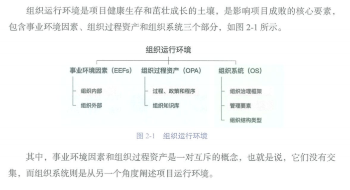

## 2.1.1 什么是事业环境因素（不可控，需遵守）

**事业环境因素（EEFs）：**项目团队不能控制的，对项目产生影响、限制或指令作用的各种条件。这些因素可能会提高或限制项目管理的灵活性，并可能对项目结果产生积极或消极的影响。

**内部：**组织文化、结构治理、设施和资源的地理分布、基础设施、信息软件软件、资源可用性、员工能力。

**外部：**市场条件、社会和文化影响与问题、法律限制、商业数据库、学术研究、政府或行业标准、财务考虑因素、物理环境要素。

## 2.1.2 什么是组织过程资产（可裁剪，多积累）

**组织过程资产：**执行组织特有并使用的计划、过程、政策、程序和知识库、会影响对具体项目的管理。在整个项目期间，项目团队成员可对组织过程资产进行必要的更新和增补。

**它包括：**

- 工件、实践或知识
- 经验教训和历史信息
- 完成的进度计划、风险数据和挣值数据

**过程、政策和程序：**指南和标准、模板、供应商清单和合同协议类型、变更控制程序、组织对沟通的要求...

**组织知识库：**配置管理知识库、财务数据库、苍凉指标数据库、经验教训知识库、以往项目的档案...

# 2.2 组织系统

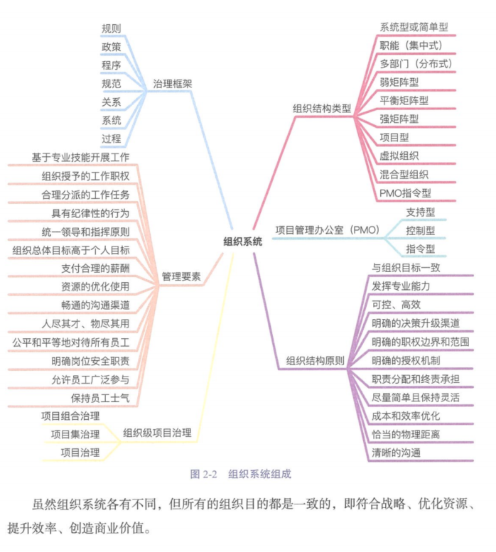

## 2.2.1 概述

组织系统是由管理要素、治理框架和组织结构等构成的，与组织的使命、愿景、价值观保持一致，与组织的战略目标相适应。

## 2.2.2 组织治理框架

### 治理与管理

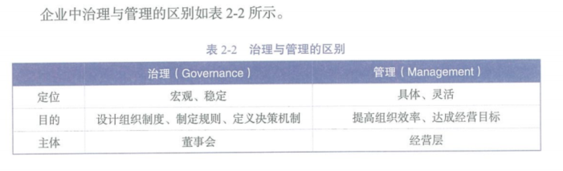

### 项目治理与项目管理

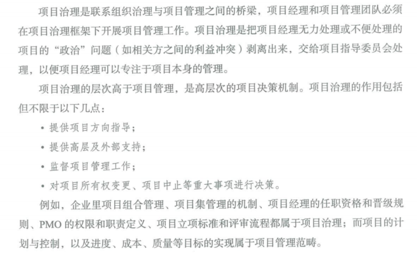

### 项目管理办公室(PMO)

**项目管理办公室（PMO）：**是对与项目相关的治理过程进行标准化，并促进资源、方法论、工具和技术共享的一个组织结构。PMO 所支持和管理的项目不一定彼此关联。

##### PMO 的类型（支持、控制、指令）

- **支持型：**支持，是顾问、项目资源库，对项目控制程度很低。
- **控制型：**支持+要求服从，对项目控制程度中等。
- **指令型：**直接管理和控制，对项目控制程度很高。

##### PMO 对项目经理支持的方式

- 管理“共享资源”，识别和制定“最佳实践”和“标准”（管理功能）
- 通过“项目审计”，监督对“标准”的遵守程度（监督功能）
- 制定和管理政策、程序、模板，提供指导和培训（指导培训功能）
- 协调“跨项目”的沟通（协调功能）

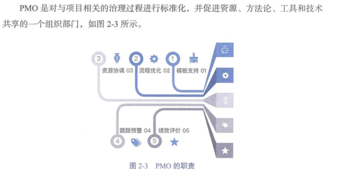

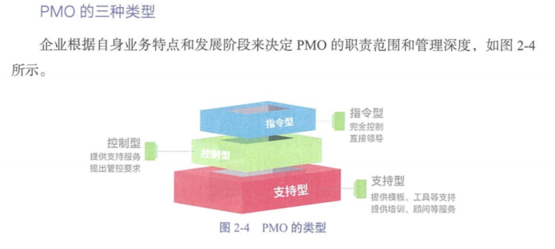

## 2.2.3 组织结构类型

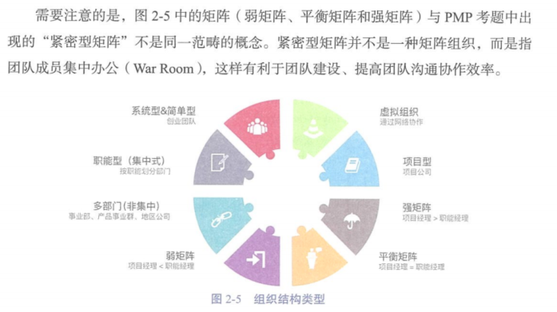

### 职能型（集中式）

职能型组织通常适用于规模小、历时短或以技术和运营为主题的组织，如工厂、医院。

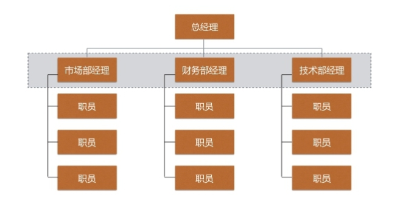

**特点：**

- 兼职项目经理（联络员）
- 权力大小：“很小”或“没有”
- 职业路径清晰、横向联系薄弱

### 项目型

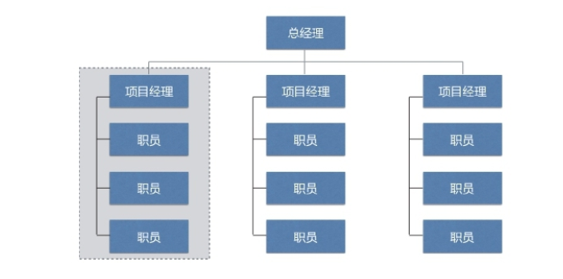

**特点：**

- 全职项目经理
- 权力大小：“大”甚至“全部”
- 项目经理控制度高
- 重复配置；无家可归

### 矩阵型

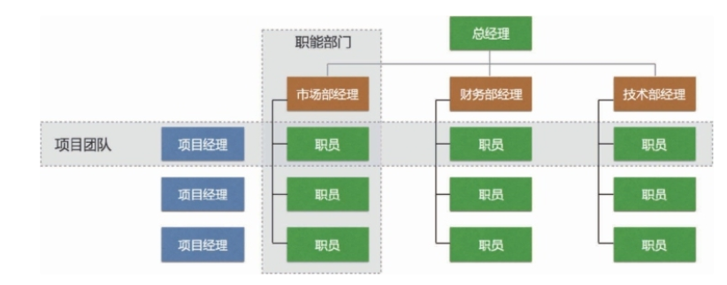

#### 弱矩阵型

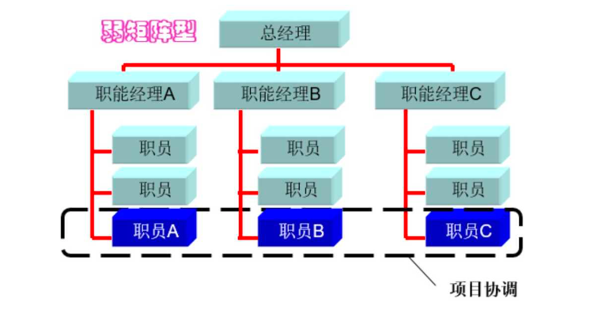

**特点：**

- 兼职项目经理
- 权力大小：“小”

#### **平衡矩阵型**

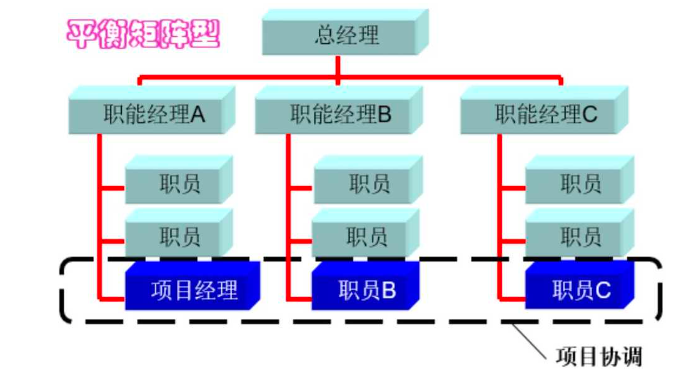

**特点：**

- 兼职项目经理
- 权力大小：“小”到“中”

#### **强矩阵型**

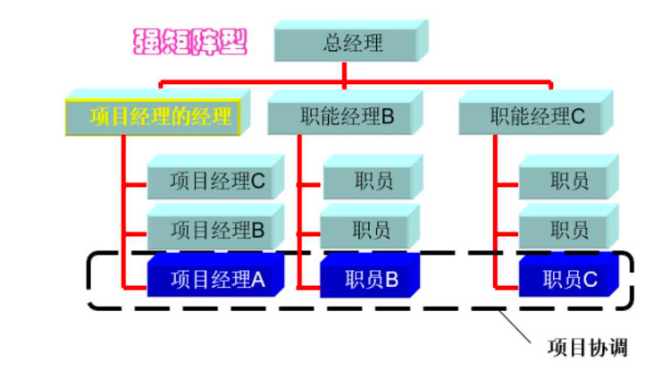

**特点：**

- 全职项目经理
- 权力大小：“中”到“大”

**常见组织结构项目经理与职能经理权力对比**

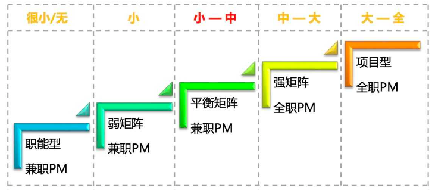

“紧密矩阵”是指集中办公，不是一种组织结构。

### 其他一些类型的组织结构

**有机型或简单型组织（Organic or simple organization）：**是应该理论家 Tom Burns 和 George Stalker 最初描述的一种非正式组织。有机组织是一个非常灵活的组织，能够很好地适应变化。它的结构是：工作专业化少，管理层次少，决策分散，监督不多。

**多部门组织（Multi-divisional）：**一个中心，多个部门或分区，这些分区实行半自制，中心对其下达财务指标。比如按照区域划分部门，每个部门有重复的职能，不集中。

**虚拟型组织：**临时把人员召集起来，以利用特定的机遇，待目标完成后即行解散的一种临时组织。虚拟组织结构，也称为网络型组织。

