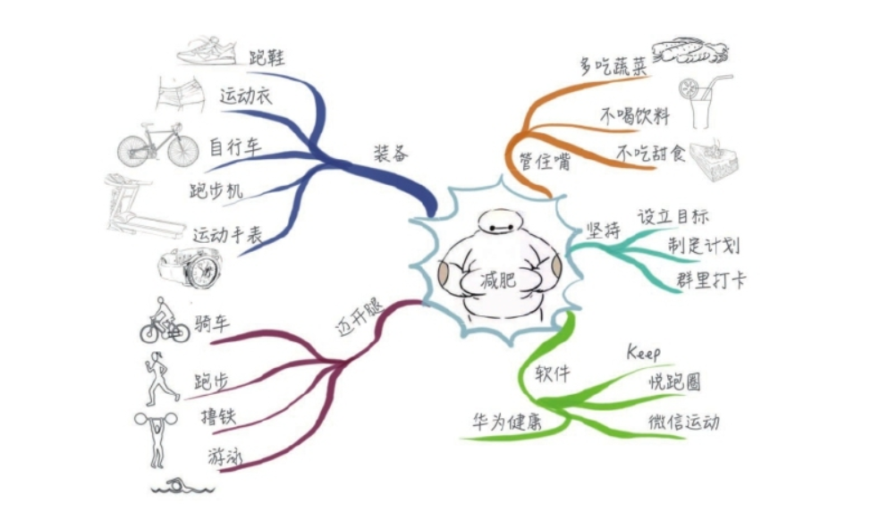

[TOC]

# 第五章 项目范围管理

# 范围管理的核心概念

项目范围管理包括做且只做所需的全部工作。“范围”包括两重含义：

- **产品范围：**某项产品、服务或成果所具有的特性和功能。
- **项目范围：**为交付具有规定特性与功能的产品、服务或成果而必须完成的工作。

**预测型和适应型生命周期之范围管理的对比**

# 项目管理范围的“发展趋势和新兴实践”

需求一直是项目管理中的重点。组织开始认识到如何运用商业分析，通过定义、管理和控制需求活动来提高竞争优势。

- 商业分析活动可在项目启动或项目经理任命之前就开始。要注重与商业分析专业人士的合作。

- 需求管理过程始于需求评估，结束于需求关闭。

- 项目经理与商业分析师之间是伙伴合作关系

- - **商业分析师：**负责需求管理相关的活动。
  - **项目经理：**负责确保这些活动在项目管理计划有所安排，并且在预算内按时完成，同时能够创造价值。

# 在敏捷和适应型环境中需要考虑的因素

特意在项目早期缩短定义和协商范围的时间，并为持续探索和明确范围而延长创建相应过程的时间。

有目的地构建和审查原型，并通过多次发布版本来明确需求。把需求列入未完项。

**“需求”和“范围”的区别**

- **需求：**是一种需要。
- **范围：**是满足“需求”必须交付的可交付成果和相关工作。

# 项目范围管理过程之一 - 规划范围管理（规划过程组）

**规划范围管理：**为记录如何定义、确认和控制项目范围及产品范围，而创建范围管理计划的过程。

**本过程的作用：**在整个项目中如何管理范围提供指南和方向。

## 输出：范围管理计划（Scopes）

**范围管理计划：**描述将如何定义、指定、监督、控制和确认项目范围。

**注意点：**

1. 范围管理计划无范围（范围在范围基准中）
2. 范围管理计划可以是正式或非正式的，非常详细或高度概括的。

## 输出：需求管理计划（Requirements）

**需求管理计划（商业分析计划）：**描述将如何分析、记录和管理项目的产品需求。

**注意点：**

1. 需求管理计划无需求（需求在需求文件中）
2. 内容包括配置管理活动、需求优先级排序过程、测量指标等。

# 项目范围管理过程之二 - 收集需求（规划过程组）

**收集需求：**为实现目标而确定、记录并管理相关方的需要和需求的过程。

**本过程的作用：**为定义产品范围和项目范围奠定基础。

**什么是需求？**

**需求：**根据特定协议或其他强制性规范，产品、服务或成果必须具备的条件或能力。

需求包括发起人、客户和其他相关方的已量化且书面记录的需要和期望。

## 输入：项目文件

相关方登记册：用于了解哪些相关方能够提供需求方面的信息，及记录相关方对项目的需求和期望。

## 输入：商业文件

会影响收集需求过程的商业文件是商业论证，它描述了为满足业务需要而应该达到的必要、期望及可选标准。

## 输入：协议

协议包含项目和产品需求。

## 工具与技术

**多标准决策分析（MCDA）：**

在相互冲突的多个方案中进行选择，就是根据准则层的各项准侧分别给方案层的各方打分，然后汇总分数，总分最高的方案胜出，成为目标方案。

**亲和图（Affinity Diagram）：**

亲和图是通过头脑风暴法把收集到的事实、意见和想法等语言文字资料，根据资料间的亲和性将其归类，以便从复杂现象中找出规律、抓住本质、理出思路的一种方法。

**思维导图（Mind Map）：**

思维导图是表达发散性思维的有效图形思维工具，把各级主题的关系用互相隶属于互相关联的层级图表现出来。

**联合应用程序开发或设计（JAD）：**

JAD 会议适用于软件开发行业。客户被邀请和开发团队一起，通过一系列的研讨会收集需求和改进软件开发过程。客户持续参与，有利于客户充分了解项目并及时给出反馈。也有利于团队更深入地理解客户的真实需求。

**质量功能开展（QFD）**

目的是为了设计、生产出充分满足用户需求的产品和服务。需要将用户“不专业”的语言翻译成“工程语言”。

- 收集用户需求的描述，罗列工程性能指标
- 分析用户需求和工程性能质变之间的关系
- 实心圆表示非常积极，空心圆表示中等积极
- 实心五角星表示中等消极，空心五角星表示非常消极
- 选择几个竞品来对比，评估产品在设计工程性能指标上能得多少分，竞品是多少分
- “冲突矩阵”是指工程新功能指标之间有冲突

## 输出：需求文件

**需求文件：**描述各种单一需求将如何满足与项目相关的业务需求。

只有明确的（可测量和可测试的）、可跟踪的、完整的、相互协调的，且主要相关方愿意认可的需求，才能作为基准。

**需求的分类：**

- **业务需求：**整个组织的高层级需要
- **相关方需求：**相关方或相关方群体的需要
- **解决方案需求：**为满足业务需求和相关方需求，产品、服务或成果必须具备的特性、功能和特征。分功能需求和非功能需求。
- **过渡和就绪需求：**从“当前状态”过渡到“将来状态”所需的临时能力。例如：数据转换和培训需求。
- **项目需求：**项目需要满足的行动、过程或其他条件，例如：里程碑日期、合同责任、制约因素。
- **质量需求：**用于确认可交付成果的成功完成或其他项目需求的实现的任何条件或标准，例如测试、认证、确认。

## 输出：需求跟踪矩阵

**需求跟踪矩阵：**把产品需求从其他来源连接到能满足需求的可交付成果的一种表格。**需求跟踪矩阵记录的是从需求到可交付成果的实现过程。**

- 把每个需求与业务目标或项目目标联系起来，有助于确保每个需求都具有商业价值。
- 提供了在整个项目生命周期中跟踪需求的一种方法（正向跟踪和逆向跟踪）。
- 有助于确保需求文件中被批准的每项需求在项目结束的时候都能交付。
- 收集需求时产生的需求文件和需求跟踪矩阵并不代表项目的真实范围。
- 需要进一步明确哪些包含在项目范围内，哪些排除在项目范围外。（定义范围）

# 项目范围管理过程之三 - 定义范围（规划过程组）

**定义范围：**制定项目和产品详细描述的过程

**本过程的作用：**描述产品、服务或成果的边界和验收标准。

从需求文件中选取最终的项目需求，然后制定出关于项目及产品、服务或成果的详细描述。

- 应根据项目启动过程中记载的主要可交付成果、假设条件和制约因素来编制项目范围说明书。
- 还需要分析现有风险、假设条件和制约因素的完整性，并做必要的增补或更新。
- 需要多次反复开展定义范围过程（涉及多个迭代）

## 输入：项目章程

项目章程中包含对项目的高层级描述、产品特征和审批要求。

## 输入：项目文件

**需求文件：**识别了应纳入范围的需求。

## 工具与技术：数据分析

可用于本过程的数据分析技术包括：备选方案分析。

## 工具与技术：决策

可用于本过程的决策技术包括：多标准决策分析。

## 工具与技术：人际关系与团队技能

在研讨会和座谈会中使用引导技能来协调具有不同期望或不同专业知识的关键相关方，使他们就项目可交付成果以及项目和产品边界达成跨职能的共识。

## 工具与技术：产品分析

**产品分析：**把高层级的产品描述转变为有形的可交付成果。产品分析技术包括产品分解、系统分析、需求分析、系统工程、价值工程、价值分析等。

## 输出：项目范围说明书

**项目范围说明书：**是对项目范围、主要可交付成果、假设条件和制约因素的描述。记录了整个范围，包括项目和产品范围。

- 项目范围说明书详细描述了项目的可交付成果，还代表项目相关方之间就项目范围所达成的共识。
- 为了便于管理相关方的期望，项目范围说明书可明确指出哪些工作不属于本项目范围。

**包含内容：**

- **产品范围描述：**逐步细化在项目章程和需求文件中所描述的产品、服务和成果的特征
- **可交付成果：**必须产出的任何独特并可核实的产品、成果或服务能力。也包括辅助成果，如项目管理报告和文件
- **验收标准：**可交付成果通过验收前必须满足一系列条件
- **除外责任：**明确说明哪些内容不属于项目范围，有助于管理相关方的期望及减少范围蔓延

# 项目范围管理过程之四 - 创建 WBS（规划过程组）

**创建 WBS：**把项目可交付成果和项目工作分解成较小的、更易于管理的组件的过程。

**本过程的作用：**对所要交付的内容提供架构。

- WBS（工作分解结构）组织并定义了项目的总范围（项目范围说明书只是定义范围，没有组织范围）
- WBS 最低层的组成部分成为工作包，其中包括计划的工作。
- 在“工作分解结构”这个词语中，“工作”是指作为活动结果的工作产品或可交付成果，而不是活动本身。

**WBS包含如下几种元素：**

1.可交付成果(Deliverables)：团队为完成某一个过程、阶段或项目而必须产出的任何独特并可核实的产品、成果或服务能力，其包括各种辅助成果。如项目管理报告和文件。

2.子项目(Subproject)：子项目是整个项目的一部分。

3.控制账户(Control Account)：控制账户是一个管理控制点。在该控制点上，把范围、预算、实际成本和进度加以整合，并与挣值相比较，以测量绩效。

4.工作包(Work Package)：工作包是WBS中最底层的组件，通常表达为可交付成果。工作包也可以对相关活动进行归类，以便对工作进度进行估算，开展监督与控制。

5.规划包(Planning Package)：

6.活动(Activity)

7.任务(Task)

任务通常是活动进一步分解的组成部分，不属于WBS组件，由某个团队成员负责。

## 工具与技术：分解

**分解：**把项目范围和项目可交付成果逐步划分为更小、更便于管理的组成部分的技术。

**工作包：**WBS 最底层的组件，可对其成本和持续时间进行估算和管理。

创建 WBS，就是要将整个项目工作分解为工作包

> WBS：工作分解结构 Work Breakdown Structure

**分解的五个步骤：**

1. 识别和分析可交付成果及相关工作
2. 确定 WBS 的结构和编排方法
3. 自上而下逐层细化分解
4. 为 WBS 组件指定和分配标识编码
5. 核实可交付成果分解的程度是否恰当

**WBS 的结构可以采用如下形式：**

- 把项目生命周期的各阶段作为分解的第二层，产品和项目可交付成果放在第三层。
- 把主要可交付成果作为分解的第二层。
- 纳入由项目团队以外的组织开发的各种较低层次组件（如外包工作）。

**WBS 词典**

**以“阶段”作为第二层**

**创建 WBS 的四个注意**

- 如果采用敏捷方法，可以将长篇故事分解成用户故事。
- 不同的可交付成果可以分解到不同的层次。
- 并不是分解得越详细越好。过细的分解会造成管理努力的无效耗费、资源使用效率低下、工作实施效率降低，同时造成 WBS 各层级的数据汇总困难。
- 远期才完成的可交付成果或组件，当前可能无法分解（规划包），需要滚动式规划。

**创建 WBS 的四个主要原则**

- 无遗漏无多余（100% 原则）
- 责任明确原则（有明确责任人）
- 工作包 80 小时（80 小时原则）
- 4~6 层原则（不宜过细分解）

**责任分配矩阵：**

注意：每一行只能有一个实心三角形，即每个工作包只能有一个负责人，必须符合"责任人唯一"原则。

**WBS的价值：**

1.基准的来源：范围基准是三大基准之首。有了范围才能确定进度基准和成本基准。

2.计划的基础：项目进度、成本、质量、风险等所有计划都要依据基准来编制。

3.工作的展现：WBS把项目所涵盖的工作分层次、机构化的展现出来。

4.控制的依据：该项工作是否应该做，要对照范围基准，如果范围里没有，就不应该做。

5.团队的指南：团队依据WBS来确定工作的目标和分工。

**工作分解结构WBS编码系统的作用：**

- 准确定位一个元素在WBS工作分解结构中的位置和隶属关系。
- 识别每个WBS元素在哪个层级
- 与组织分解结构(OBS)、资金分解结构(ABS)、风险分解结构(RBS)等进行整合，形成项目核心控制系统，是项目管理信息系统(PMIS)的基础。

## 输出：范围基准

哪儿找可交付成果和验收标准：首选范围说明书，次选 WBS 词典，再次选范围基准。

**控制账户与工作包**

**控制账户（CA）：**是一个管理控制点（可以与组织的财务程序链接），在该控制点上，把范围、预算、实际成本和进度加以整合，并与挣值相比较，以测量绩效。

**绩效测量基准（PMB）：**由范围基准、进度基准、成本基准共同构成。

每个控制账户可能包括一个或多个工作包（或规划包），但是一个工作包只能属于一个控制账户。

# 项目范围管理过程之五 - 确认范围（验收）（监控过程组）

**范围确认：**“客户”或“发起人”正式验收完成的项目可交付成果的过程。

**本过程的作用：**通过验收每个可交付成果，提高最终产品、服务或成果验收的可能性。

## 输入：核实的可交付成果

**核实的可交付成果：**已经完成，并被控制质量过程检查为正确的可交付成果。

## 工具与技术：检查

**检查（审查、产品审查、巡检）：**开展测量、审查与确认等活动，来判断工作和可交付成果是否符合需求和产品验收标准。

## 输出：验收的可交付成果

符合验收标准的可交付成果应该由客户或发起人正式签字批准。

应该从客户或发起人那里获得正式文件，证明相关方对项目可交付成果的正式验收。

## 输出：变更请求

如果未能通过验收，处理步骤：

1. 记录（了解）原因
2. **走变更流程，进行缺陷补救**

# 项目范围管理过程之六 - 控制范围（监控过程组）

**控制范围：**监督项目和产品的范围状态，管理范围基准变更的过程。

**本过程的作用：**

在整个项目期间保持对范围基准的维护。

确保所有变更请求、纠正措施、预防措施都通过实施整体变更控制过程进行处理。

## 工具与技术：数据分析

**偏差分析：**用于将基准与实际结果进行比较，以确定偏差是否处于临界值区间内或是否有必要采取纠正或预防措施。

**趋势分析：**旨在审查项目绩效随时间的变化情况，以判断绩效是在改善还是在恶化。

确定偏离范围基准的原因和程度，并决定是否需要采取纠正或预防措施，是项目范围控制的重要工作。

**范围蔓延、镀金、范围潜变**

**范围蔓延：**未对时间、成本和资源做相应调整，未经控制的产品或项目范围的扩大。

- - 来自团队内部原因造成的范围蔓延成为“镀金”。
  - 来自团队外部原因造成的范围蔓延称为“范围潜变”。

**镀金：**项目人员为了“讨好”客户而做的不解决实际问题，没有应用价值的项目活动。(没有经过范围控制程序)。范围爬行往往是团队对客户提出超出范围的需求的被动接受，造成范围失控。

**范围潜变：**范围潜变是指客户不断提出小的、不易察觉的范围改变，如果不加控制，累计起来导致项目严重偏离既定的范围基准，导致项目失控和败诉。

**镀金和范围爬行的共同特点是没有经过整体变更控制程序而发生的范围变化，所以统称"范围蔓延"。**

**如果已经出现了范围蔓延，需要补变更流程。如果变更没有获得批准，需要取消不良变更。**

