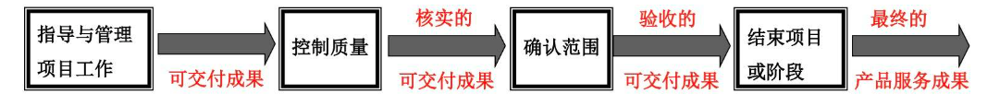

[TOC]

# 第八章 项目质量管理

# 五个质量管理大师

1. **戴明：**PDCA 环（休哈特提出，戴明完善）、**质量管理 14 条原**则（预防胜于检查、质量成本 85% 都是管理问题）
2. **朱兰：**质量螺旋**（质量环）、强调质量是适合使用、提出质量与等级的区别、提出**质量管理三部曲**（质量计划、质量控制、质量改进）
3. **克鲁斯比：**提出零缺陷、强调质量是符合要求、强调第一次就把事情做对、提出质量是免费的、提出质量用非一致性成本衡量
4. **石川：鱼骨图**（因果图、石川图）、提出质量图、总结质量七工具的使用
5. **田口玄一：**质量损失函数、提出实验设计方法、提出稳健设计方法

**项目质量管理要兼顾项目管理与项目可交付成果两方面**

# 项目质量管理核心概念

**质量与等级的区别**

**质量：**作为实现性能或成果，是一系列内在特性满足要求的程度。

**等级：**作为设计意图，是对用途相同但技术特征不同的可交付成果的级别分类。

- 高等级并不意味着一定高质量；低等级也并不意味着一定低质量；
- 质量水平未达到质量要求肯定是个问题，而低等级不一定是个问题。
- 项目经理及项目团队负责权衡，以便同时达到所要求的的质量与等级水平。

**一些术语的区别**

- **预防：**保证过程中不出现错误
- **检查：**保证错误不落到客户手中
- **属性抽样：**结果为合格或不合格
- **变量抽样：**表名合格的程度
- **公差：**结果的可接受范围
- **控制界限：**稳定过程的普通偏差的边界

**按有效性递增的五种质量管理水平**

企业的质量管理水平分为 5 个层次。

# 项目质量管理的趋势和新兴实践

**质量管理的发展趋势：**

1. **客户满意：**了解、评估、定义和管理要求。符合要求 + 适合使用。**敏捷中可确保始终做到客户满意。**
2. **持续改进：**通过持续不断的小改进积累成大改进，往往比瞬间的大改进更有价值。PDCA 环是质量改进的基础。全面质量管理（TQM）、六西格玛和精益六西格玛也可以提高质量
3. **管理层的责任**：85/15 原则。管理者对质量负责 85% 的责任，工人只有 15% 的责任
4. **与供应商的互利合作：**组织与其供应商相互依赖。组织应着眼于长期关系而不是短期利益

**质量成本：**

1. **预防胜于检查：**最好将质量设计到可交付成果中。**质量是规划和实施出来的，不是检查出来的**
2. **质量成本（COQ）：**一致性工作成本 + 非一致性工作成本；
3. **反对“镀金”：**镀金不会增加项目价值，会造成较大机会成本；资源有限，只提供答应的东西
4. **第一次就把事情做对（质量是免费的）：**就是“零缺陷管理”，最节约成本的方法，虽不能绝对做到，但可不断接近
5. **准时制（零库存）管理（JIT）：**由于零库存，没有多余的材料，促使人们更加注重质量，力争一次做对，力争零缺陷
6. **全面质量管理（TQM）：**强调全过程的质量管理和全员参与质量管理

# 在敏捷和适应型环境中需要考虑的因素

为引导变更，敏捷方法要求多个质量与审核步骤贯穿整个项目，而不是在面临项目结束时才执行。

1. 循环回顾，定义检查效果
2. 寻找问题原因，建议改进方法
3. 评估实验过程，确定措施

为促进频繁的增量交付，敏捷方法关注于小批量工作，目的是在项目生命周期早期发现不一致和质量问题。

- **规划质量“定标准”：**规划如何管理质量、控制质量；需要遵守的质量标准、可交付成果的质量测量指标
- **管理质量“管过程”：**做好质量审计，过程分析；分析质量控制测量结果，反思过程，持续改进；
- **控制质量“查结果”：**核实可交付成果是否满足质量检测指标

# 项目质量管理过程之一：规划质量管理（规划过程组）

**规划质量管理：**识别项目及其可交付成果的质量要求和（或）标准，并书面描述项目将如何证明符合质量要求和（或）标准的过程

**本过程的作用：**为整个项目中如何管理和核实质量提供指南和方向。

## 输入：组织过程资产

执行组织的质量政策是高级管理层所推崇的，规定了组织在质量管理方面的工作方向。

如果执行组织没有正式的质量政策，或项目涉及多个执行组织（如合资项目）。

项目经理或项目管理团队就需要为项目制定质量政策。

## 工具与技术：数据收集 - 标杆对照

**标杆对照：**将实际或计划的项目实践或项目的质量标准与组织内部或外部、同一应用领域或不同应用领域的可比项目的实践进行比较，以便识别最佳实践，形成改进意见，并为绩效考核提供依据。（可用于确定质量标准）

## 工具与技术：数据收集 - 头脑风暴

**头脑风暴：**收集数据，制定最合适新项目的质量管理计划

## 工具与技术：数据收集 - 访谈

**访谈：**了解有经验的相关方和主题专家对项目和产品质量的隐性和显性、正式和非正式的需求和期望。应在信任和保密的环境下开展访谈，以获得真实可信、不带偏见的反馈。

## 工具与技术：数据分析 - 成本效益分析

达到质量要求的主要效益包括：减少返工、提高生产率、降低成本、提升相关方满意度、提升盈利能力。对每个质量活动进行**成本效益分析**，就是要比较其可能成本与预期效益。

## 工具与技术：数据分析 - 质量成本（COQ）

**质量成本：**在产品生命周期中为预防不符合要求、为评价产品或服务是否符合要求，以及因未达到要求（返工），而发生的所有成本。

## 工具与技术：决策

**多标准决策（如优先矩阵）：**可用于识别关键事项和合适的备选方案，并通过一系列决策排列出备选方案的优先顺序。

在本过程中，它有助于排定质量测量指标的优先顺序。

## 工具与技术：数据表现 - 流程图

**流程图（过程图）：**用来显示在一个或多个输入转化成一个或多个输出的过程中，所需要的步骤顺序和可能分支。它展示了流程中的活动、决策点、分支循环、并行路径及整体处理顺序。

可以通过分析流程图来估算质量成本。通过展示过程步骤，可帮助改进过程并识别可能出现质量缺陷或可以纳入质量检查的地方。

**关键字：**改进过程、识别潜在缺陷、估算质量成本、预测出错环节。

**SIPOC 模型：**由戴明提出，用于组织流程管理和改进。通过分析，识别核心过程。戴明认为任何一个组织都是一个由供应者、输入、流程、输出、还有客户这样相互关联、互动的 5 个部分组成的系统。

SIPOC 是 Value Chain（价值链）的一种。

## 工具与技术：数据表现 - 逻辑数据模型

**逻辑数据模型：**把组织数据可视化，以商业语言加以描述，不依赖任何特定的软件开发技术。

- 逻辑数据模型可用于识别会出现数据完整性或其他质量问题的地方。
- 由于不涉及软件技术，所以项目经理、相关方都可以研究这份文件。如果发现与项目需求不符合、或其他问题就马上提出来。避免后续出现问题。

## 工具与技术：数据表现 - 思维导图

**思维导图：**一种用于可视化组织信息的绘图法。

可以从一个质量概念开始，开展发散性思维，快速收集项目质量要求、制约因素、依赖关系和联系等各种信息。

## 工具与技术：数据表现 - 矩阵图

**矩阵图：**在行列交叉的位置展示因素、原因和目标之间的关系强弱。

在本过程中，它们有助于识别对项目成功至关重要的质量测量指标。

矩阵图实例

## 工具与技术：检查与测试的规划

**检查与测试的规划：**在规划阶段项目经理和团队决定如何测试或检查产品、服务或成果。

不同的行业有不同的检查和测试。

## 输出：质量管理计划

**质量管理计划：**描述如何实施适用的政策、程序和指南以实现质量目标。描述项目管理团队为实现项目质量目标所需的活动和资源。

包括质量政策、质量标准（国家标准/行业标准等）、质量目标（可量化的目标）、角色职责、相关活动、质量工具等等。应该在项目早期就对质量管理进行评审，以确保决策是基于准确信息的。

## 输出：质量测量指标

**质量测量指标：**描述项目或产品属性，以及控制质量过程将如何验证符合程度。（属于“项目文件”）

质量测量指标是对高层级的质量标准的具体化和可操作化。

**举例：项目 - 给客户定制 5 个桌子**

**质量管理计划中：**

- - 组织的质量政策：把客户满意放在第一位
  - 质量标准：GB/T 3976 - 2014 学校课桌椅功能尺寸及技术要求
  - 项目的质量目标：项目缺陷率低于 1%
  - 跟质量管理有关的角色和职责
  - 质量管理活动、质量控制活动

**质量测量指标中：**

- - 漆膜
  - 材料
  - 工艺
  - 尺寸
  - 桌面高、座面高的允许误差范围为 ±2mm，靠背点距座面高的允许误差范围为 ±15mm

# 项目质量管理过程之二：管理质量（执行过程组）

**管理质量：**把组织的质量政策用于项目，并将质量管理计划转化为可执行的质量活动的过程。

**本过程的作用：**

1. 1. 提高实现质量目标的可能性
   2. 识别无效过程
   3. 识别导致质量低劣的原因

管理质量有时被称为“质量保证”，但“管理质量”的定义比“质量保证”更广。

管理质量的工作属于质量成本框架中的一致性工作。

**管理质量的人员和角色**

**QA 部门：**执行某些管理质量活动，例如故障分析、实验设计和质量改进。

**全员责任：**所有人（项目经理、项目团队、项目发起人、执行组织的管理层、甚至是客户）在管理项目质量方面都扮演一定的角色。

质量管理在敏捷项目中，所有团队成员执行；传统项目中，特定团队成员执行。

## 输入：项目文件

**质量控制测量结果：**用于分析和评估项目过程和可交付成果的质量是否符合执行组织的标准或特定要求；也有助于分析这些测量结果的产生过程，以确定实际测量结果的正确程度。

**质量测量指标：**依据这些质量测量指标设定项目的测试场景和可交付成果，用作改进举措的依据。

**风险报告：**使用风险报告识别整体项目风险的来源以及整体风险敞口的最重要的驱动因素，这些因素能够影响项目的质量目标。

**经验教训登记册：**项目早期与质量管理有关的经验教训，可以运用到项目后期阶段，以提高质量管理的效率与效果。

## 工具与技术：数据收集

**核对单：**一种结构化工具，通常列出特定组成部分。

**用途：**

1. 1. 核实所要求的一系列步骤（质量活动）是否已得到执行
   2. 检查需求列表是否已得到满足

**质量核对单应该与范围基准中定义的验收标准保持协调一致。**

## 工具与技术：审计

**质量审计：**用来确定项目活动是否遵循了组织和项目的政策，过程与程序的一种结构化的独立过程。

**质量审计的目标：**

1. 1. 识别最佳实践、违规做法、差距及不足
   2. 分享类似项目的良好实践
   3. 协助过程改进、提高生产效率
   4. 积累经验教训
   5. 确认已批准的变更请求的实施情况

质量审计通常由项目外部的团队开展，如组织内部审计部门、项目管理办公室（PMO）或组织外部的审计师。（内审或外审、事先安排或随机进行）

## 工具与技术：数据分析

- **文件分析：**分析项目控制过程所输出的文件，如质量报告、测试报告、绩效报告和偏差分析。找到失控的过程，或有问题的过程。
- **根本原因分析（RCA）：**找到根本原因，杜绝问题再次发生。
- **过程分析：**识别过程改进机会，发现一个过程中存在的问题，制约因素，和非增值活动。
- **备选方案分析：**选择那些最合适的质量方案或方法。

## 工具与技术：决策

**多标准接触分析：**用于讨论影响项目或产品质量的备选方案

- **“项目”决策：**在多个实施方案或供应商之间做出选择。
- **“产品”决策：**综合考虑生命周期成本、进度、相关方满意度等。

## 工具与技术：数据表现 - 因果图

**因果图（鱼骨图、石川图、why-why 分析图）：**将问题陈述的原因分解为离散的分支，有助于识别问题的主要原因或根本原因。

**层别法：**也称数据分层法，是将性质相同的、在同一条件下收集的数据归纳在一起，以便进行比较分析。

航空公司的服务质量表

## 工具与技术：数据表现 - 直方图

**直方图：**直方图是一种展示数字数据的条形图，可以展示每个可交付成果的缺陷数量、缺陷成因的排列、各个过程的不合规次数，或项目或产品缺陷的其他表现形式。

**帕累托图**

**帕累托图：**一种特殊的垂直条形图，用于识别造成大多数问题的少数重要原因。

**帕累托法则（二八定律）：**数据的绝大部分存在于很少的类别中，极少数剩下的数据分散在大部分类别中（“至关重要的极少数（20%）”和“微不足道的大多数（80%）”）

## 工具与技术：数据表现 - 散点图

**散点图：**展示两个变量之间的关系（解释因变量 Y 相对于自变量 X 的变化）;可以帮助我们通过变量之间的相关分析质量问题产生的原因，所以散点图又称相关图。

## 工具与技术：面向 X 的设计

**面向 X 的设计（DfX）：**产品设计期间可采用的一系列技术指南，旨在优化设计的特定方面，可以控制或提高产品最终特性。

- DfX 中的“X”可以是产品开发的不同方面。
- 使用 DfX 可以降低成本、改进质量、提高绩效和客户满意度

## 工具与技术：问题解决

**问题解决：**发现解决问题或应对挑战的解决方案

问题解决方法有助于消除问题和制定长久有效的解决方案。

1 定义（问题）、2 识别（根本原因）、3 方案（生成方案）、4 选择（最佳方案）、5 执行、6 验证。

## 工具与技术：质量改进方法

PDCA：计划、实施、检查、行动

六西格玛：百万分之三点四

## 输出：质量报告

**关键内容：**

- - 团队上报的质量问题
  - 针对项目、产品、过程的改善建议
  - 纠正措施建议（包括返工、缺陷/漏洞补救、100%检查等）
  - 在控制质量过程中发现的情况的概述

**形式：**图形、数字、定性文件

**目的：**帮助其他过程和部门采取纠正措施，以实现项目质量期望。

## 输出：测试与评估文件

**测试与评估文件：**是一份项目文件，也被称为测试与评估指导方案。里面列出了一些活动，通过这些活动来确定项目是否满足质量目标（供控制质量使用，评估质量目标的实现情况），如质量核对单、需求跟踪矩阵等。

## 输出：变更请求

如果管理质量过程期间出现了可能影响项目管理计划任何组成部分、项目文件或项目/产品管理过程的变更、项目经理应提交变更请求并遵循 4.6 节定义的实施整体变更控制过程。

改善建议、纠正措施等会导致变更请求。

# 项目质量过程管理之三：控制质量（监控过程组）

**控制质量（Quality Control，QC，针对可交付成果）：**为了评估绩效，确保项目输出完成、正确且满足客户期望，而监督和记录质量管理活动执行结果的过程。

**本过程的作用：**

- - 核实项目可交付成果和工作已经达到主要相关方的要求，可供最终验收。
  - 在整个项目期间应执行质量控制
  - **敏捷项目中：**QC 由全部成全、全生命周期执行
  - **瀑布模式中：**特定成员在特定时间段或项目/阶段快结束时进行。
  - 以下行业 QC 更为严格：制造、医疗、运输、核能等。

- 

## 输入：项目文件

- **质量测量指标：**专用于描述项目或产品属性，以及控制质量过程将如何验证符合程度（来自规划）
- **测试与评估文件：**用于评估质量目标的实现程度（来自管理）。
- **经验教训登记册：**项目早期获得的经验教训，可以运用到项目后期阶段，以改进质量控制。

## 输入：批准的变更请求

- 完成局部变更时，如果步骤不完整或不正确，可能会导致不一致和延迟。
- 批准的变更请求的实施需要核实，并需要确认完整性、正确性、以及是否重新测试。

## 输入：可交付成果

**可交付成果：**在某一过程、阶段或项目完成时，必须产出的任何独特并可核实的产品、成果或服务能力

作为指导与管理项目工作过程的输出的可交付成果将得到检查，并与项目范围说明书定义的验收标准做比较。

## 工具与技术：数据收集

**核对单（Checklists）：**有助于以结构化方式管理控制质量活动。

**核查表（Check Sheets）：**用于合理排列各种事项，以便有效地收集关于潜在质量问题的有用数据

在开展检查以识别缺陷时，用核查表收集属性数据就特别方便，例如关于缺陷数量或后果的数据。

用核查表收集关于缺陷数量或后果的数据，又经常使用帕累托图来显示。

## 工具与技术：数据收集

- **统计抽样：**从目标总体中选取部分样本用于检查，抽样的频率和规模应在规划质量管理过程中确定
- **属性抽样：**结果为合格或不合格（需要较多的样本）
- **变量抽样：**在连续的量表上标明结果所处的位置，表明合格的程度（需要专门人员进行）
- **问卷调查：**用于在部署产品或服务之后收集关于客户满意度的数据。

## 工具与技术：数据分析

**绩效审查：**针对实际结果，测量、比较和分析规划质量管理过程中定义的质量测量指标。

**根本原因分析（RCA）：**用于识别缺陷成因。

## 工具与技术：检查

**检查（审查、同行审查、审计、巡检）：**指检验工作产品，以确定是否符合书面标准，也可用于确认缺陷补救。

检查可在任何层面上进行。可以检查单个活动的成果，也可以检查项目的最终产品。

## 工具与技术：测试/产品评估

**测试：**有组织的、结构化的调查，旨在根据项目需求提供有关被测产品或服务质量的客观信息。

测试可以贯穿于整个项目，可以可用时进行，也可以在项目结束时进行，但建议尽早测试。

## 工具与技术：数据表现 - 控制图

**控制图：**用来确定一个过程是否稳定，或者是否具有可预测的绩效。（无界限的控制图叫“趋势图”）

**规格上限和下限（USL/LSL）：**反映了可允许的最大值和最小值。超出规格界限就可能收到处罚（次品）

**控制上限和下限（UCL/LCL）：**代表一个稳定的过程的自然波动范围（失控 - 无需停产但必须查原因）

**失控的判断：**

1. 1. 某个数据点超出控制界限
   2. 连续 7 个点落在均值同侧

控制界限通常设在离过程均值（0 西格玛）±3 西格玛的位置

## 输出：质量控制测量结果

质量控制测量结果：对质量控制活动的结果的书面记录，应以质量管理计划所确定的格式加以记录。

## 输出：核实的可交付成果

## 输出：变更请求和项目文件更新

- **问题日志：**多次不符合质量要求的可交付成果通常被记录为问题。
- **测试与评估文件：**本过程可能导致测试与评估文件修改，使未来的测试更加有效。
- **风险登记册：**记录在本过程中识别的新风险，并通过风险管理过程进行管理。
- **经验教训登记册：**记录质量缺陷的来源、本应可以规避它们的方法，以及有效的处理方式。

**“范围确认”和“控制质量”区别汇总**

**项目质量管理注意点**

**质量管理过程的区分**

规划质量：定标准

管理质量：管过程。所有项目管理过程 QA

控制质量：查结果。QC

**关于“如何避免”的选择**

客户发现了缺陷，事先应该做好“控制质量” QC

控制质量发现了缺陷，事先应该做好“管理质量” QA

**控制质量时发现缺陷的处理方法**

如果是少数，部分可交付成果有缺陷，需要查原因，并经过变更流程做缺陷补救

如果是大量可交付成果有缺陷，需要反思过程做好 QA

**QA和QC的区别**

1、定义不同。QA是质量保证，是指确保产品符合预定质量要求而作出的所有有组织、有计划活动的总和。QC是质量控制，即实验室控制系统，它涉及取样、质量标准、检验、产品批准放行程序等方面内容。

2、工作性质不同。QA主要是事先的质量保证类活动，以预防为主，期望降低错误的发生几率。QC主要是事后的质量检验类活动为主，默认错误是允许的，期望发现并选出错误。

3、涵盖范围不同。QA的工作涉及公司的全局，各个相关职能，覆盖面比较宽广，而QC主要集中在产品质量检查方面，只是质量工作的其中一个方面。

