[TOC]

# 第六章 项目进度管理

# 项目进度管理的“核心概念”

项目管理团队通过以下步骤开展进度规划工作

1. **选择进度计划方法**（如关键路径法、敏捷方法）
2. **将项目特定数据**（如活动、计划日期、持续时间、资源、依赖关系、制约因素等）**输入进度计划编制工具，创建出项目进度模型**
3. 通过以上工作**输出“项目进度计划”**这个成果。

应在**整个项目期间**保持项目详细进度计划的灵活性，使其可以随着知识的获得、对风险理解的加深，以及增值活动的设计而调整。

**进度计划模型由两部分构成：**

- 进度计划编制工具和方法
  - 进度计划编制工具，如甘特图(横道图)、网络图、里程碑图等
  - 进度计划编制方法，如关键路径法、关键链法
- 项目信息
  - 项目信息是指该项目具体活动清单、活动历时、资源、依赖关系等，它们被记录在项目文件中。

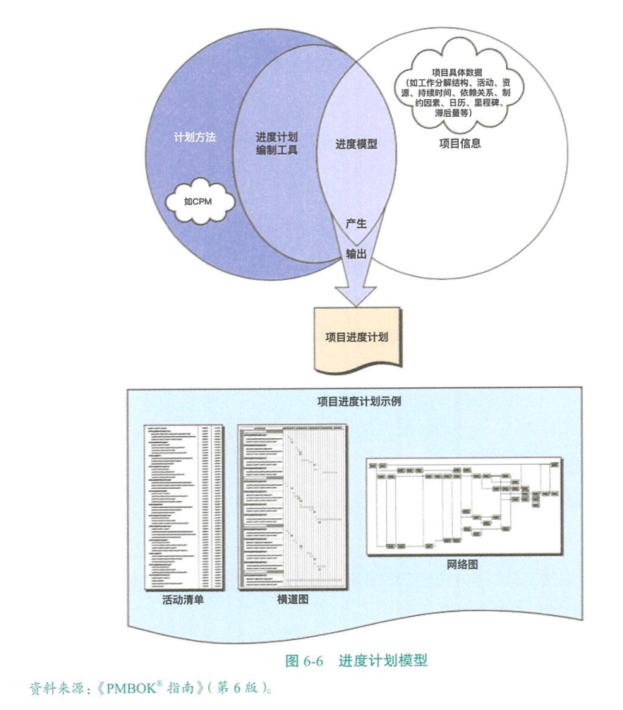

# 进度管理的“发展趋势和新兴实践”

**1.具有未完项的迭代进度计划**

**基于适应型生命周期的滚动式规划（如敏捷）**

- **做法：**

- 1. 需求记录在用户故事中
  2. 建造之前按优先级排序并优化用户故事
  3. 在规定时间盒内开发产品功能

- **适用于：**

- - 向客户交付增量价值
  - 多个团队并行开发大量内部关联较小的功能

- **好处：**

- - 允许在整个开发生命周期期间进行变更。

- 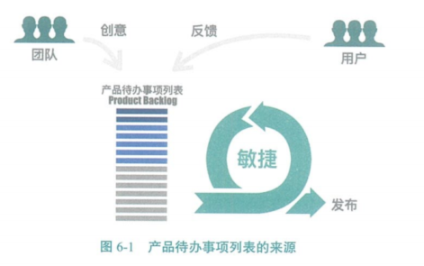

- 

- 

**2.按需进度计划**

基于制约理论和来自精益生产的拉动式进度计划

根据团队的交付能力来限制团队正在开展的工作

通常用于看板体系

- **做法：**

- - 在资源可用时立即从未完项和工作序列中提取出来开展

- **适用于：**

- - 在运营或持续环境中以增量方式研发产品
  - 任务的规模或范围相对类似
  - 可以按照规模和范围进行组合的工作

# 敏捷场景下的进度管理

**敏捷发布规划**

在敏捷发布规划中，软件是按版本发布的，每个版本由若干个迭代组成，每个迭代又包含了若干功能(用户故事)，每个功能可分解为若干个任务。

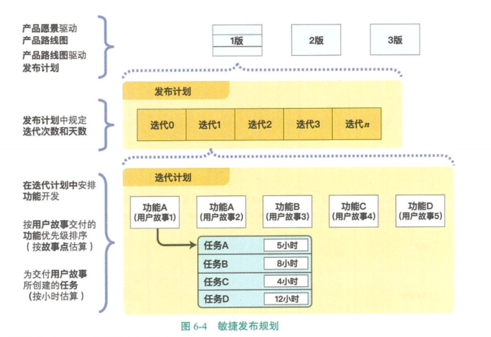

**洋葱圈规划**

在敏捷开发中，团队按照层次做滚动式规划，也叫洋葱圈规划。层次越低，周期越短，规划越细，如每日站会(1天)、sprint计划(1-4周)、版本计划(几周或几个月)、产品线路图计划(产品生命周期)、投资组合计划(组织战略周期)。

**在敏捷和适应性环境中需要考虑的因素**

- 适应型方法采用短周期来开展工作、审查结果，并在必要时做出调整。
- 通常表现为迭代进度计划和拉动式按需进度计划。
- 在大型组织中，可能同时存在小规模项目和大规模举措，需要制定长期路线图。
- 为管理大规模的、全企业系统的、完整的交付生命周期，可能需要采用预测型方法、适应型方法或两种方法的混合。
- 无论是采用预测型还是适应型，项目经理的角色都不变。
- 但要成功实施适应型方法，项目经理需要了解如何高效使用相关的工具和技术。

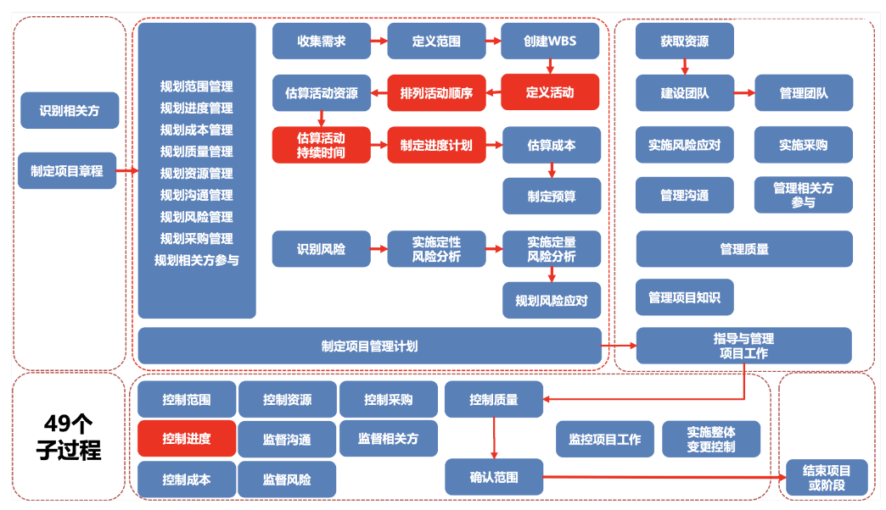

# 项目进度管理过程之一：规划进度管理（规划过程组）

**规划进度管理：**为规划、编制、管理、执行和控制项目进度而指定政策、程序和文档的过程。

**本过程的作用：**为如何在整个项目期间管理项目进度提供指南和方向。

## 输出：进度管理计划

**进度管理计划：**为编制、监督和控制项目进度建立准则和明确活动。进度管理计划中无进度。

包含的内容：

- **进度计划的发布和迭代长度：**使用适应型生命周期时，应指定固定时间的发布时段、阶段和迭代。固定时间段有助于尽可能减少范围蔓延。
- **准确度：**活动持续时间估算的可接受区间及允许的应急储备数量。比如：估算某活动的工期是 10±2 天。
- **计量单位：**每种资源的计量单位。比如：时间计量用“人天”，数量计量用吨、千米等等。
- **控制临界值：**项目执行中，采取某种措施前，允许出现最大**进度偏差(SV)**。通常用偏离基准计划中的参数的某个百分数来表示。
- **绩效测量规则：**需要规定用于绩效测量的挣值管理（EVM）规则或其他测量规则。

**挣值测量技术：固定公式法（适用工作量无法精确衡量来估算 EV）**

- 50/50 法则：开始计 50%，结束计另外 50%（保守，PMP 认证最常用）
- 20/80 法则：开始计 20%，结束计另外 80%（更加保守）
- 0/100 法则：开始计 0%，结束计 100%（最保守的）

# 项目进度管理过程之二：定义活动（规划过程组）

**定义活动：**定义活动就是把WBS中的工作包进一步分解为更小的单元--活动，我们可以更惊喜的评估活动的历时和所需资源。识别和记录为完成项目可交付成果而采取的具体行动的过程。

**本过程作用：**

- 将工作包分解为活动，作为对项目工作进行估算、进度规划、执行、监督和控制的基础。
- 工作包是 WBS 中最底层的可交付成果。
- 工作包通常还应进一步细分为更小的组成部分，即“活动”，代表着为完成工作包所需的工作投入。

## 输入：项目管理计划

**范围基准：**需明确考虑范围基准中的 WBS、可交付成果、制约因素和假设条件。

## 工具与技术：分解

**分解：**把项目范围和项目可交付成果逐步划分为更小、更便于管理的组成部分。

- WBS 中的每个工作包都需要分解成活动，以便通过这些活动来完成相应的可交付成果。
- 让团队成员参与分解过程，有助于得到更好、更准确的结果。

## 工具与技术：滚动式规划

**滚动式规划：**迭代式的规划技术，即详细规划近期要完成的工作，同时在较高层级上粗略规划远期工作。

滚动式规划是一**种渐进明细的规划方式**。适用于工作包、规划包以及采用敏捷或瀑布式方法的发布规划。

早期的战略规划阶段，信息尚不够明确，工作包只能分解到已知的详细水平；随着了解到更多的信息，近期即将实施的工作包就可以分解到具体的活动。

## 输出：活动清单

活动清单：包含项目所需的全部进度活动的综合清单，还包括每个活动的标识及工作范围详述。

使用滚动式规划或敏捷技术的项目，活动清单需要定期更新。

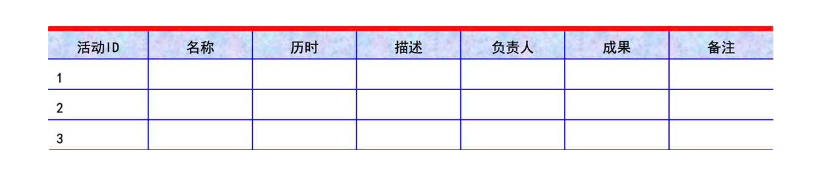

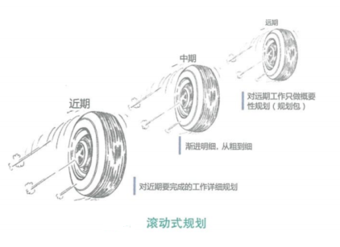

## 输出：里程碑清单

里程碑是重要的时间点或事件

里程碑可以是强制的或者是选择性的

里程碑与活动有相同的结构和属性，但是它不是活动，持续时间为零，只代表一个时间点。

## 输出：变更请求

一旦定义基准后，在将可交付成果**渐进明细为活动的过程中**，可能会**发现原本不属于项目基准的工作**，这样就会提出变更请求。对变更请求的处理要通过实施整体变更控制过程。

## 输出：项目管理计划更新

可能需要变更请求的项目管理计划组成部分包括：**进度基准、成本基准。**

# 项目进度管理过程之三：排列活动顺序（规划过程组）

**排列活动循序：**识别和记录项目活动之间的**关系**的过程。

**本过程的作用：**定义工作之间的**逻辑顺序**，以便在既定的**所有项目制约因素**下获得**最高的效率**。

## 工具与技术：紧前关系绘图法 PDM

**紧前关系绘图法（PDM、节点法、AON、前导图法、单代号法）：**创建进度模型的一种技术，用节点表示活动，用一种或多种逻辑关系连接活动，以显示活动的实施顺序。

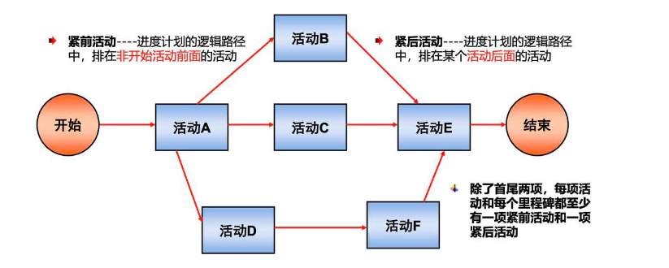

**紧前关系绘图法 PDM 的四种逻辑关系**

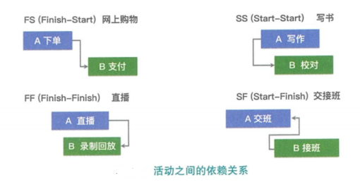

- **完成到开始（FS）：**只有紧前活动**完成**，紧后活动才能**开始**
- **完成到完成（FF）：**只有紧前活动**完成**，紧后活动才能**完成**
- **开始到开始（SS）：**只有紧前活动**开始**，紧后活动才能**开始**
- **开始到完成（SF）：**只有紧前活动**开始**，紧后活动才能**完成**

“完成到开始 FS”最常用，“开始到完成 SF”很少使用。

## 工具与技术：确定和整合依赖关系

**强制性依赖关系（硬逻辑、硬依赖）：**法律或合同要求的或工作的内在性质决定的依赖关系（项目团队不能违反）

**选择性依赖关系（首选逻辑、优先逻辑、软逻辑）：**基于最佳实践建立的、或基于项目的某些特殊性质而采用的依赖关系（项目团队可自由选择）

如果打算**快速跟进**，应对**审查**相应的选择性**依赖关系**。

**内部依赖关系：**项目活动与非项目活动之间的依赖关系（项目团队不可控）

**内部依赖关系：**是项目活动之间的紧前关系（项目团队可控）

可两两组合形成：**强制性外部关系**、**强制性内部关系**、**选择性外部关系**、**选择性内部关系**。

## 工具与技术：提前量和滞后量

在活动之间依赖关系的基础上，增加的间隔时间被称为滞后量（lag），减少的间隔时间被称为提前量（lead）

**提前量（Lead）：**相对于紧前活动，紧后活动可以提前的时间量。（往往表示为负滞后量，如 FS-3）

**滞后量（Lag）：**相对于紧前活动，紧后活动必须推迟的时间量。（如 FS+3）

提前量和滞后量的使用不能替代进度逻辑关系，**活动持续时间**估算中不包括任何提前量或滞后量。

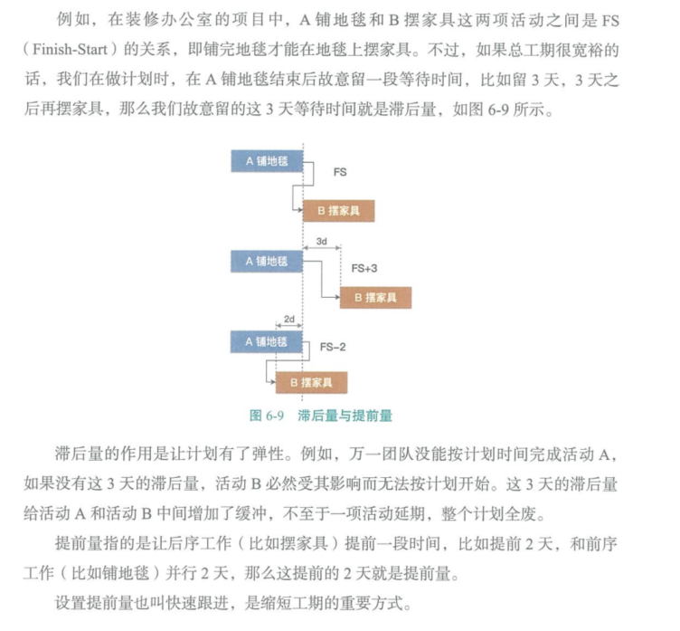

## 输出：项目进度网络图

前导图法（Precedence Diagramming Method，PDM），也称紧前关系绘图法，是用于编制项目进度网络图的一种方法，它使用方框或者长方形（被称作节点）代表活动，节点之间用箭头连接，以显示节点之间的逻辑关系。

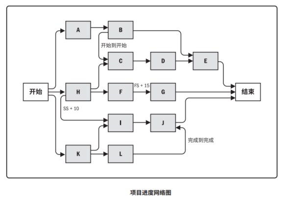

- **路径汇聚：**带有多个紧前活动的活动（如活动 I）
- **路径分支：**带有多个紧后活动的活动（如路径 K）

带汇聚和分支的活动受到多个活动的影响或能够影响多个活动，因此存在更大的风险。

**帕金森定律：**20 世纪管理学界三大经验式定律之一

**帕金森定律：**只要还有时间，人们就会有意无意地多做不必要的工作（范围蔓延），直到用完所有的时间。

**学生综合征：**工作范围通常不变，人们在较早的时间完全不做事或者很少做事，总要等到截止日期快到时才着急做。

**墨菲定律**：20 世纪管理学界三大经验式定律之二；有可能出错的事情，就会出错。

**彼得定律：**20 世纪管理学界三大经验式定律之三；工作岗位总是被不能胜任的人占据的。

**学习曲线：**表示了经验与效率之间的关系，指的是越是经常地执行一项任务，每次所需的时间就越少（熟能生巧）。

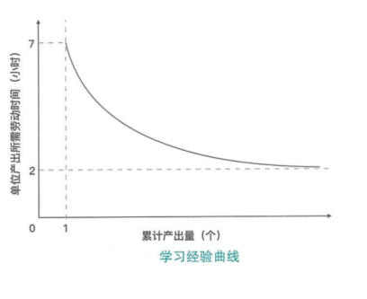

# 项目进度管理过程之四：估算活动持续时间（规划过程组）

**估算活动持续时间：**根据**资源估算的结果**，估算完单项活动**所需工作时间段数**（也叫工期）的过程。

- 应该由项目团队中**最熟悉具体活动的个人或小组**，来提供活动持续时间估算所需的各种输入。
- 注意：向某个活动**新增资源或分配低技能**资源，就需要**增加沟通、培训和协调**工作。从而可能导致活动效率或生产率下降，以致需要更长的持续时间。

**估算活动持续时间需考虑的其他因素：**

**边际收益递减规律：**在保持其他因素不变的情况下，增加一个用于确定单位产出所需投入的因素（如资源）会最终达到一个临界点，在该点之后的产出或输出会随着增加这个因素而递减。

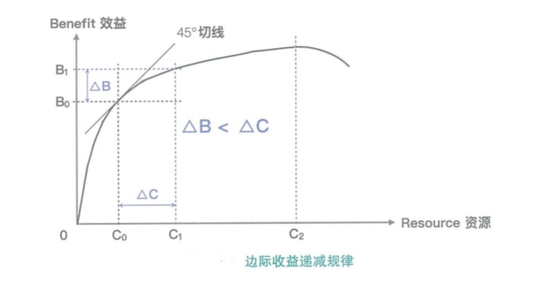

**资源数量：**增加资源数量，不一定能缩短时间。可能会因为风险造成持续时间增加，也可能因为对于增加的资源，需要知识传递、学习曲线、额外合作等因素造成持续时间增加。

**技术进步**

**员工激励：**估算时还需要考虑“学生综合征”和“帕金森定律”。

资源管理工具：

- 资源日历：资源日历反映的是团队资源的时间占用情况。

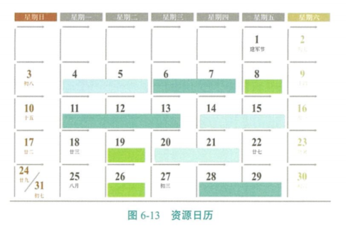

- 资源直方图：反映了某一种资源

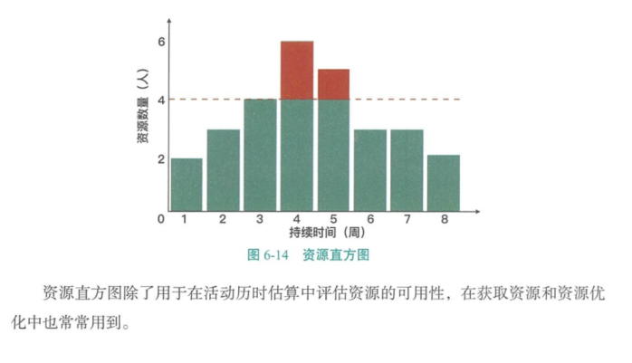

## 工具与技术

活动历时估算方法包括专家判断、类比估算、参数估算、三点估算、自下而上估算。

**专家判断：**这类活动最好由经验丰富的人来进行估算。需要注意，专家也有可能存在偏见，甚至估算失误。

**类比估算：**相似活动、历史数据、也是一种专家判断、也是整体估算、也是自上而下的、成本较低、耗时较少，准确性也较低、项目详细信息不足时、在启动阶段。

**参数估算：**历史数据、项目参数、统计关系、参数模型、基础数据、公式。

**三点估算：**考虑不确定性和风险、计划评审技术 PERT、最乐观时间(O)、最可能时间(M)、最悲观时间(P)3个持续时间来计算概率分布均值(期望值)。

- β分布：期望值=(O+4M+P)/6

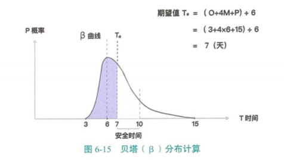

- 三角分布：期望值=(O+M+P)/3

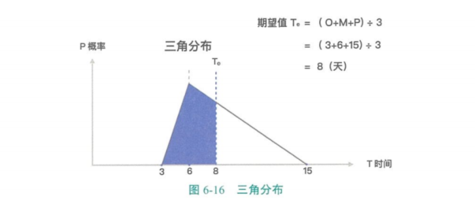

- 正态分布：

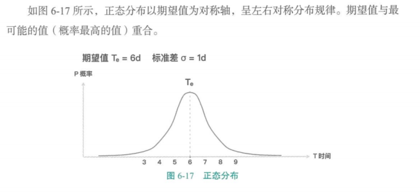

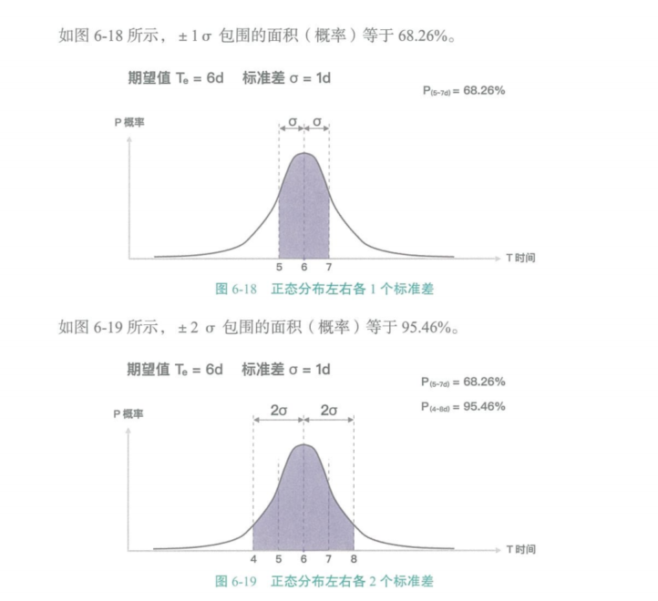

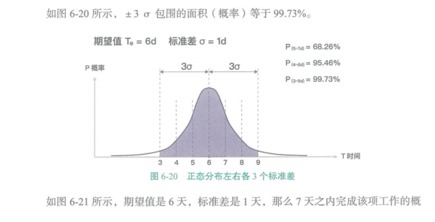

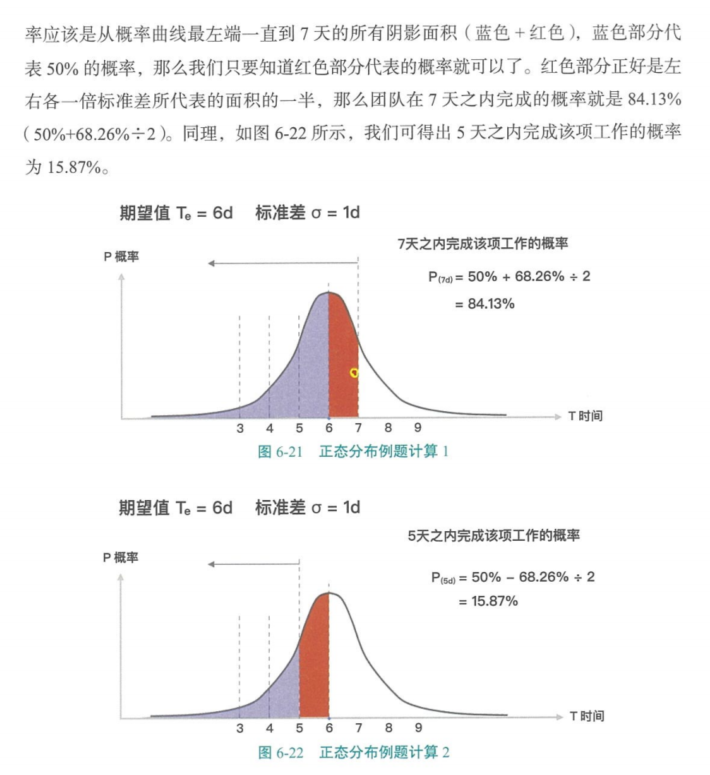

**自下而上估算：**基于项目工作分解结构WBS，从每个活动历时估算开始，从下到上、逐层汇总、成本较高、耗时较多。

**数据分析：**

- - 备选方案分析：比较不同、有助于权衡、确定最佳方式。
  - 储备分析：应急储备（已知 - 未知）、管理储备（未知 - 未知）。

**决策：**

- - 投票：举手表决（常用于敏捷）、达成共识或同意进入下一个决定。

**会议：**

- - 敏捷中：冲刺或迭代计划会议、未完项。

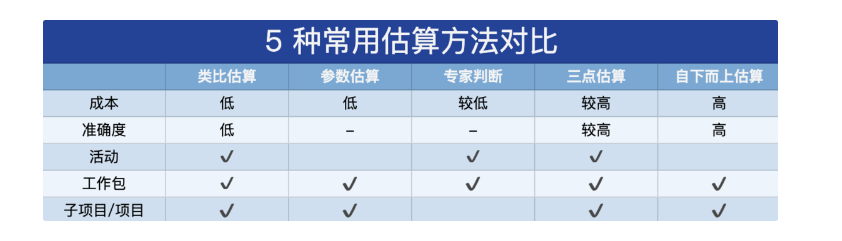

## 工具与技术：储备分析

**应急储备：**是包含在进度基准中的一段持续时间，用来应对已经接受的已识别风险。（已知 - 未知）

**管理储备：**是为管理控制的目的而特别留出的项目预算，用来应对项目范围中不可预见的工作。（未知 - 未知）

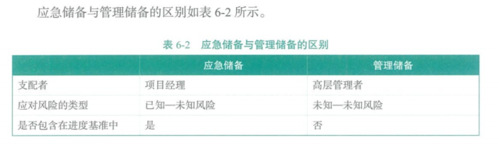

## 工具与技术：三点估算

**三点估算：**源自计划评审技术（PERT）。考虑估算中的不确定性和风险，来提高估算的准确性。

**三个估算值：**最可能时间（M）、最乐观时间（O）、最悲观时间（P）。

**两种假定分布：**

- - 三角分布：期望值（平均值）（Te）=（最悲观 P + 最乐观 O + 最可能 M）/ 3
  - β(贝塔)分布：期望值（平均值）（Te）=（最悲观 P + 最乐观 O + 最可能 M*4）/ 6

例如，一项活动最乐观时间（O）为 3 天，最可能时间（M）为 6 天，最悲观时间（P）为 15 天。

**β分布**结果为 7 天。

**三角分**布结果为 8 天。

**正态分布**以期望值作为对称轴，成左右对称分布规律。期望值与最可能的值（概率最高的值）重合。

## 输出

**持续时间估算：**持续时间估算是对完成某项活动、阶段或项目所需的工作时间段数的定量评估，其中并不包括任何滞后量但可指出一定的变动区间。例如：

- - 2 周 ±2 天：表明活动至少需要 8 天，最多不超过 12 天（假定每周工作 5 天）；
  - 超过 3 周的概率为 15%，表明该活动将在 3 周内（含三周）完工的概率为 85%。

**估算依据：**应该清晰、完整地说明持续时间估算是如何得出的。

# 项目进度管理过程之五 - 制定进度计划（规划过程组）

**指定进度计划：**分析活动顺序、持续时间、资源需求和进度制约因素、创建进度模型，从而落实项目执行和监控的过程。

**本过程的作用：**未完成项目活动而制定具体计划日期的进度模型。

## 工具与技术：进度网络分析

**进度网络分析：**是创建项目进度模型的一种综合技术，它采用了其他几种技术，例如关键路径法、资源优化技术、建模技术。

当多个路径在同一时间点汇聚或分叉时，评估汇总进度储备的必要性，以减少出现进度落后的可能性。

审查网络，看关键路径是否存在高风险活动或具有较多提前量的活动，是否需要降低关键路径的风险。

## 工具与技术：关键路径法 CPM

研究如何在减少工期的情况下，尽可能的减少增加费用。

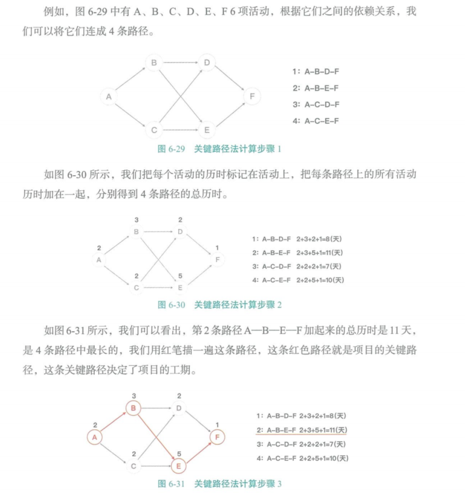

关键路径：ABEF

关键路径不仅可以版主我们判断哪条路径决定总工期，而且，学会关键路径参数计算，还能获得很多有价值的信息。

关键路径参数计算

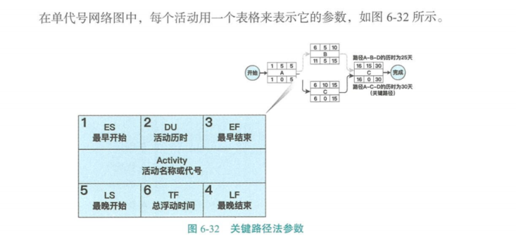

1. 最早可以开始时间（Earliest Start Time，ES）
2. 活动历时（Duration，DU）
3. 最早可以结束时间（Earliest Finish Time，EF）
4. 最晚必须结束时间（Latest Finish Time，LF）
5. 最晚必须开始时间（Latest Start Time，LS）
6. 总浮动时间（Total Float，TF）：不至于延误项目完工日期。体现进度灵活性。
7. 自由浮动时间（Free Float）：不延误任何紧后活动最早开始时间

**7 格图计算活动的日期**

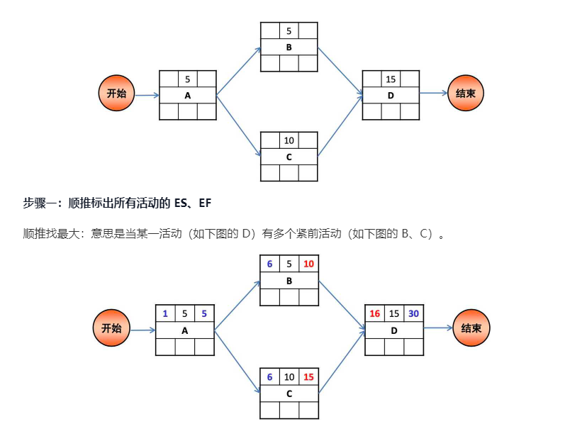

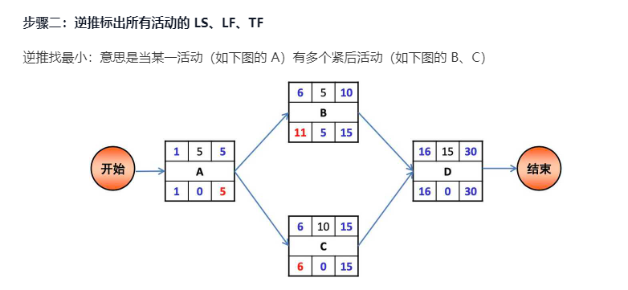

**步骤三：根据最终结果得出一些结论**

- 结论一：根据时间最长的活动顺序，可以找到关键路径：ACD=30 天（最短工期）
- 结论二：各活动的 TF：A-0；B-5；C-0；D-0；此题关键活动的 TF 都为 0
- 结论三：个活动的 FF：A=6-5-1=0；B=16-10-1=5；C=16-15-1=0

**关键路径法 CPM 总结**

- 关键路径是项目中时间最长的活动顺序，决定着可能的项目最短工期。
- **总浮动时间：**活动延期但不至于延误项目完工日期。**体现进度灵活性**。
- **自由浮动时间：**活动延期但不延误任何紧后活动最早开始日期。
- 关键路径的总浮动时间可能是**正值**、**零或负值**。
- 关键路径可能存在多条，关键路径越多，风险越大。（次关键路径与关键路径越接近，风险越大）
- 关键路径上的活动被称为关键路径活动。
- **关键路径法**排出来的进度计划未必可行，关键路径法**不考虑资源约束**，**需要**配合**资源平衡**处理。
- 关键路径不考虑资源约束，只是考虑路径约束。

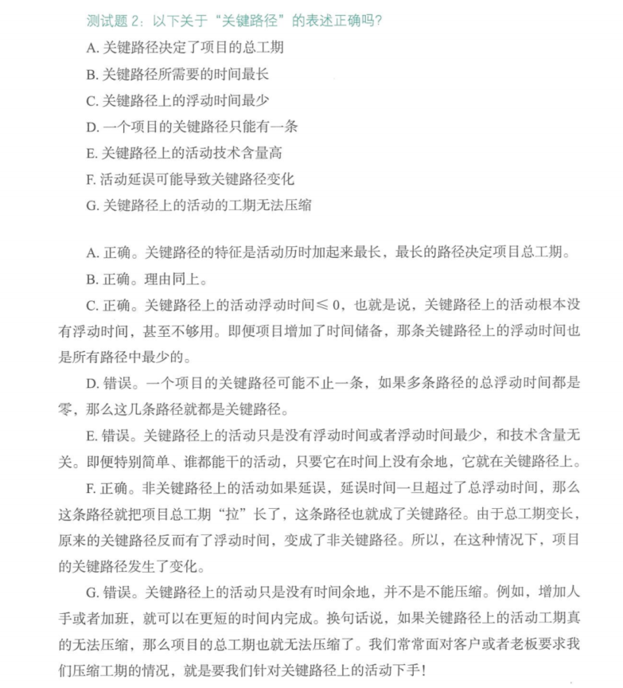

## 工具与技术：资源优化

**资源优化技术：**根据资源供需情况，来调整模型的技术。包括**“资源平衡”和“资源平滑”**。

**资源平衡：**根据资源制约对开始日期和结束日期进行调整的一种技术。

**需要资源平衡的情况：**

1. 资源只在**特定时间可用**
2. 资源**数量有限**
3. 资源被**过渡分配**（如一个资源在同一时间段内被分配至多个活动）
4. 也可以为保持资源使用量**处于均衡水平**而**进行资源平衡**（减少资源负荷的变化）

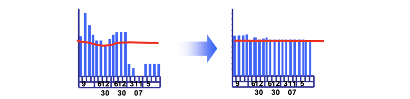

资源平滑往往**导致关键路径改变，通常是延长。**

理想情况下，资源平衡应作用于非换件路径上的活动。

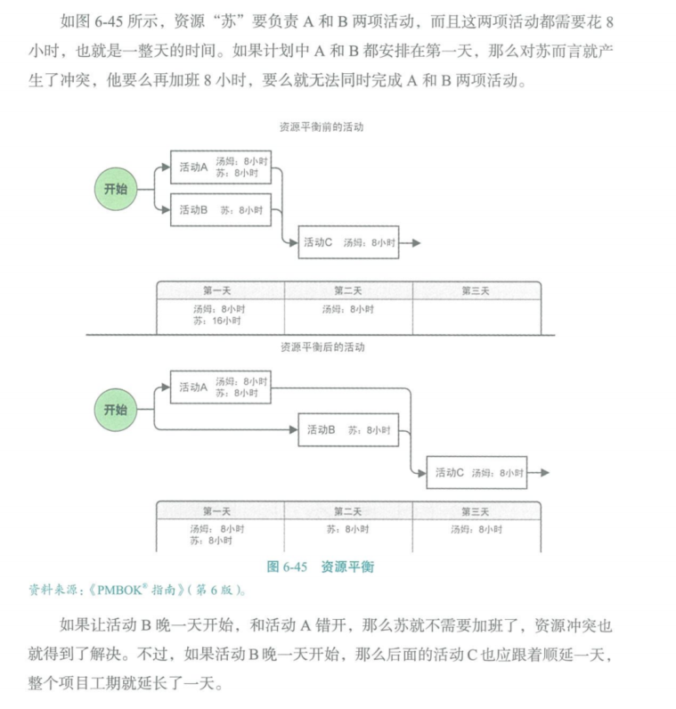

**资源平滑：**对活动进行调整，使项目资源需求不超过预定的资源限制的技术，活动只在其自由和总浮动时间内延迟，所以该技术可能无法实现所有资源的优化。

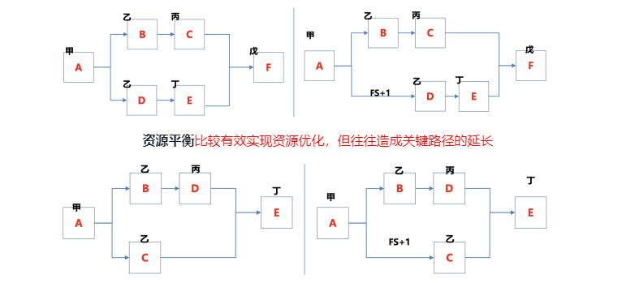

**资源平滑**不会改变关键路径，但是无法实现所有的优化。通俗地说，要看命好不好，能不能“滑”

## 工具与技术：数据分析

**假设情景分析：**对各种情景进行评估，预测他们对项目目标的影响（积极或消极的）。

对“如果情景 X 出现，情况会怎样？”这样的问题进行分析。即基于已有的进度计划，考虑各种各样的情景。

根据假设情景分析的结果，评估项目进度计划在不利条件下的可行性，以及为应对意外情况的影响而编制进度储备和应对计划。

**模拟：**把单个项目风险和不确定性的其他来源模型化的方法，以评估它们对项目目标的潜在影响。

常用的模拟技术是蒙特卡洛分析。

## 工具与技术：提前量和滞后量

- 通过调整紧后活动的开始时间来编制一份切实可行的进度计划。
- **提前量**用于在条件许可的情况下提早开始紧后活动。
- **滞后量**是在某些条件下，在紧前和紧后活动之间增加一段不需工作或资源的自然时间。

## 工具与技术：进度压缩

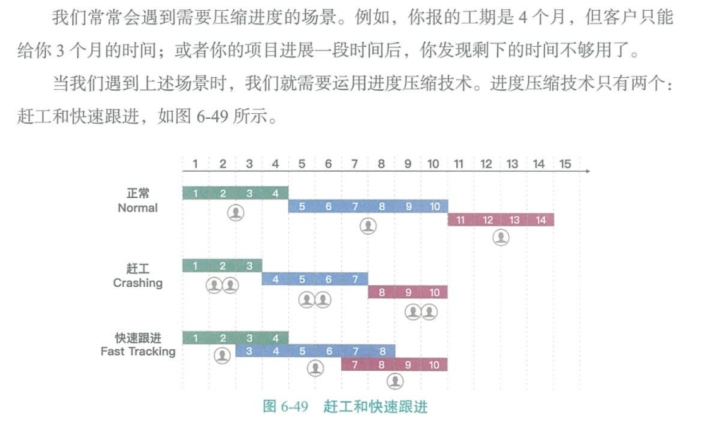

**进度压缩：**不缩减项目范围的前提下，缩短或加快进度工期（进度压缩之后要进行关键路径分析，防止出现新的关键路径）。进度压缩包括以下两种方式：

**赶工：**通过增加资源（加人或加班），以最小的成本增加来压缩进度工期。其技术原理是用钱换时间；可能导致成本和/或风险的增加。

- - 赶工**只适用**于那些通过**增加资源就能缩短持续时间的**，且位于**关键路径上**的活动。

**快速跟进：**按顺序进行的活动或阶段改为**至少是部分并行**开展。可能造成**返工和风险增加**。

- - 快速跟进**只适用**于相互为**选择性依赖关系**的活动。

## 工具与技术：项目管理信息系统 PMIS

用进度计划软件，自动生成开始和完成日期，从而加快进度计划的编制过程。

## 工具与技术：敏捷发布原则

- 基于项目路线图和产品发展愿景，提供了高度概括的发布进度时间轴（通常是 3 到 6 个月）
- 确定了发布的迭代或冲刺数，使产品负责人和团队能确定达到产品放行所需的时间。
- 对客户而言，产品功能就是价值，因此，该时间轴定义了每次迭代结束时交付的功能，提供了易于理解的项目进度计划，而这些就是客户真正需要的信息。

## 输出：进度基准

**进度基准：**经相关方接受和批准的进度模型，包含了基准的开始/结束日期等信息，只有通过正式的变更控制程序才能进行变更，用作与实际结果进行比较的依据。

## 输出：项目进度计划

**项目进度计划：**进度模型的输出，展示活动之间的的相互关联，以及计划日期（至少要有）、持续时间、里程碑和所需资源。有三种层次的进度计划（详细程度由低到高）

