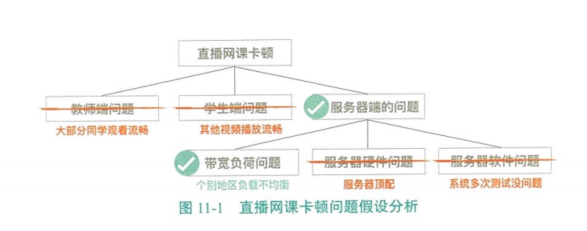
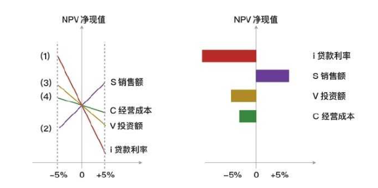
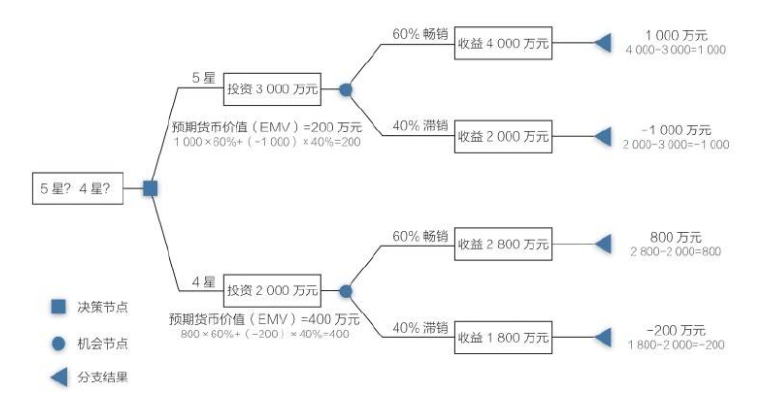

[TOC]

# 第十一章 项目风险管理

# 项目风险管理的核心概念

## 什么是项目风险

**项目风险：**是一种不确定的事件或条件，一旦发生，就会对一个或多个项目目标造成积极或消极的影响。

**风险的三要素：风险事件、概率、影响**

积极和消极风险通常被称为机会和威胁。

## 两个层面的风险

**单个项目风险：**一旦发生，会对一个或多个项目目标产生正面或负面影响的不确定事件或条件。

**整体项目风险：**不确定性对项目整体的影响，是相关方面临的项目结果正面和负面变异区间。

- 整体项目风险大于项目中单个风险之和，因为整体风险源于包括单个风险在内的所有不确定性。

## 三种性质的项目风险

**“已知 - 已知”风险：**已识别，可对这些风险规划应对措施。（计入时间/成本）

**“已知 - 未知”风险：**已识别，但无法（或不需要）主动管理的风险，**分配应急储备。**

**“未知 - 未知”风险：**未识别，无法进行主动管理，因此需要预留一定的**管理储备。**

## 影响风险态度的因素

**风险偏好：**为了预期和回报，一个实体愿意承受不确定性的程度。（愿不愿意承受）

**风险承受力：**组织或个人能承受的风险程度、数量或容量。（能不能承受）

**风险临界值：**反映了组织与项目相关方的风险偏好程度，是项目目标的可接受的变异程度。（要不要管理）

较为合适且正确的做法是如下排列：风险承受力 > 风险偏好 > 风险临界值。

## 什么是风险态度

**风险态度：**个人或组织认为自己应该冒多大的风险。如果实际所冒风险未超出应该冒的风险，就觉得很舒服。个人和团体的风险态度影响其应对风险的方式。

**风险冒进者：**常常采用“接受”的策略。

# 项目风险管理的发展趋势和新兴实践

## 非事件类风险

**传统关注：**

- - **事件类风险：**可能发生或可能不发生的不确定性未来事件的风险。

发展趋势：

- - **非事件类风险：**变异风险、模糊性风险。

**变异风险：**

- - **定义：**已规划事件、活动或决策的某些关键方面存在不确定性，就导致变异性的风险。
  - **举例：**计划一个工人刷 100 平米的墙需要 8 小时。实际上可能需要 6 小时、7 小时、9 小时、10 小时...
  - **处理策略：**蒙特卡洛模拟

**模糊性风险：**

- - **定义：**对未来可能发生什么、存在不确定性。
  - **举例：**不太了解需求或技术解决方案，不太了解项目内在的系统复杂性。
  - **处理策略：**外部专家意见、标杆对照、迭代、增量、模拟、原型等。

## 项目韧性

**项目韧性：**确实存在只有发生后才能被发现的突发性风险，需要通过加强项目韧性来应对。

**应对思路：**

- - 留出储备
  - 灵活的变更管理机制
  - 足够授权、值得信赖的团队
  - 关注早期风险信号
  - 沟通相关方，明确面对突发可采取的策略的范围

## 整合式风险管理

在较高层面识别出的某些风险，将被授权给项目团队去管理

而在较低层面识别出的某些风险，又可能上交给较高层面去管理

应该采用协调式企业级风险管理方法，来确保所有层面的风险管理工作的一致性和连贯性

# 在敏捷和适应型环境中需要考虑的因素

要应对快速变化，就需要采用适应型方法管理项目

即：通过跨职能项目团队和经常审查增量式工作产品，来加快知识分享，确保对风险的认识和管理

在选择每个迭代期的工作内容时，应该考虑风险；在每个迭代期间应该识别、分析和管理风险。

应该根据对当前风险敞口的理解的加深，定期更新需求文件，并随项目进展重新排列工作优先级。

# 项目风险管理过程之一：规划风险管理（规划过程组）

**规划风险管理：**定义如何实施项目风险活动的过程。

**本过程的作用：**确保风险管理的水平、方法和可见度与项目风险程度，及项目对组织和其他相关方的重要程度的匹配。

## 输入：项目章程和项目文件

**项目章程：**项目章程中有高层级的风险。

**相关方登记册：**包含项目相关方的详细信息，并概述其在项目中的角色和对项目风险的态度；可用于确定项目风险管理的角色和职责，以及为项目设定风险临界值。

## 工具与技术：数据分析

**相关方分析：**通过相关方分析确定相关方的风险偏好。

## 输出：风险管理计划

**风险管理计划：**描述如何安排与实施风险管理活动。（风险管理计划无风险）

**管理计划的内容：**

- 风险管理战略、方法论、资金、时间安排

- **角色与职责：**确定项目风险管理活动的领导者、支持者和团队成员，并明确他们的职责。

- **风险类别：**确定单个项目风险进行分类的方法，通常借助风险分解结构（RBS）来构建风险类别。

- - **风险分解结构（RBS）：**是潜在风险来源的层级展现。有助于项目团队考虑单个风险的全部可能来源，对识别风险或归类已识别风险特别有用。

- **相关方风险偏好：**应该针对每个项目目标，把相关方的风险偏好表述成可测量的风险临界值。

- **风险概率和影响定义：**根据具体的项目环境、组织和关键相关方的风险偏好和临界值，来制定风险概率和影响定义。项目可能自行制定具体定义，或者用组织提供的通用定义作为出发点。

- **概率和影响矩阵：**把每个风险发生的概率和一旦发生对项目目标的影响映射起来的表格。通常由组织来设定概率和影响的各种组合，并据此设定高、中、低风险级别。

- 报告格式、跟踪

**规划风险管理 - 风险分解结构 RBS**

如表11-2所示，风险分解结构(RBS)是指将识别出来的风险分类、分级并编号，按照编码录入项目管理信息系统，方便与工作分解结构(WBS)中的单元对应。例如，2.1.2的工作包中存在编号为1.2.2的风险。 

需要注意的是，风险类别中的已知/未知风险、内部/外部风险、商业/可保险风险是风险分类的三个不同维度，它们之间并非并列关系。例如，新型冠状病毒肺炎疫情属于未知风险，同时它也属于外部风险。 

**风险影响的定义（概率的定义也是类似定义）**

**概率和影响矩阵**

# 项目风险管理过程之二：识别风险（规划过程组）

**识别风险：**识别单个项目风险以及正整体项目风险的来源，并记录风险特征的过程。

**本过程的作用：**

- 记录现有单个项目风险，以及整体项目风险的来源
- 汇集相关信息，以便项目团队能够恰当应对已识别的风险
- 应鼓励所有项目相关方参与单个项目风险识别的工作
- 项目团队的参与尤其重要，以便培养和保持他们对风险管理的主人翁意识和责任感
- 可以在识别风险过程中为单个项目风险指定风险负责人，待实施定性风险分析过程确认
- 可以识别和记录初步的风险应对策略，待规划风险应对过程审查和确认
- 识别风险是一个迭代的过程，迭代的频率和每次迭代所需的参与程度应在风险管理计划中做出规定

## 工具与技术：数据收集

**头脑风暴：**可以采用自由或结构化的形式开展头脑风暴，在引导者的指引下产生各种创意。可以用风险类别（如 RBS）作为识别风险的框架。

**核对单（有具体的风险）：**

- 是包括需要考虑的项目、行动或要点的清单，常被用作提醒。
- 基于从类似项目和其他信息来源积累的历史信息和知识来编制核对单。
- 因不能穷尽所有风险，所以必须确保不要用核对单来取代所需的风险识别工作。另外也应该注意考察未在核对单中列出的事项。

## 工具与技术：数据分析

**根本原因分析：**

- - **问题陈述**作为出发点，**识别威胁**
  - **收益陈述**作为出发点，**识别机会**
  - 常用语发现导致问题的**深层原因**并**制定预防措施。**

**假设条件和制约因素分析：**

- - 从假设条件的不准确、不稳定、不一致或不完成，识别威胁
  - 通过清除或放松会影响项目过程执行的制约因素，创造机会

**系统或过程流程图：**

**SWOT 分析：**

- - 优势 - Strength、劣势 - Weakness、机会 - Opportunity、威胁 - Threat

1. 1. 关注项目、组织或一般业务领域，识别出组织的优势和劣势

   2. 找出优势可能会带来机会，劣势可能造成威胁

   3. 分析优势能在多大程度上克制威胁，劣势是否会妨碍机会产生

      

      

## 工具与技术：人际关系与团队技能

**引导：**能提高用于识别单个项目风险和整体项目风险来源的许多技术的有效性。

## 工具与技术：提示清单

**提示清单：**是关于可能引发单个项目风险以及可以作为整体项目风险来源的风险类别的预设清单。

可以用风险分解结构（RBS）底层的风险类别作为提示清单。

**识别耽搁项目风险的框架：**提示清单

**识别整体项目风险的框架：**

- - PESTLE：挣值、经济、社会、技术、法律、环境
  - TECOP：技术、环境、商业、运营、政治
  - VUCA：易变性、不确定性、复杂性、模糊性

## 输出：风险登记册

**风险登记册：**记录已识别单个项目风险的详细信息。

随着其他风险管理过程的实施，风险登记册还将包括这些过程的输出，其中的信息种类和数量也就逐渐增加。

风险登记册的编制始于识别风险的过程。

**完成识别风险的过程时，风险登记册包括如下信息：**

- **已识别风险清单：**要以所需的详细程度对已识别风险进行描述，确保明确理解。
- **潜在风险责任人：**记录识别出的潜在风险责任人，随后由实施定性风险分析过程进行确认。
- **潜在应对措施清单：**记录识别出的潜在风险应对措施，随后由规划风险应对过程进行确认。

## 输出：风险报告

**风险报告：**提供关于整体项目风险的来源、已识别的单个项目风险的概述信息。编制需要渐进式。

# 项目风险管理过程之三：实施定性风险分析（规划过程组）

**实施定性风险分析：**通过评估单个项目风险发生的概率和影响以及其他特征，对风险进行优先级排序，从而为后续分析活性多提供基础的过程。

**本过程的作用：**重点关注高优先级的风险

- 由于相关方对风险的感知程度不同，因此会导致评估时出现主观的偏见。克服的方法是：

1. 1. 注意找出偏见并加以纠正
   2. 评估单个项目风险的现有信息的质量

另外，本过程还会确认每个风险责任人，这个人负责后续的工作，包括制定和落实应对措施。

在**整个项目生命周期中**要**定期开展**实施定性风险分析过程

在**敏捷**开发环境中，实施定性风险分析过程通常要在**每次迭代开始前进行**

本过程完成后，可进入实施定量风险分析过程或**直接进入规划风险应对过程**

## 工具与技术：数据分析

**风险数据质量评估：**旨在评价关于单个项目风险的数据的准确性和可靠性

- - 可以开展问卷调查，了解项目相关方对数据质量各方面的评价。
  - 可以计算数据的完整性、客观性、相关性和及时性等方面的加权平均数，作为数据质量的总体分数

**风险概率和影响评估**

- - 风向概率评估考虑的是特定风险发生的可能性
  - 风险影响评估考虑的是风险对项目目标（如进度、成本、质量或绩效）的潜在影响（消极和积极）

对已识别的每个风险都要进行概率和影响评估

可以选择熟悉相应风险类别的人员，以访谈或会议的形式进行风险评估

低概率和影响的风险将被列入风险登记册中的观察清单，以供未来监控。

**其他风险参数评估：**紧迫性、邻近性、潜伏期、可管理性、可控性、可监测性、连通性、战略影响力、密切度等。考虑这些特征有助于进行更稳健的风险优先级排序。

## 工具与技术：风险分类

可按照不同的分类标准对项目风险分类，以确定哪些项目领域最容易被不确定性影响。

**风险分类标准：** 1 RBS；2 WBS；3 项目阶段、预算、角色和职责；4 共同的根本原因；

**对风险进行分类、有助于：**

1. 1. 把注意力和精力集中到风险敞口最大的领域
   2. 针对一组相关的风险制定通用的风险应对措施

## 工具与技术：数据表现

**概率和影响矩阵：**此矩阵对概率和影响进行组合，以便于把单个项目风险划分成不同的优先级组别

- 采用风险管理计划中规定的风险概率和影响定义，逐一对单个项目风险的发生概率及其对一项或多项项目目标的影响进行评估。再基于所得到的的概率和影响的组合，使用概率和影响矩阵，来分配风险的优先级别。

**层级图：**如使用了两个以上的参数对风险进行分类，则不能使用概率和影响矩阵，而需要使用其他的图形。

- 如：气泡图（X 轴值、Y 轴值和气泡大小来表示风险的三个参数）

# 项目风险管理过程之四：实施定量风险分析（规划过程组）

**实施定量风险分析：**就已识别的单个项目风险和不确定性的其他来源来源对整体项目目标的影响进行定量分析的过程。

**本过程的作用：**量化整体项目风险敞口，并提供额外的定量风险信息，以支持风险应对规划。

并非所有项目都需要实施定量风险分析，它最可能使用的的情况如下：

1. 1. 大型或复杂的项目
   2. 具有战略重要性的项目
   3. 合同要求进行定量分析的项目
   4. 主要相关方要求进行定量分析的项目

如要评估所有单个项目风险对项目整体的综合影响，定量风险分析就成为唯一可靠的方法。

实施定量风险分析的对象，是在定性分析过程中被评估为对项目目标存在重大潜在影响的，并且能被量化的单个项目风险的信息。

定量风险分析也可以在规划风险应对过程之后展开，以分析已规划的应对措施对降低整体项目风险敞口的有效性。

## 工具与技术：数据收集

**访谈：**当需要向专家征求信息时，访谈尤其适用。

访谈者应该营造信任和保密的访谈环境，以鼓励被访者提出诚实和无偏见的意见。

## 工具与技术：不确定性表现方式

如果活动的持续时间、成本或资源需求是不确定，就可以在模型中用概率分布（如三角分布、正态分布、对数正态分布、贝塔分布、均匀分布或离散分布）来表示其数值的可能区间。

## 工具与技术：数据分析 - 模拟

**模拟**（是单变量反复模拟）：通常采用蒙特卡洛分析。

- **输入：**成本、进度网络图、持续时间估算
- **处理（随机选择）**：**蒙特卡洛分析**、计算机软件数千次迭代运行。
- **输出：**次数的直方图、累计概率分布、S 曲线

**关键性分析：**对项目进度进行蒙特卡洛模拟时，计算风险模型中的每个活动出现在关键路径上的次数和评率。出现频率高的那些活动，我们要重点关注，并规划风险应对措施。这个频率也可以称为“关键性指标”。

## 工具与技术：数据分析 - 敏感型分析

**敏感性分析（是一种单因素分析）：**有助于确定哪些风险对项目具有**最大的潜在影响**。它有助于理解**项目结果变异**与**定量风险分析模型中的要素变异**之间存在怎样的联系。

把所有**其他不确定因素固定在基准值**，考察**每个因素的变化**会对项目产生多大程度的影响

敏感性分析的典型表现形式是**龙卷风图**（用于比较很不确定的变量与相对稳定的变量之间的相对重要性和相对影响）

## 工具与技术：数据分析 - 决策树分析

**决策树分析：**用决策树在**若干备选行动方案中选择一个最佳方案。**不同的分支代表不同的决策或事件。

在决策树分析中，通过计算每条分支的**预期货币价值（EMV）**，就可以选出最优的路径。

- **机会**的 EMV 通常表示为**正值**，而**威胁**的 EMV 则表示为**负值。**
- EMV 是**建立在风险中立的假设之上**的，**既不避险，也不冒险。**

## 工具与技术：数据分析 - 影响图

**影响图：不确定条件**下决策制定的图形辅助工具。是对变量与结果之间的因果关系、事件时间顺序及其他关系的图形表示。

影响图分析，可以得出类似于其他定量风险分析的结果，如 S曲线图和龙卷风图。

## 输出：项目文件更新

更新风险报告，反应定量风险分析的结果

- 对整体项目风险敞口的评估结果
- 项目详细概率分析的结果
- 单个项目风险优先级清单
- 定量风险优先级清单
- 风险应对建议

# 项目风险管理过程之五：规划风险应对（规划过程组）

**规划风险应对：**为处理整体项目风险敞口，以及应对单个项目风险，而制定可选方案、选择应对策略并商定应对行动的过程。

**本过程的作用：**

制定应对整体项目风险和单个项目风险的适当方法。

分配资源，并根据需要将相关活动添加进项目文件和项目管理计划。

**风险应对措施必须：**

1. 1. 与风险的重要性相匹配
   2. 能经济有效地应对挑战
   3. **现实可行**
   4. 能获得**全体相关方的同意**
   5. 由一名责任人具体负责（**风险应对责任人**）

如果选定的策略并不完全有效，或者发生了已接受的风险，就需要制定**应急计划（或弹回计划）**

**次生风险：**实施风险应对措施而直接导致的风险。规划风险应对时，需要**识别次生风险。**

往往需要为风险**分配**时间或成本**应急储备**，并可能需要说明动用应急储备的条件。

## 工具与技术：威胁应对策略

**上报：**

- - **定义：**被上报的风险将在项目集层面、项目组合成眠或组织的其他相关部门加以管理，而不再项目层面。
  - **举例：****上报给其目标会受该威胁影响的那个层级（一旦上报，项目团队不再进一步监督）**
  - **注意点：**对于被上报的威胁，组织中的相关人员**必须愿意承担应对责任。**

**规避：**

- - **定义：**指项目团队采取行动来**消除威胁**，或保护项目免受威胁的影响**（将发生概率降低到零）**
  - **举例：延长进度、改变策略、缩小范围、澄清需求、获取信息、改善沟通、取得专有技能**
  - **注意点：**适用于**发生概率较高**，且具有**严重负面影响**的**高优先级**威胁

**转移：**

- - **定义：**将应对威胁的**责任转移**给第三方，让**第三方**管理风险并**承担威胁**发生的影响。
  - **举例：保险、使用履约保函、担保、保证书、外包**
  - **注意点**：通常需要**支付风险转移费用**。转移风险是把风险管理责任简单地推给另一方，而并**非消除风险。**

**减轻：**

- - **定义：**采取措施降低威胁发生的概率和（或）影响
  - **举例：采用较简单的流程、进行更多测试、选用更可靠的卖方、原型开发、加入冗余部件**
  - **注意点：**它意味着把不利风险的概率和/或影响**降低到**可接受的**临界值范围内**

**接受：**

- - **定义：**承认威胁的存在，但**不主动**采取措施
  - **举例：主动接受** - 建立**应急储备**；**被动接受** - **记录**策略，无需任何其他行动，需要**定期复查。**
  - **注意点：**适用于**低优先级**危险，或**无法**以任何其他方式加以**经济有效地应对的**威胁。

## 工具与技术：机会应对策略

**上报：**

- - **定义：**被上报的机会将在项目集层面、项目组合层面或组织的其他相关部门加以管理，而**不在项目层面。**
  - **举例：上报给其目标会受该机会影响的那个层级（一旦上报，项目团队不再进一步监督）**
  - **注意点：**对于被上报的机会，组织中的相关人员**必须愿意承担对应责任。**

**开拓：**

- - **定义：**如果组织想确保把握住高优先级的机会，就可以选择开拓策略**（将发生概率提高到 100%）**
  - **举例：**把组织中最有能力的资源分配给项目来缩短完成时间；采用**全新**或**升级**的技术来解决成本（**牛 X 的人或技术）**
  - **注意点：**适用于**高优先级**机会

**分享：**

- - **定义：**将应对计划的**责任转移**给第三方，使其**享有**机会带来的部分**收益**
  - **举例：建立合伙关系、合作团队、特殊公司、合资企业**
  - **注意点：**必须仔细为已分享的机会**安排新的风险责任人**（最有能力为项目抓住机会的人）

**提高：**

- - **定义：提高**机会出现的**概率**和（或）**影响**
  - **举例：**为早日完成活动而增加资源（普通人）

**接受：**

- - **定义：**承认机会点存在，但**不主动**采取措施
  - **举例：主动接受** - 建立应急储备；**被动接受** - 记录策略，无需任何其他行动，需要定期复查
  - **注意点：**适用于低优先级机会，或无法以任何其他方式加以经济有效地应对的机会

## 工具与技术：应急应对策略

**应急应对策略：**仅在**特定事件发生**时才采用的应对措施。（注意区分“应急响应”）

如果确信风险的发生会有充分的**预警信号**，就应该制定应急应对策略。

采用此技术制定的风险应对计划称为**应急计划或弹回计划**，包括**已识别的、用于启动计划的触发事件**

**规划风险应对时还需要注意以下风险**

**次生风险：**实施风险应对措施的直接结果。由于应对一个风险而产生的另一个风险。

**残余风险：**执行风险应对计划后仍残留的风险，通常是可接受的。

## 工具与技术：整体项目风险应对策略

**规避：**

- - **定义：**采取集中行动，**弱化不确定**性对项目整体的**负面影响**，并将项目拉回到**临界值以内**
  - **举例：取消项目范围中的高风险工作。取消项目（最极端）**
  - **注意点：**适用于整体项目风险有**严重负面**影响的，并以超出商定的项目**风险临界值**

**开拓：**

- - **定义：**采取集中行动，去获得不确定性对整体项目的正面影响
  - **举例：**项目范围中增加高收益的工作。与关键相关方协商修改项目风险临界值
  - **注意点：**适用于整体项目风险有**显著正面影响**的，并已超出商定的项目风险临界值

**转移或分享：**

- - **定义：**让第三方代表组织对风险进行管理。**负面风险** - 转移策略，支付费用；**正面风险** - 多方分享，获得利益
  - **举例：**建立协作式业务结构、成立合资企业或特殊目的公司、分包关键工作
  - **注意点：**适用于整体项目风险的级别很高，组织无法有效加以应对

**减轻或提高：**

- - **定义：**变更整体项目风险的级别，以优化实现项目目标的可能性
  - **举例：**重新规划项目、改变项目范围和边界、调整项目优先级、改变资源配置、调整交付时间
  - **注意点：减轻策略** - 适用于负面的整体风险；**提高策略** - 适用于正面的整体风险

**接受：**

- - **定义：**不主动采取措施，继续按当前的定义推动项目进展
  - **举例：主动接受** - 建立整体应急储备；**被动接受** - 记录策略，无需任何其他行动，需要定期复查
  - **注意点：**适用于无法针对整体项目风险采取主动的应对策略

## 工具与技术：数据分析

**备选方案分析：**对备选风险应对方案的特征和要求进行简单比较，进而确定哪个应对方案最为适用。

**成本效益分析：**如果能够把单个项目风险的影响进行货币量化，那么就可以通过成本收益分析来**确定备选风险应对策略的成本有效性。**

- - **策略的有效性 = 应对的结果 / 应对花费的成本**

## 输出：项目文件更新

**风险登记册：**

1. 1. 商定的应对策略、实施应对策略所需的具体行动
   2. 风险发生的触发条件、征兆和预警信号
   3. 实施所选应对策略所需的预算和进度活动
   4. 应急计划、弹回计划、残余风险、次生风险

**风险报告：**

1. 1. 针对当前整体项目风险敞口和高优先级风险的商定的应对措施
   2. 实施这些措施后的预期变化

## 输出：变更请求

规划风险应对后，可能会就成本基准和进度基准，或项目管理计划的其他组件提出变更请求。

应该通过实施整体变更控制过程对变更请求进行审查和处理。

## 输出：项目管理计划更新

- **进度管理计划：**对进度管理计划的变更包括：资源负荷和资源平衡变更，或进度策略更新等。
- **成本管理计划**：对成本管理计划的变更包括：成本会计、跟踪和报告变更，以及预算策略和应急储备使用方法更新等。
- **质量管理计划：**对质量管理计划的变更包括：满足需求的方法、质量管理方法，或质量控制过程的变更等。
- **资源管理计划：**对资源管理计划的变更包括：资源配置变更，以及资源策略更新等。
- **采购管理计划：**对采购管理计划的变更包括：自制或外购决策或合同类型的更改等。
- **范围基准**：如果商定的风险应对策略导致了范围变更，并且这种变更已经获得其中，那么就要对范围基准做出相应的变更。
- **进度基准：**如果商定的风险应对策略导致了进度估算变更，且这种变更已经获得批准，那么就要对进度基准做出相应的变更。
- **成本基准：**如果商定的风险应对策略导致了成本估算变更，且这种变更已经获得批准，那么就要对成本基准做出相应的变更。

# 项目风险管理过程之六：实施风险应对（执行过程组）

**实施风险应对：**执行商定的风险应对计划的过程。

**本过程的作用：**确保按计划执行商定的风险应对措施，来管理整体项目风险敞口、最小化单个项目威胁、最大化单个项目机会。

只有风险责任人以必要的努力去实施商定的应对措施，项目的整体风险敞口和单个威胁及机会才能得到主动管理。

## 工具与技术：人际关系与团队技能

**影响力：**有些风险应对措施可能由直属**项目团队以外的人员去执行**，或由存在其他**竞争性需求的人员去执行**。这种情况下，项目经理需要**施展影响力**，去鼓励指定的风险责任人采取所需的行动。

# 项目风险管理过程之七：监督风险（监控过程组）

**监督风险：**在整个项目期间，监督商定的风险应对计划的实施、跟踪已识别风险、识别和分析新风险，以及评估风险管理有效性的过程。

如图11-15所示，风险发生的概率会随着项目的推进逐渐降低，因为可能时过境迁，风险发生的条件已不具备；但是风险造成的影响会随着项目的推进持续上升，因为投入的资源越来越多，所以风险越晚发生，损失就越大。 

**本过程的作用：**是项目决策都基于关于整体项目风险敞口和单个项目风险的当前信息。

## 输入：风险登记册

**风险登记册中包括：**已识别的单个项目风险、风险责任人、商定的风险应对策略、具体的应对测试、用于评估应对计划有效性的控制措施、风险征兆和预警信号、残余风险和次生风险、低优先级风险观察清单。

## 工具与技术：风险分析

**技术绩效分析：**把项目执行期间所取得的的技术成果与取得相关技术成果的计划进行比较。

要求定义关于技术绩效的客观的、量化的测量指标。

实际结果偏离计划的程度可以代表威胁或机会的潜在影响。

**储备分析：**在项目的任一时点比较剩余应急储备与剩余风险量，从而确定剩余储备是否仍然合理。

可以利用各种图形（如燃尽图）来显示应急储备的消耗情况。

## 工具与技术：风险审计

**风险审计：**用于评估风险管理过程的有效性。（第二大审计，针对过程）

**可开展的地方：**

1. 1. 日常项目审查会；
   2. 风险审查会；
   3. 专门的风险审计会；

## 工具与技术：会议

适用于本过程的会议包括：风险审查会

应该定期安排风险审查，来检查和记录风险应对在处理整体项目风险和已识别的单个项目风险方面的有效性。

在风险审查中，还可以识别出新的当个项目风险（包括次生风险），重新评估当前风险，关闭已过时风险，讨论风险发生所引发的问题，以及总结可用于当前项目后续阶段或未来类似项目的经验教训。

根据风险管理计划的规定，风险审查可以是定期项目状态中的一项议程，或者也可以召开专门的风险审查会。

# PMP-识别风险、定性风险、定量分析工具和技术汇总对比

在项目风险管理中，识别风险，实施定性风险分析，实施定性风险分析是比较容易混淆的概念。

**识别风险：**

识别风险是判断哪些风险可能影响项目并记录其特征的过程。本过程的主要作用是，对已有风险进行文档化，并为项目团队预测未来事件积累知识和技能。

**实施定性风险分析：**

实施定性分析是评估并综合分析风险的概率和影响，对风险进行优先排序，从而为后续分析或行动提供基础的过程。本过程的主要作用，使项目经理能够梳理项目风险的级别、并重点关注高优先级的风险。

**实施定量风险分析：**

实施定量风险分析是就已识别风险对项目整体目标的影响进行定量分析的过程。本过程的主要作用是，产生量化风险信息，来支持决策制定，降低项目的不确定性。

**识别风险，实施定性风险分析，实施定性风险分析工具技术对比汇总图**：

**风险工具技术举例：**

1、项目相关方担心几个风险，但无法确定哪种风险影响最大。 项目经理应使用什么工具或技术来解决相关方的问题？

- A：龙卷风图
- B：决策树分析
- C：优势、劣势、机会与威胁(SWOT)分析
- D：石川图

答案：A。解析：定量风险分析的常用工具：龙卷风图。敏感性分析的结果通常用龙卷风图来表示。在该图中，标出定量风险分析模型中的每项要素与其能影响的项目结果之间的关联系数。这些要素可包括单个项目风险、易变的项目活动，或具体的不明确性来源。每个要素按关联强度降序排列，形成典型的龙卷风形状。

2、在确定高风险、中风险和低风险的临界值后，项目经理应该使用什么来查看风险发生的可能性？

- A：直方图
- B：控制图
- C：概率分布
- D：概率和影响矩阵

答案：D。解析：前半句说的是确定了风险等级（用于定性分析），后半句问如何审查风险发生的大致情况还是定性分析，因此选D。

3、项目发起人对项目进行审查并对一些项目风险提出质疑，项目发起人要求项目经理分析这些风险对项目总体目标的影响。项目经理应该执行下列哪一项？

- A：定量和定性风险分析
- B：假设条件和制约因素分析
- C：优势、劣势、机会与威胁(SWOT)分析
- D：核对单分析

答案：A。解析：针对某种风险评估对项目整体目标的影响应该采用定性和定量结合的方法。B,C 用于识别风险；D涵盖的范围太广。

4、项目经理、团队成员以及若干相关方共同参与一次风险研讨会。已经根据风险管理计划 生成并提供一份风险报告。若要为各个项目风险进行优先级排序，现在必须执行哪一项分析？

- A：定量风险分析
- B：根本原因分析
- C：偏差分析
- D：定性风险分析

答案：D。解析：实施定性风险分析通过评估单个项目风险发生的概率和影响以及其它特征，对风险进行优先级拍讯，从而为后续分析或行动提供基础的过程。

