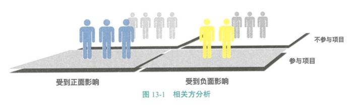
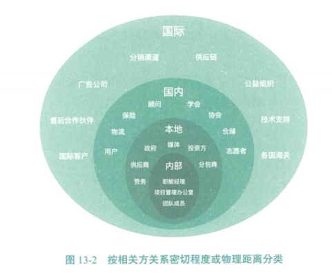
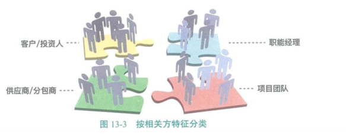
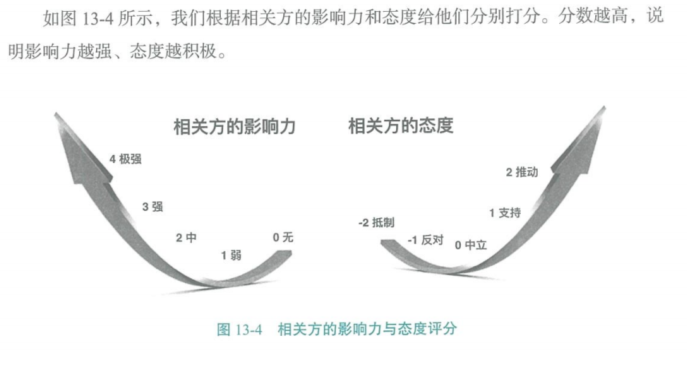
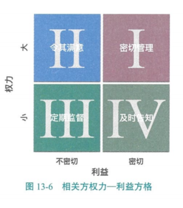
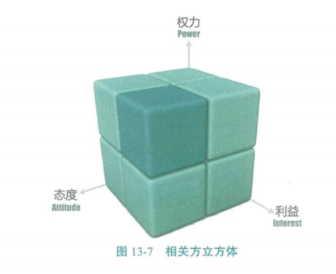
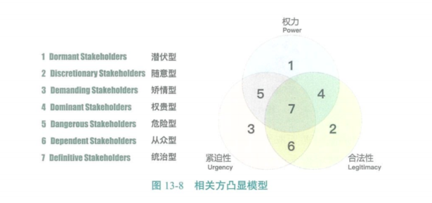
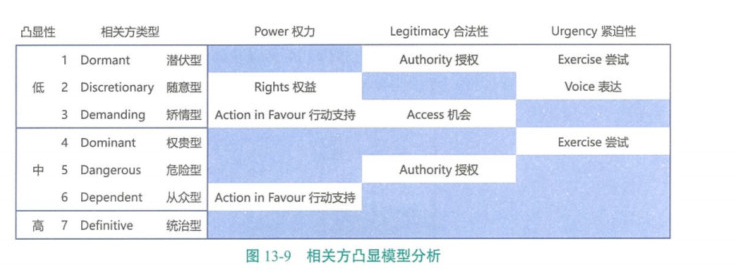
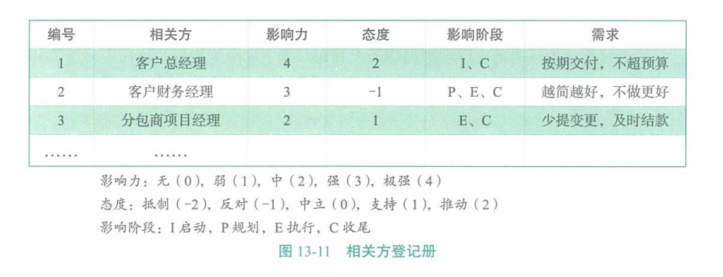
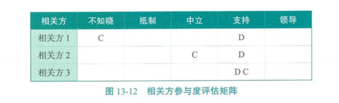

[TOC]

# 第十三章 项目相关方管理

# 相关方管理的核心概念 

项目**相关方管理包括识别能影响项目或受项目影响的全部人员、群体或组织，分析相关方对项目的期望和影响**，制定合适的管理策略来有效调动相关方参与和支持项目。 

相关方管理还包括关注与相关方的持续沟通，以便动态了解相关方的需求和期望的变化，解决随时产生的问题，管理利益冲突，促进相关方合理参与项目决策和活动。 

相关方满意度高是关键的项目目标。 

相关方管理可以解决以下问题：

- 谁是你的相关方？
- 他们有什么期望？
- 他们的影响有多大？
- 如何调动他们的积极性？
- 如何与他们沟通？
- 如何解决利益冲突？ 

相关方管理的发展趋势是“共创”。“共创”是将受项目影响或对项目影响较突出的相关方作为合作伙伴，构建价值共同体（包括利益、事业、理念、情怀、理想等），从过去的买卖关系、管理和被管理关系，甚至竞争关系转化为方向相同、利益相关、理念相容、资源相衬、行动相佐的共赢共生关系。 

# 敏捷场景中的相关方管理 

敏捷场景中的项目需求、环境都在变化之中，更需要项目相关方的有效互动和积极参与。敏捷团队应直接与相关方互动，而不需要通过各层级管理者。 

客户、用户和团队在动态的共创过程中及时、充分地交换信息，通常能实现更高的相关方参与度和满意度。 

在整个项目期间，团队保持与相关方的互动，有利于降低风险、建立信任和及时做出调整，从而节约成本，提高项目成功的可能性。 

# 13.1 识别相关方

识别相关方是识别能影响项目决策、活动或结果的个人、群体或组织，以及被项目决策、活动或结果所影响的个人、群体或组织，并分析和记录他们的相关信息的过程。这些信息包括他们的权力、利益、态度、参与度及对项目成功的潜在影响等。本过程的**主要作用是帮助项目经理建立对各个相关方或相关方群体的适度关注。** 

## 13.1.1 相关方分析

**识别相关方维度**

按照相关方关系密切程度或物理距离由近及远分类：

按相关方特征分类(立场、角色、专业等)：

### 相关方权利--利益方格

### 相关方立方体

相关方立方体是上述权利--利益方格的改良模型。

### 凸显模型

图13-9展示的是相关方凸显模型分析，前六种类型的相关方都存在发展为第七种类型统治型的潜力，蓝色区域表示相关方已拥有的特性，灰色区域表示相关方欠缺的特性，灰色区域中的文字代表相关方发展为第七种类型统治型所需要的条件。

 凸显模型可以指导团队努力让相关方处于团队希望的凸显性水平。对于多数相关方，团队最好使其保持在现在较低的凸显性水平，不要随便触发让相关方凸显性升级的条件，否则团队就会陷入四面楚歌、首尾难顾的局面。 

## 13.1.2 相关方登记册

# 13.2 规划相关方参与

规划相关方参与是基于对相关方需求、利益及对项目成功的潜在影响的分析，制定合适的管理策略，以有效调动相关方参与整个项目生命周期的过程。**本过程的主要作用是为与项目相关方的互动提供清晰且可操作的计划，以指导相关方参与项目。** 

**相关方参与度评估矩阵** 

在整个项目生命周期中，相关方的参与对项目的成功至关重要。 

相关方的参与度可分为以下几种类别。

- 不知晓：对项目和潜在影响不知晓。
- 抵制：知晓项目和潜在影响，抵制变更。 
- 中立：知晓项目和潜在影响，既不支持，也不反对。
- 支持：知晓项目和潜在影响，支持变更。
- 领导：知晓项目和潜在影响，积极致力于保证项目成功。 

我们应该比较所有相关方当前的参与度与计划参与度（项目成功所需的参与度）。如图13-12所示，项目团队可在相关方参与度评估矩阵中记录相关方当前的参与度和项目成功所需的参与度。其中，C表示相关方当前的参与度，D表示项目成功所需的参与度。项目团队应该基于可获取的信息，确定项目当前阶段所需要的相关方参与度。 

通过分析，项目团队可以识别出相关方当前的参与度与项目成功所需参与度之间的差距。项目团队可以使用专家判断来制定行动和沟通方案，以消除上述差距。 

# 13.3 管理相关方参与

管理相关方参与是在整个项目生命周期中与相关方进行沟通和协作，以满足其需要与期望，解决实际出现的问题，并促进相关方合理参与项目活动的过程。本过程的主要作用是帮助项目经理提升来自相关方的支持，并把相关方的抵制程度降到最低，从而显著提高项目成功的机会。 

# 13.4监督相关方参与

监督相关方参与是全面监督项目相关方之间的关系，调整策略和计划，以调动相关方参与的过程。本过程的主要作用是随着项目的进展和环境的变化，维持并提升相关方参与活动的效率和效果。 

# 13.5 本章考试要点 

1.共创思维☆☆☆ 

2.敏捷中的相关方管理☆☆☆☆ 

3.权力—利益方格☆☆☆☆☆ 

4.凸显模型☆☆☆ 

5.相关方登记册☆☆☆☆ 

6.相关方参与度评估矩阵☆☆☆☆ 

