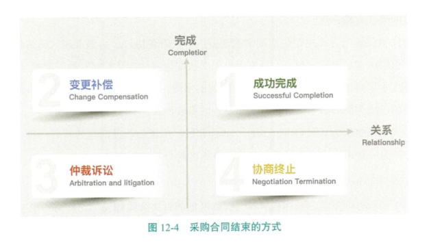

[TOC]

# 第十二章 项目采购管理

# 采购管理的核心概念 

项目采购管理包括从项目团队外部采购或获得所需**产品、服务或成果**的过程。 

**建筑信息模型(BIM)** 

对于建筑项目而言，BIM具有如下优势。

- 可视化：3D(三维空间)、4D(空间+时间轴)等。
- 协调性：便于碰撞检查、便于在设计、采购、施工和各专业之间的协调配合。
- 模拟性：可展现未来的建造过程和成果。
- 优化性：可随时更新模型，随时出新图。
- 持续性：从规划、设计、加工、安装、维修到报废。 

BIM是建筑信息化的趋势，为合同和采购带来深刻的变化，需要项目各方配合才能发挥其价值。 

**国际标准采购合同范本**

市场全球化导致项目参与各方来自不同国家，采用谁家的合同模板成了一个问题。为了解决这个问题，有些专业组织提供了标准的采购合同范本，比如： ·国际咨询工程师联合会(FIDIC ); ·美国建筑师学会(AIA); ·英国土木工程师学会(ICE); ·世界银行(World Bank )。 

**敏捷场景中的采购管理**

因为甲乙双方对项目的范围无法确定，需要根据现实的开发情况和外部反馈实时地做出调整，所以适合采取敏捷方法或混合开发模式。可是不确定范围，怎么签订采购合同呢？ 

甲乙双方往往通过主要服务协议(MSA)来管辖整体协作关系，用附录或补充文件记录适应型的工作内容。变更只针对适应型工作，不会对主体协议造成影响。 

# 12.1 规划采购管理

规划采购管理的主要作用是**确定是否需要外部支持**，如果需要，则还要决定采购什么、如何采购、采购多少，以及何时采购。 

## 12.1.1采购合同的基本类型

采购合同包含以下三种类型。 

**1.总价类合同** 

总价类合同包括以下三种类型。

 **(1)固定总价合同(Firm Fixed Price Contract ,FFP)** 

固定总价合同也称总价包死。对于合同中签订的固定总价，双方可约定完工时支付或分阶段支付。 **固定总价合同适用于边界清晰、设计完整的中小型项目。**

 **(2)总价加激励费用合同(Fixed Price Plus Incentive Fee Contract ,FPIF)** 

总价加激励费用合同需要甲乙双方事先确定如下内容：

- 目标成本；
- 目标利润（费用）；
- 最高限价（天花板价格），即甲方可以支付的最高合同价；
- 分成比例。 

合同款结算步骤如下。 

第一步：计算总付款。计算公式如下： 

总付款=实际成本+目标利润-（实际成本-目标成本）×卖方分成比例 

第二步：检验总付款是否超过最高限价。

- 总付款<最高限价，按总付款支付；
- 总付款≥最高限价，按最高限价支付。 

例题12-1 某项目预算成本为300万元，约定费用为100万元，天花板价格为450万元。如果实际成本超出或低于预算成本，甲乙双方按80：20的比例分担或分享。 

如果实际成本为400万元，甲方应支付给乙方的总付款是多少？总付款=400+100-(400-300)×20%=480（万元） 总付款(480万元)>最高限价(450万元)，所以甲方只付450万元。 

**(3)总价加经济价格调整合同(Fixed Price with Economic Price Adjustment Contract ,FPEPA ）**

如果卖方的履约期较长（数年），对外部条件变化（如通货膨胀、材料价格波动等)无法准确预测，那么我们建议使用本合同类型。它有利于买卖方之间维持长期关系。 经济价格调整(EPA)的规则条款应事先确定。总价加经济价格调整合同可以保护甲乙双方的合作关系免受外界不可控的情况的影响。 

**2.成本类合同** 

成本类合同包括以下三种类型。 

**(1)成本加固定费用合同(Cost Plus Fixed Fee Contract ,CPFF)** 

合同规定：成本实报实销，乙方完工后，甲方另外支付乙方固定的费用。 

例题12-2合同规定，成本由甲方承担，乙方完工后，甲方另支付乙方100万元的费用。如果最终成本为300万元，那么甲方应支付给乙方的总付款是多少？ 

总付款=300+100=400（万元） 

这种合同一般用于项目开始前无法判断项目能否成功，更无法估算项目的成本，只有项目进行到一定程度，才能判断项目是否可以成功的项目，比如创新研发类项目。 

**(2)成本加激励费用合同(Cost Plus Incentive Fee Contract ,CPIF)** 

合同规定：成本按预算控制另加约定费用。例如，成本超支或节约，按约定的比例分担或分享。 

例题12-3成本预算为300万元，约定费用为100万元，如果成本超支或节约，按80：20分担或分享。如果最终成本为400万元，那么甲方应给乙方结算多少合同款？ 

总付款=400+100-(400-300)×20%=480（万元） 

成本加激励费用合同与总价加激励费用合同唯一的区别就是，成本加激励费用合同没有天花板价格，也就是没有封顶价，直接按计算结果支付。 

**(3)成本加奖励费用合同(Cost Plus Award Fee Contract ,CPAF)** 

合同规定：成本实报实销，乙方完工后，甲方根据绩效决定奖励乙方的数额。甲方报销一切合法成本。奖励数额完全由甲方主观判断决定，一般不允许申诉。 

成本加激励费用合同和成本加奖励费用合同的本质区别在于，成本加激励费用合同约定了激励规则（有计算公式），甲乙双方都可以独立计算出激励的金额；而成本加奖励费用合同奖励的金额是靠甲方评价乙方表现后决定的（没有计算公式），乙方事先无法计算出会得到多少奖励，事后也没法讨价还价。需要注意的是，成本加激励费用合同激励的依据不一定是节省的成本，有时依据的是提前的工期、提升的质量等。 

**3.工料合同(T&M)** 

工料合同的特点如下：

- 买方按卖方实际消耗的工时支付工时费；
- 卖方提供材料，买方支付材料费；
- 买方和卖方预先确定了单位人力和材料成本（包含卖方税费及利润）。 

工料合同适用于工作内容明确，但工作量不容易实现准确评估的情况。例如，在工程项目基础处理中需要对溶洞进行回填，回填多少混凝土事先很难准确预测，所以该项目适合采用工料合同，直到溶洞被填满为止。 

## 12.1.2 采购文件和项目交付方式

**采购文件** 

采购文件包括招标文件、采购工作说明书(SOW)和工作大纲。 

**1.招标文件**

招标文件是指买方向卖方提供的关于招标内容和要求的文件，包括以下几种类型。

**信息邀请书(RFI)** 

如果买方需要卖方提供关于拟采购货物和服务的更多信息，就使用信息邀请书。随后一般还会使用报价邀请书或建议邀请书。 

**报价邀请书(RFQ)** 

如果买方需要卖方提供关于将如何满足需求和（或）需要多少成本的更多信息，就使用报价邀请书。 

**建议邀请书(RFP)** 

如果买方需要卖方提供完整的解决方案，就使用建议邀请书。这是最正式的“邀请书”文件，需要买方遵守与内容、时间表和卖方应答有关的严格的采购规则。 

**2.采购工作说明书(SOW)**

依据项目范围基准，项目经理为每次采购编制工作说明书，仅对将要包含在相关合同中的那一部分项目范围进行定义。工作说明书会详细描述拟采购的产品、服务或成果，以便潜在卖方确定是否有能力提供此类产品、服务或成果。根据采购品的性质、买方的需求，或拟采用的合同形式，工作说明书的详细程度会有较大不同。采购工作说明书的内容包括规格、数量、质量水平、绩效数据、履约期限、工作地点和其他要求。 

**3.工作大纲(TOR)** 

工作大纲适用于服务采购，比如咨询合同、顾问合同。与采购工作说明书类似，工作大纲通常包括以下内容：

- 承包商需要执行的任务，以及所需的协调工作；
- 承包商必须达到的适用标准；
- 需要提交批准的报告和数据等。 

**采购工作说明书和工作大纲通常是由项目经理根据项目范围基准**，摘出本次采购需要的部分编写而成。 

如图12-1所示，公司采购部门（职能部门）遵照法律法规（如合同法、招标法等)、行业规范，并结合公司采购流程制度，在项目经理提供的采购工作说明书或工作大纲的基础上补充必要的规则说明和条款，将其编制成采购文件。 

项目经理对采购文件中的范围负责，采购部门对采购文件的合法合规性负责。 

**项目交付方式** 

**1.DBB模式** 

DBB模式是传统的设计一招标一建造模式(Design -Bid-Build )。买方分别招标设计方、施工方，并自行采购主材和设备。**买方协调工作量大，协调难度高。这种模式对买方的专业程度要求高，但买方拥有较高的主动性和管控深度。** 

**2.总承包模式** 

EPC模式是设计一采购一施工总承包模式(Engineering -Procurement -Construction ),也称交钥匙工程。EPC模式是指买方把设计、采购和施工统一包给EPC总承包商，EPC总承包商通过设计、采购和施工之间的统筹协调，创造更加高效、经济和优质的工程。在EPC模式下，双方通常签订总价类合同，所以买方风险低，而EPC总承包商肩负起更多的管理责任，也承担了更多的项目风险。 DB模式是设计一建造总承包模式(Design -Build )。

DB模式与EPC模式类似，只是在DB模式下，买方保留采购主导权，只把设计和施工统一委托给总承包商。买方自己采购，对材料的质量和采购成本管控更为主动。 

**3.特许融资模式** 

特许融资模式是指政府为基础设施项目的建设和经营提供特许权，**比如公路、地铁、污水处理厂等项目，企业可以凭借政府授予的特许权向银行贷款，用于项目建设。**以下是几种常见的特许融资模式。

- BOT模式是**建造—运营—移交模式(Build -Operation -Transfer )**。政府特许某家企业负责基础设施项目的建造和一定年限的运营，企业通过运营收回成本并获得利润，到期后将项目移交给政府。 
- BT模式是**建造一移交模式(Build -Transfer )**。**政府特许某家企业负责建造**，企业建造完成后，将项目移交给政府，没有运营环节。
- PPP模式是**公私合营模式(Public -Private -Partnership )**。**政府和企业共同成立合伙制项目公司**，按股份比例出资，并按股份比例分享项目收益。 

## 12.1.3 合同模式与风险分担

不同合同类型本质上的区别是合同双方分担项目风险的原则和比例不同。

固定总价合同，因为合同总价是固定的，对甲方而言没有不确定性，不管节省还是超支，这个不确定性都由乙方承担。 

激励费用合同包括总价加激励费用合同(FPIF)和成本加激励费用合同(CPIF)。无论项目超支还是节约，甲乙双方均按比例分担或分享，这有利于甲乙双方一起努力控制成本，一同承担风险。 

因为成本加固定费用合同(CPFF)中的费用是固定的，成本实报实销，所以对于乙方而言，项目没有不确定性，项目的不确定性都由甲方承担。 

## 12.1.4 自制与外购分析

自制是指在项目执行组织内部完成某一项工作。

外购是指从执行组织外部获得所需要的产品、服务或成果。

## 12.1.5 供方选择分析

供方要根据不同的项目场景和买房关注重点来决定采取那种选择标准。不同的选择依据对应不同的选择标准。

# 12.2 实施采购

实施采购是获取卖方应答、选择卖方并授权合同的过程。本过程的主要作用是通过达成协议使内部和外部相关方的期望协调一致。

## 12.2.1 采购流程

## 12.2.2 实施采购的工具和技术

实施采购的工具与技术如下。 

**独立估算(Independent Estimates )** 

采购组织可以自行编制独立估算，或者邀请外部专业估算师做出成本估算，并以此作为标杆，与潜在卖方的应答做比较。 

**投标人会议(Bidders Conference )** 

投标人会议（又称承包商会议、供应商会议、投标前会议、招标文件交底会议）是在卖方提交建议书之前，在买方和潜在卖方之间召开的会议。其目的是确保所有潜在投标人对采购要求都有清楚且一致的理解，并确保没有任何投标人会得到特别优待。 

**采购谈判** 

采购谈判是指在合同签署之前对合同的结构、要求及条款加以澄清，以取得谈判双方一致的意见。最终的合同措辞应该反映双方达成的全部一致意见。 合同中需要澄清的内容包括双方应承担的责任、变更的权限、使用的条款和法律、 技术和商务要求、所有权、合同融资、技术解决方案、总体进度计划、付款方式及金额等。

# 12.3 控制采购

控制采购是管理采购关系、监督合同执行情况，并根据需要实施变更和采取纠正措施的过程。本过程的主要作用是确保买卖双方履行法律协议，满足采购需求。 控制采购的工具和技术如下。 

**索赔管理** 

如果买卖双方不能就变更补偿达成一致意见，甚至对变更是否已经发生都存在分歧，那么被请求的变更就成为有争议的变更或潜在的推定变更。有争议的变更也称为索赔、争议或诉求。 如果合同双方无法自行解决索赔问题，则要按照合同中规定的争议解决程序进行处理，如调解、仲裁或诉讼，而谈判是解决所有索赔和争议的首选方法。 

**采购审计** 

采购审计是指对从规划采购管理过程到控制采购过程的所有采购过程进行结构化审查。其目的是找出合同准备或管理方面的成功经验与失败教训，供本项目其他采购合同或执行组织内其他项目的采购合同借鉴。 

**替代争议解决方式(ADR)** 

替代争议解决方式是指可以被法律程序接受的，通过协议而非强制性和有约束力的裁定来解决争议的任何方法，是非诉讼、非仲裁的选择性争议解决方式的概括性的统称，又称选择性争议解决方式。 简单地说，替代争议解决方式就是当合同双方无法达成一致意见时请一个双方都信得过的第三方来评理。 替代争议解决方式主要包括调解或调停、中立听者协议、小型审理、简易陪审团审判、租借法官、事实发现法、特别主事人、法院附属仲裁及监察专员制度等。 替代争议解决方式是对诉讼和仲裁的辅助手段，是社会有机体自我完善机制的表现，目前已成为民商事争议解决方式体系中的重要形式。 替代争议解决方式具有非正式性、非强制性、广泛性、灵活性的特点。替代争议解决方式是一种可以广泛地适用于解决争议的纯粹自愿的程序。 

**采购合同争议解决方式对比** 

当买卖双方因采购合同存在争议时，要考虑的解决方式如表12-5所示。在这几种解决方式中，应首选谈判的解决方式。 

**采购合同结束的方式**

如图12-4所示，我们可以从采购合同双方的关系和项目范围内工作的完成度这两个维度来分析采购合同结束的不同方式。

- 第一种情况：项目顺利完成，且双方保持了良好的关系，这是最好的结果。
- 第二种情况：项目虽然完成，但过程很曲折，出现大量的变更、索赔、补偿，双方都不愉快。
- 第三种情况：项目没有完成，双方却陷入仲裁或诉讼中，这是最糟糕的结果。
- 第四种情况：虽然项目没有完成，但双方经过友好协商，提前终止了合作，双方关系没有破裂。 

双方在签订采购合同前就应尽最大努力对合同内容达成共识，并确保各自具备履约能力。双方在采购合同执行中应充分沟通，积极协商，争取项目圆满，长期合作。

采购合同中卖方的责任 采购合同中卖方的责任如下：

- 项目经理对采购合同中的需求负责；
- 技术经理对采购合同中的技术规范负责；
- 采购经理对采购合同中的合法合规负责。 

# 12.4 本章考试要点 

1.敏捷中的采购管理☆☆☆☆ 

2.各种采购合同形式☆☆☆☆☆ 

3.各种采购文件☆☆☆☆ 

4.各种交付方式☆☆☆ 

5.自制与外购分析☆☆☆☆ 

6.供方选择分析☆☆☆ 

7.投标人会议与采购谈判☆☆☆☆ 

8.采购合同争议解决☆☆☆ 

9.采购合同收尾与行政收尾☆☆☆☆☆ 

10.采购合同中的责任☆☆☆ 

# 采购合同类型

