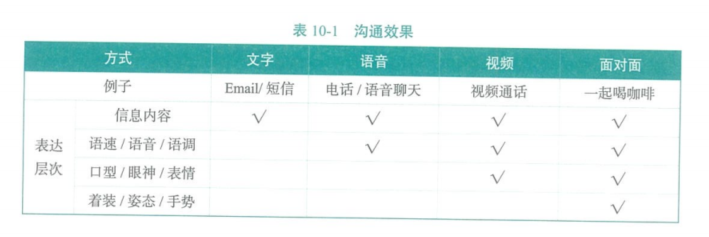
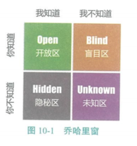
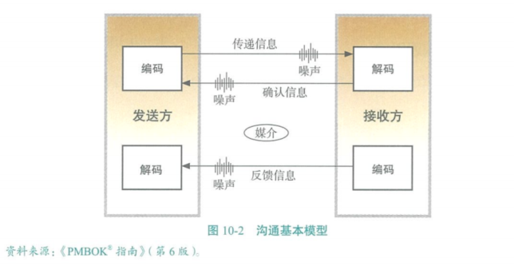
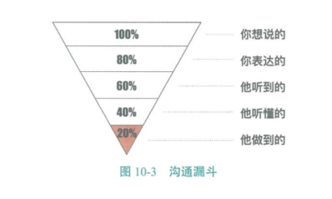
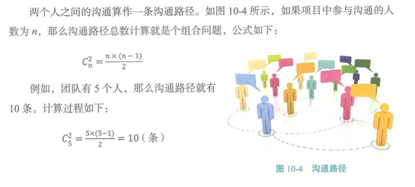
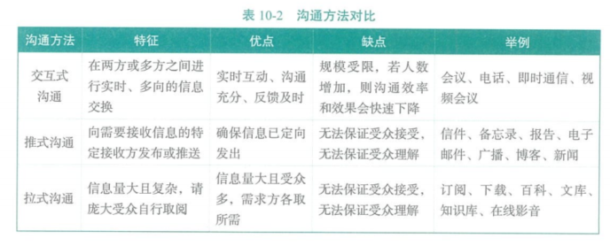

[TOC]

# 第十章 项目沟通管理

# 沟通管理的核心概念

## 沟通的方式

1、内部和外部

2、正式和非正式

3、垂直和水平

4、官方和非官方

5、书面和口头

6、言语和体语

## 沟通的效果

面对面沟通是效果最佳的。

# 10.1 规划沟通管理

规划沟通管理是根据相关方的信息需要和要求及组织的可用资产情况，指定合适的项目沟通方式和计划的过程。本过程主要作用用于识别和记录相关方最有效率且最有效果的沟通方式。

团队应该在整个项目期间定期审查规划沟通管理过程的成果，以确保其持续适用。

## 10.1.1 有效的沟通

### 乔哈里窗 

乔哈里窗被称为“自我意识的发现一反馈模型”。这个理论最初是由乔瑟夫(Joseph )和哈里(Harry )在20世纪50年代提出的。如图10-1所示，视窗理论将人际沟通的信息比作一扇窗，它被分为四个区域：开放区、隐秘区、盲目区、未知区，人的有效沟通就是这四个区域的有机融合。 

1.开放区

自己知道、别人也知道的信息。在实际工作中和人际交往中，共同的开放区越多，沟通起来也就越便利，越不易产生误会。要想使你的开放区变大，就要多说，多询问，询问别人对你的意见和反馈。

2.隐秘区

自己知道、别人却可能不知道的秘密。一个真诚的人也需要隐秘区，完全没有隐秘区的人是心智不成熟的。而适度地打开隐秘区是增加沟通成功率的一条捷径。

3.盲目区 

自己不知道、别人却可能知道的盲点。性格上妄自尊大，听不进别人意见的人，很难听到关于自己的真话。只有主动沟通、积极寻求反馈，才是缩小自己盲目区的方法。

4.未知区 

自己和别人都不知道的信息。未知区是尚待挖掘的黑洞。我们要尽可能地缩小双方的未知区，主动地通过别人了解自己，主动地告诉别人自己能够做什么。 乔哈里窗能够用来展现、提高个人与组织的自我意识，也可以用来改变整个组织的动态信息沟通系统。 

### 书面沟通的5C原则 

1.正确的语法和拼写(Correct ) 

- 语法不当或拼写错误会分散注意力，还有可能扭曲信息含义，降低可信度。 

2.简洁的表述和无多余字(Concise ) 

- 简洁且精心组织的信息能降低误解信息意图的可能性。 

3.清晰的目的和表述(Clear ) 

- 确保在信息中包含能满足受众需求与激发其兴趣的内容。 

4.连贯的思维逻辑(Coherent ) 

- 写作思路连贯，结构清晰、完整，上下文呼应。 

5.受控的语句和想法承接(Controlled ) 

- 可能需要使用图表或小结来控制语句和想法的承接。 

## 10.1.2 沟通基本模型

如图10-2所示，发送方想把自己的想法传递给接收方，需要先对想法进行编码，将其变成语言或文字，再选择传递的方式，过程中会受到噪声的影响。这里的噪声是广义的，包括所有影响信息传递效果的因素，如杂音、情绪、专业差异等。接收方收到信息后需要进行解码，将其变成自己的理解。在这些环节中，必然会有信息损失的现象。 

### 沟通漏斗

如图10-3所示，沟通漏斗形象地表达了在沟通过程中信息损失的现象。为了减少信息损失，最有效的办法就是增加反馈环节，让接收方给信息发送方反馈，及时确认收到的信息的准确性和完整性，把单向沟通变成双向沟通，形成沟通的闭环，有效避免沟通中信息的损失。 

### 沟通路径

## 10.1.3 沟通障碍

沟通障碍是指延误或者曲解信息。沟通出现障碍会增加冲突。沟通障碍包括以下几个方面：

- 信息过载；
- 缺少知识；
- 文化差异；
- 分散注意力的环境因素；
- 有害的态度；
- 不良的情绪；
- 不懂行业术语和技术术语；
- 沟通渠道过多；
- 选择性认知。

产生沟通障碍的原因如下：

- 不同的相关方对项目目标的理解不同；
- 人力、设备、材料等资源的竞争；
- 人员之间的个人冲突；
- 对变化的抵制（如新技术、新流程）。 

## 10.1.4 沟通方法和技术

项目相关方之间的沟通技术如下：

- 简化运用语言；
- 采取视觉辅助手段；
- 积极倾听；
- 有效反馈；
- 控制情绪。 

项目相关方之间的沟通方法如下。

- **交互式沟通**。在两方或多方之间进行多向信息交换。这是确保全体参与者对特定话题达成共识的最有效的方法，包括会议、电话、即时通信、视频会议等。

- **推式沟通。**把信息发送给需要接收这些信息的特定接收方。这种方法可以确保信息的发送，但不能确保信息被目标受众理解。推式沟通包括信件、备忘录、报告、电子邮件、传真、语音邮件、日志、新闻稿等。

- **拉式沟通。**用于信息量很大或受众很多的情况。要求接收者自主地访问信息内容。这种方法包括企业内网、电子在线课程、经验教训数据库、知识库等。

  以上三种沟通方法有各自的优缺点，如表10-2所示。团队要根据项目的实际情况，选用适当的沟通方法。 

# 10.2 管理沟通

管理沟通是根据沟通管理计划，生成、收集、分发、储存、检索及最终处置项目信息的过程。本过程的主要作用是促进项目相关方之间实现有效率且有效果的沟通。 

## 会议管理(Meeting Management ) 

会议管理是采取必要的步骤确保会议有效并高效地达到预期目标。规划会议时应才去以下步骤：

1.准备并发布会议议程（其中包含会议目标）；

2.确保会议在规定的时间开始和结束； 

3.确保参与者受邀并出席； 

4.确保整场会议内容切题； 

5.处理会议中的期望、问题和冲突； 

6.记录所有行动及为其分配的行动责任人。 

# 10.3 监督沟通

监督沟通是确保满足项目及其相关方的信息需求的过程。本过程的主要作用是**按沟通管理计划和相关方参与计划的要求优化信息传递流程。** 

沟通管理计划中定义的沟通活动在监督沟通过程中应根据需要进行调整，并采取行动实施干预。产生的变更请求需要通过实施整体变更控制程序。变更可能导致以下两种结果：

- 修正相关方的沟通要求，包括相关方对信息发布、内容或形式，以及发布方式的要求；
- 建立消除瓶颈的新程序。 

# 10.4 本章考试要点 

1.沟通占用项目管理者多少精力☆☆☆☆ 

2.沟通类型☆☆☆ 

3.沟通模型☆☆☆☆ 

4.沟通漏斗☆☆☆ 

5.沟通路径☆☆☆☆☆ 

6.沟通方法☆☆☆☆☆ 

7.沟通障碍☆☆☆☆ 

8.沟通技术☆☆☆☆ 

9.会议管理☆☆☆ 

10.沟通中的变更☆☆☆☆ 

