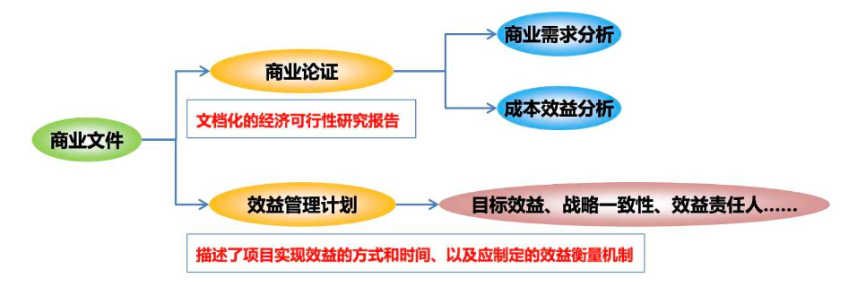
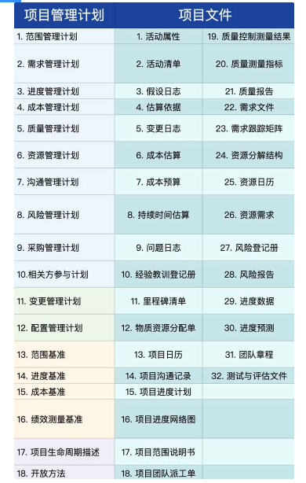
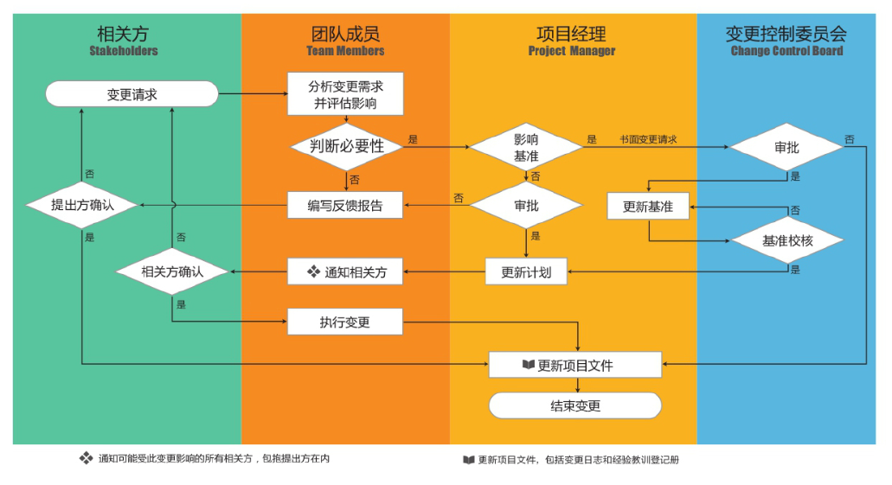

[TOC]

# 第四章 项目整合管理

# 4.1 项目整合管理“核心概念”

- 在项目管理中，整合兼具统一、合并、沟通和建立联系的性质，这些行动应该贯穿项目始终。
- 项目整合管理由项目经理负责，并且整合管理的责任不能被授权或者转移
- 项目经理必须对整个项目承担最终责任
- 项目越复杂，相关方的期望越多样化，就需要越全面的整合方法

**整合的对象：**

# 4.2 项目整合管理“发展趋势和新兴实践”

项目整合管理知识领域要求整合所有其他知识领域的成果

与整合管理过程相关的发展趋势包括：

- **使用自动化工具：**如 PMIS（项目管理信息系统）
- **使用可视化管理工具：**便于看到实时状态，促进知识转移，促进相关方参与到问题解决中，例如：横道图、网络图、敏捷开发中的看板、燃尽图
- **项目知识管理：**应对项目人员的流动性和不稳定性
- **增加项目经理的职责：**项目经理被要求介入启动和结束项目，例如开展商业论证和效益管理
- **混合型方法：**敏捷或其他迭代做法、商业分析技术 - BA、组织变革管理方法等混合使用

# 4.3 在敏捷和适应型环境中需要考虑的因素

**迭代和敏捷方法中**

**团队成员以领域专家的身份参与整合管理：**

- 团队成员自行制定计划
- 团队成员自行决定各个组件的整合方式

**敏捷的实践：**

- **范围动态：**团队根据吞吐能力确定在一个 Sprint（迭代） 中要完成的代表事项
- **过程精简：**团队的注意力从过程的规范性转向产品最终的价值
- **状态可视：**原型设计、卡诺模型（KANO）、每日立会（站立会）中的看板（Kanban）、燃尽图、价值流图。
- **质量内建：**结对编程（PP）、测试驱动开发（TDD）
- **团队自组织：**做什么、怎么做、由谁来做，都是由团队自己协商决定

**与传统方法的比较：**

- 对项目经理的期望不变，但把对具体产品的规划和交付授权给团队
- 项目经理的关注点在于营造一个合作型的决策氛围，确保团队有能力应对变更。团队成员有广泛技能（而不是狭窄领域），则更利于合作型决策氛围

# 4.4 5 大过程组、10 大领域、49 个过程

# 整合管理过程之一 - 制定项目章程（启动过程组）

**制定项目章程：**编写一份正式批准项目并授权项目经理在项目活动中使用组织资源的文件的过程。

**本过程的作用：**明确项目与组织战略目标之间的之间联系，确立项目正式地位，并展示组织对项目的承诺。

**制定项目章程的几个注意点**

- 项目章程在项目执行组织与需求组织之间建立起伙伴关系
- 经批准的项目章程意味着项目的正式启动
- 项目由项目以外的实体来启动，如发起人、项目集或项目管理办公室等等
- 尽早确认并任命项目经理，项目经理应该参与项目章程的制定，以便对项目需求有基本的了解
- 最好在制定项目章程时就任命，最晚也必须在规划开始之前
- 通过编制项目章程，来确认项目符合组织战略和日常运营的需要
- 在执行外部项目时，通常需要用正式的合同来达成合作协议
- 不要把项目章程看作合同，因为其中未承诺报酬或金钱或用于交换的对价

**输入：商业文件**

**商业文件：**包含关于项目目标以及项目对业务目标的贡献等相关信息的文件。它包括：商业论证、效益管理计划。

商业文件是在项目之前制定的，需要定期审核。

商业文件不是项目文件，项目经理不可以对它们进行更新或修改，只可以提出相关建议。

## 输入：协议

**协议：**定义了启动项目的初衷。

**协议形式：**合同（为外部客户做项目时）、谅解备忘录（MOUs）、服务品质协议（SLA）、意向书等。

## 工具与技术：专家判断

**专家判断：**基于某应用领域、学科和行业等的专业知识而做出的，关于当前活动的合理判断，这些专业知识可来自具有专业学历、知识、技能、经验或培训经理的任何小组或个人（人人都是“砖家”）

## 工具与技术：数据收集

**可用于制定项目章程过程的数据收集技术包括：**

- **头脑风暴：**短时间内获得大量创意，是典型的信息收集技术，原则是：不质疑、不分析、不批判、不反对，不包含分析过程。
- **焦点小组：**召集相关方和主题专家讨论相关议题，比一对一访谈更有利于互动交流（同职能）
- **访谈：**通过与相关方直接交谈来了解相关信息

## 工具与技术：人际关系与团队技能

**可用于指定项目章程过程的人际关系与团队技能包括：**

- **冲突管理：**有助于相关方就目标、成功标准、高层级需求、项目描述、总体里程碑等内容达成一致意见。

- **引导：**有效引导团队活动成功以达成决定、解决方案或结论的能力。

- **会议管理：**不要把各种会议类型混在一起；面对面的会议效果最好，有时也需要举行虚拟会议。

- - 明确每个参会的角色，确保有效参会；会议要达成共识，要有行动计划。
  - **会前：**要确定会议议程、目的、目标和期限
  - **会中：**不要跑题
  - **会后：**要形成书面的会议纪要和行动方案

## 工具与技术：会议

在本过程中，与关键相关方矩形会议的目的是识别项目目标、成功标准、主要可交付成果、高层级需求、总体里程碑和其他概述信息。

## 输出：项目章程

**项目章程：**由项目启动者或发起人发布的，正式批准项目成立，并授权项目经理动用组织资源开展项目活动的文件。（是项目的“宪法”，是项目经理的“尚方宝剑”）

**包含的内容：**

委派的项目经理及其权责

项目的目的、目标、项目的成功标准

高层级的需求、高层级的项目描述、高层级战略和运营假设条件和制约因素

总体里程碑进度计划、总体预算、整体项目风险

项目审批要求、关键相关方名单、项目退出标准、主要可交付成果

## 输出：假设日志

**假设日志：**用于记录整个项目生命周期中的所有假设条件和制约因素

**假设条件：**不需验证即可视为正确、真实或确定的因素。同时还应描述如果这些因素不成立，可能造成的潜在影响。

**制约因素：**对项目或过程的执行有影响的限制性因素

# 整合管理过程之二 - 制定项目管理计划（规划过程组）

**制定项目管理计划：**定义、准备和协调项目计划的所有组成部分，并把他们整合为一份综合项目管理计划的过程。

**本过程的作用：**生成一份综合文件，用于确定所有项目工作的基础及其执行方式。

项目管理计划可以是概括的或详细的，详细程度取决于具体项目的要求。

**项目管理计划应该：**

- **足够强大：**可以应对不断变化的项目环境（敏捷性），这有利于项目进展产出更准确的信息。

- **基准化：**

- - 确定基准前：可进行多次更新，无需遵循正式流程
  - 确定基准后：只能通过实施整体变更控制过程进行更新

- **渐进明细：**在项目收尾前，该计划需要通过不断更新来渐进明细，并且这些更新需要得到控制和批准

## 输入：项目章程

项目团队把项目章程作为初始规划的起点。

## 输入：其他过程的输出

其他规划过程所输出的子计划和基准，都是本过程的输入。对这些子计划和基准的变更都可能导致对项目管理计划的相应更新。

## 工具与技术：数据收集

头脑风暴、核对单、焦点小组、访谈；

**核对单：**包括需要考虑的项目、行动或要点的清单，常被用作提醒。

## 工具与技术：人际关系与团队技能

冲突管理、引导、会议管理；

## 工具与技术：会议

## 输出：项目管理计划

**项目管理计划：**是说明项目执行、监控和收尾方式的一份文件。它整合并综合了v，以及管理项目所需的其他信息。

# 项目管理计划的组成部分

**指南型计划：**是一种指南，如何去管理 XX。强调的是 How。

1. 范围管理计划
2. 需求管理计划
3. 进度管理计划
4. 成本管理计划
5. 质量管理计划
6. 资源管理计划
7. 沟通管理计划
8. 风险管理计划
9. 采购管理计划
10. 相关方参与计划
11. 变更管理计划
12. 配置管理计划

**实体型计划：**具体描述范围包括哪些，工期多久，成本多少。描述的是 What。

1. 范围基准
2. 进度基准
3. 成本基准

其他组件：

**项目生命周期描述**

- 绩效测量基准
- 开发方法

## 项目管理计划的指南型和实体型

## “项目管理计划”和“项目文件”

**项目管理计划：**项目管理计划需要相关方的一致认可，需要经过变更流程的审批才能修改。

**项目文件：**是团队自行维护的，更倾向于工作过程记录。

# 整合管理过程之三 - 指导与管理项目工作（执行过程组）

**指导与管理项目工作：**为实现项目目标而领导和执行项目管理计划中确定的工作，并实施已批准变更的过程。

**本过程的作用：**对项目工作和可交付成果开展综合管理，以提高项目成功的可能性

**该过程会实施以下活动：**

1. 实施已计划好的项目活动
2. 管理项目内的各种技术接口和组织接口
3. 回顾所有项目变更的影响，并实施已批准的变更
4. 收集工作绩效数据并传达给合适的控制过程

## 输入：项目管理计划

项目管理计划的任何组件都可用作本过程的输入

## 输入：批准的变更请求

**批准的变更请求：**实施整体变更控制过程的输出，可能是纠正措施、预防措施或缺陷补救

## 工具与技术：项目管理信息系统 PMIS

**项目管理信息系统 PMIS：**为指导和管理项目工作提供自动化工具，并用于自动收集和报告关键绩效指标（KPI）

**工作授权系统：**用来保证项目工作由**正确**的组织、在**正确**的时间已**正确**的顺序执行。可以防止“**镀金**”。

## 工具与技术：会议

**会议类型：**开工会议、技术会议、敏捷或迭代规划会议、每日站会、指导小组会议、问题解决会议、进展跟进会议、回顾会议。

**参会者：**项目经理、项目团队成员，以及与所讨论事项相关或会受该事项影响的相关方。

## 输出：可交付成果

**可交付成果：**在某一过程、阶段或项目完成时，必须产出的任何独特并可核实的产品、成果或服务能力，通常是项目结果，并可包括项目管理计划的组成部分。

## 输出：工作绩效数据

**工作绩效数据：**在执行项目工作的过程中，从每个正在执行的活动中收集到的原始观察结果和测量值。

在工作执行过程中收集数据，再交由控制过程做进一步分析

- **工作绩效数据：**在项目执行过程中自然产生并持续收集的关于项目范围、进度、成本、质量等方面的数据。

- **工作绩效信息：**在日常监控过程中，对工作绩效数据进行整理归纳后所产生的的信息，用于分析项目执行情况与计划之间的偏差和产生偏差的原因。

- **工作绩效报告：**是对工作绩效信息进一步统计、分析、汇编所形成的的报告。如：

- - 定期报告：项目周报、月报、阶段报告
  - 专项报告：变更报告、采购报告、挣值分析报告等

## 输出：问题日志

**问题日志：**一种记录和跟进所有问题的项目文件。再次过程被首次创建，在整个项目生命周期应该随同监控活动更新。

**包含主要内容：问题描述、责任人、解决期限**。

## 输出：变更请求

**变更请求：**是关于修改任何文档、可交付成果或基准的正式提议。可以是直接或间接的，可以由外部或内部提出，可能是自选或由法律/合同所强制的，可口头提，但**必须书面记录**。包括：

- 纠正措施 - 就偏差（事后）：用来维护“某些”**基准**
- 预防措施 - 防风险（事前）：用来维护“某些”**基准**
- 缺陷补救 - 补质量（针对质量缺陷）
- 更新 - 通常该计划：会修改计划或**基准**

# 如何理解指导与管理项目工作的 ITTO

# 整合管理过程之四 - 管理项目知识（执行过程组）

**管理项目知识：**使用现有知识并生成新知识，以实现项目目标，并帮助组织学习的过程。

**本过程的作用：**利用已有的组织知识来创造或改进项目成功，并使当前项目创造的知识可用于支持组织运营和未来的项目或阶段。本过程需要在整个项目期间开展。

**知识管理注意点：**

- **组织角度看：**在项目开始之前、开展期间和结束之后都能使用旧知识、生成新知识。

- **最重要的环节：**营造信任氛围，激励人们分享自己的知识和关注他人的知识。

- **实践中双管齐下：**

- - 知识管理工具和技术（用于人际互动）
  - 信息管理工具和技术（用于编纂显性知识）

## 输入：项目文件

- **经验教训登记册：**提供了有效的知识管理实践。
- **项目团队派工单：**说明了项目已具有的能力和经验以及可能缺乏的知识。
- **资源分解结构RBS：**有助于了解团队拥有和缺乏的知识。
- **相关方登记册：**有助于了解相关方可能拥有的知识。

## 工具与技术：知识管理

知识管理工具和技术将员工联系起来，使他们能够**合作**生成新知识、**分享**隐性知识，以及**集成**不同团队成员拥有的知识。

面对面互动最有利于建立知识管理所需的信任关系。建立之后，可以用虚拟互动来维护这种信任关系。

## 工具与技术：信息管理

信息管理用于创建人们与知识之间的联系，可以有效促进简单、明确的显性知识的分享。

通过增加互动要素，比如：增加“与我联系”的功能，使用户能够与经验教训发帖者联系，并向其寻求与特定项目和情境有关的建议。从而可以向隐性知识延伸。

## 工具与技术：人际关系与团队技能

- **积极倾听：**有助于减少误解并促进沟通和知识分享
- **引导技术：**有助于有效指引团队成功达成决定、解决方案或结论
- **领导力：**可帮助沟通愿景并鼓舞项目团队关注合适的知识和知识目标
- **人际交往：**促使项目相关方之间建立非正式的联系和关系，为显性和隐性知识的分享创造条件
- **政治意识：**有助于项目经理根据项目环境和组织的政治环境规划沟通

## 输出：经验教训登记册

**包含的内容：**

1. 情况的类别和描述
2. 与情况相关的影响、建议和行动方案
3. 遇到的挑战、文件、意识到的风险和机会，或其他适用的内容

# 整合管理过程之五 - 监控项目工作（监控过程组）

**监控项目工作：**跟踪、审查和报告整体项目进展，以实现项目管理计划中确定的绩效目标的过程

**本过程的作用：**

- 让相关方了解项目的当前状态并认可为处理绩效问题而采取的行动
- 通过成本和进度预测，让相关方了解未来项目状态
- 监控项目工作贯穿于整个项目，是唯一输出工作绩效报告的过程

## 输入：项目文件

**进度预测：**基于项目以往的绩效，用于确定项目是否仍处于**进度**的公差区间内，并识别任何必要的变更。

**成本预测：**基于项目以往的绩效，用于确定项目是否仍处于**预算**的公差区间内，并识别任何必要的变更。

## 输入：工作绩效信息

- 将工作绩效数据与项目管理计划组件、项目文件和其他项目变量比较之后生成工作绩效信息。
- 绩效包含：范围、进度、成本、质量以及项目管理计划中定义的其他。
- 工作绩效信息为决策提供依据。

## 工具与技术：数据分析

- **挣值分析：**对范围、进度、成本绩效进行综合分析，发现偏差。
- **偏差分析：**审查目标绩效与实际绩效之间的差异，可涉及持续时间估算、成本估算、资源使用、资源费率、技术绩效和其他测量指标。
- **趋势分析：**根据过去，预测未来。提前发现问题，提前纠偏或预防。
- **根本原因分析：**寻找偏差潜在的问题的根本原因。
- **备选方案分析：**选择纠正措施、预防措施。
- **成本效益分析：**选择成本最低的方案来纠偏。

## 工具与技术：决策

决策技术包括**投票**：一致同意、大多数同意、相对多数原则。

## 输出：工作绩效报告

基于工作绩效信息，以实体或电子形式编制工作绩效报告，以制定决策、采取行动或引起关注。

根据项目沟通管理计划，通过沟通过程向项目相关方发送工作绩效报告（状态报告、进展报告）。

# 整合管理过程之六 - 实施整体变更控制（监控过程组）

**实施整体变更控制：**审查**所有**变更请求、批准变更、管理变更、并对变更处理结果进行沟通的过程。

本过程的作用：

- 确保对项目中已记录在案的变更做综合评审，从而降低项目风险。
- 本过程只会审批、管理变更，不会提出变更请求（我们只处理变更，不生产变更）。

**实施整体变更控制的几个注意点：**

- 实施整体变更控制过程贯穿项目始终，项目经理对此负最终责任。

- 应确保只有经批准的变更才能纳入修改后的基准中。

- 任何相关方都可以提出变更请求，可以口头提出，必须书面形式记录。并纳入变更管理和/或配置管理系统中。

- 应该评估变更对时间和成本的影响，并向这些过程提供评估结果。

- 每项记录在案的变更请求都必须由一位负责人批准、推迟或否决，应在项目管理计划或组织程序中指定这位责任人，必要时，应由**变更控制委员会（CCB）**来开展实施整体变更控制过程。

- - **CCB：**一个正式组成的团体，负责审查、评价、批准、推迟或否决项目变更，以及记录和传达变更处理决定。

## 输入：变更请求

向变更请求的提出者了解变更的具体内容或变更的原因，告知变更的流程，防止不必要的变更。

若确认必须变更则走以下 5 步流程：**1 记录、2 评估、3 提交、4 变更、5 通知（重中之重）**

1. **记录：**书面记录变更请求。项目经理书面记录（变更日志），或要求变更提出者提交书面的变更请求。
2. **评估：**充分了解变更，与相关方沟通评估变更带来的影响。
3. **提交：**提交责任人审批。**注意，这里的提交是指“项目经理”将变更请求和评估的结果交给 CCB**。
4. **更新：**不管变更通过还是不通过，必须更新变更日志。如果变更通过，更新项目管理计划（文件）。
5. **通知：**应将变更的结果通知（受影响的）相关方。

## 工具与技术：变更控制工具

**配置管理系统：**项目管理系统的子系统，由一系列正式的书面程序组成，为以下配置管理活动提供技术和管理方面的指导与监督：

**一识 - 配置识别：**识别与选择配置项 -- 规划

**二记 - 配置状态记录：**关于各个配置项的信息记录和报告 -- 执行

**三审 - 配置审核与审计：**通过核实与审计保证配置项组成的正确性，及变更被正确实施 -- 监控

## 输出：批准的变更请求

**变更请求批准人的选择顺序：**

1. 项目管理计划或组织流程中指定的责任人。（最准确的说法，但不常见）
2. 变更控制委员会（CCB）（最常见的选择）
3. 如无以上选择，则可选“PMO”、“发起人”、“项目经理”

## 输出：项目文件更新

**变更日志：**用来记录项目过程中出现的变更，被否决的变更请求也应该记录在变更日志中。

## 输出：项目管理计划更新

对基准的变更，只能基于最新版本的基准且针对将来的情况，而不能变更以往的绩效。这有助于保护基准和历史绩效数据的严肃性。

# 整合管理过程之七 - 结束项目或阶段（收尾过程组）

**结束项目或阶段：**终结项目、阶段或合同的所有活动的过程。

**本过程的作用：**存档项目或阶段信息，完成计划的工作，释放组织团队资源以展开新的工作。

**结束项目或阶段注意点**

在项目结束时，项目经理需要回顾项目管理计划，确保所有项目工作都已完成以及项目目标均已实现。

若项目在完工前就提前终止，结束项目或阶段过程还是需要制定程序，来调查和记录提前终止的原因。

**项目或阶段收尾流程顺序参考：**

1. 获得**项目整体**验收
2. 相关方满意度调查
3. 移交成果
4. 总结和记录经验教训
5. 组织过程资产更新
6. 文件归档
7. 庆功会
8. 释放资源

## 输入：项目章程

项目章程记录了项目成功标准、审批要求，以及由谁来签署项目结束。

## 输入：验收的可交付成果

**验收的可交付成果：**包括批准的产品规范、交货收据和工作绩效文件。对于分阶段实施的项目或提前取消的项目，还可能包括部分完成或中间的可交付成果。

## 输入：商业文件

**商业论证：**用于确定项目是否达到了经济可行性研究的预期结果。

**效益管理计划：**用于测量项目是否达到了计划的效益。

## 输入：组织过程资产

**项目或阶段收尾指南或要求：**如经验教训、项目终期审计、项目评价、产品确认、验收标准、合同收尾、资源重新分配、团队绩效评估，以及知识传递。

**配置管理知识库：**包括组织标准、政策、程序和项目文件的各种版本及基准。

## 工具与技术：数据分析

可用于项目收尾的数据分析技术有：文件分析、回归分析、趋势分析、偏差分析

## 工具与技术：会议

会议用于确认可交付成果已通过验收，确定已达到退出标准，正式关闭合同，评估相关方满意度，收集经验教训，传递项目知识和信息，以及庆祝成功。

## 输出：最终产品、服务或成果移交

把项目交付的最终产品、服务或成果（对于阶段收尾，则是所在阶段的中间产品、服务或成果）**从一个团队转交到另一个团队或组织，并由其在整个生命周期中进行运营、维护和支持**。

## 输出：最终报告

用最终报告总结项目绩效。

## 输出：组织过程资产更新

- **项目文件**

- **运营和支持文件**

- **项目或阶段收尾文件：**

- - 1 表明项目或阶段完工的正式文件；
  - 2 把可交付成果移交给他人的正式文件。
  - 若项目提前终止，需要：
  - 1 在正式的收尾文件中说明终止的原因；
  - 2 把已完成未完成的可交付成果移交他人；

- **经验教训知识库：**

- - 3 把历史信息和经验教训信息存入经验教训知识库，供未来项目或阶段使用。

 

**项目完成收尾的标志：**释放资源（解散团队）、项目或阶段收尾文件。

