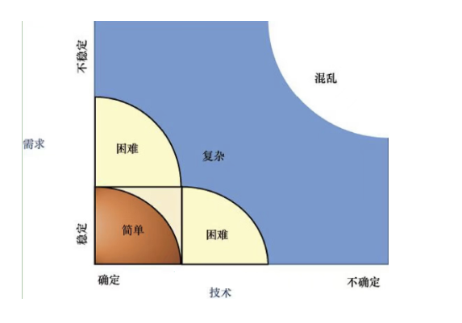

# 项目管理之敏捷开发-第一部分：价值驱动

敏捷开发是伴随互联网产品兴起的一套通用型管理模式，管理理念由“闭关修炼”转向“开放互惠”。更加注重价值驱动，关注人与人之间的沟通与协作。具体实践为“有效沟通，降低成本，快速迭代，复盘调整”。

# 传统“瀑布”开发与“敏捷”开发

传统项目的管理“铁三角”是：需求范围、成本控制、进度管理。这要求客户的需求是明确的，可以真实反映产品的需求，并且团队做的计划是符合实际的，几乎不存在延期或存在较少的可控风险。

在新的互联网产品中，客户需求是随万变的市场随时变化的，几乎不存在确定的项目需求。对市场的敏锐洞察是组织成长的第一要素，这就要求组织中的团队具有快速响应，可以迅速推出新产品，并持续的快速迭代的能力。

Jim highSmith（吉姆.海史密斯） 提出：价值目标、质量目标、约束目标。敏捷开发铁三角。追求价值最大化应该是每一个项目的管理目标，也是所有重要决策的依据。在整个开发过程中，管理决策都应该围绕价值目标的实现来进行。一款成功的产品，必定是解决了用户或客户的一个或多个需求或痛点。

敏捷开发也并不适用所有的项目，这需要根据需求及技术背景来判断。将这两个因素做一个图来观察。项目的复杂度可分为“简单、困难、复杂、混乱”等 4 个描述。

- 需求的稳定及技术的稳定，是“简单”的项目。通过“传统/接力”的开发模式是最优的选择。
- 需求及技术的困难和复杂，更加适用于“敏捷”的开发模式。
- 需求及技术的不确定性，一般很少见。这是一种新维度上的“实验性”产品的开发，任何的模式都没有一个确定的结果，只能是“摸着石头过河”。

**需求的确立，是客户对自己产品的认知过程**

需求是客户的一种愿景，实现公司或其产品价值的诉求。包含 2 种形态（熵增、熵减）和 4 种分类。

**管理过程中的熵减 - 更加有序**

需求的提供者和产品开发团队，在进行不断的良好沟通的基础上，追加新需求特性时平衡好约束条件。由需求提供者（客户或用户）与团队一起完成产品的过程。这是愿景（Vision）的第一种形态：需求的自然进化（Requirement Evaluation）。

**管理过程中的熵增 - 更加无序**

当团队缺乏与客户/用户之间的沟通，客户的需求无法做到必要的价值分析、成本控制。开发团队往往会假意用户意图，变更追加的需求。这是由客户与开发团队共同造成的，愿景的第二种形态：需求失控蔓延（Requirement Creep）。

需求有成本，却不一定有价值。敏捷开发可以有效控制和降低“试错”的成本。我们将需求的不确定性分为 4 个分类：

1. 模糊的需求：产品愿景不清晰、产品特性不清楚。需求随项目进度，逐渐清晰明确的一个过程，是客户对产品需求的理解不断完善的一个成长历程。
2. 波动的需求：产品愿景清晰，核心特性基本明确，只是部分特性较为模糊。
3. 常态的需求：产品愿景和核心特性基本确定，通常变更率小于 15%。
4. 稳定的需求：愿景和特性基本确定，且基本不会变更。例如：通用的计算机通信协议。

技术的摩尔定律，使其不断更新迭代。可以将其分为三种类类别：

1. 全新技术：摸着石头过河，具有高风险、高收益。一旦项目成功，也将为公司带来巨大收益。
2. 领先技术：具有某一领域的人才，或多个领域的多个人才。带领团队使用先进技术完成项目推进。
3. 常用技术：是一种常规的技术，多数成员都有丰富的项目经验。熟能生巧，是一种低风险、低收益。

传统的开发模式不能解决这些不确定性带来的问题，仅用于“简单”项目，才能体现“瀑布”模式的优势。“敏捷”的快速迭代模式，更适用于开发“复杂”类项目。

新方法的诞生，一定是解决旧方法的不足之处。敏捷开发就是在开发中学习、成长、调整和完善，是实现价值驱动管理的好方法。以人为本，和客户/用户一起完成产品开发的过程。敏捷开发包含 4 个核心元素：

1. 迭代开发：通过不断的演示、评审，继而做出必要的调整和改进。不断的循环往复。
2. 特性驱动：由用户需求细化为产品的特性。根据特性的优先级不断完成需求的特性子集，是每次迭代的目标。
3. 时间盒：固定的周期内完成一个迭代。持续迭代的过程中，更关注问题的解决和优化，实现“先有后优”的迭代逻辑。
4. 增量提交：根据每次的迭代，不断优化和调整产品需求及子级特性。对项目需求和时间盒做“增量”的调整。

敏捷开发是一种项目管理的理念，是决策和部署的逻辑依据。在实践过程中还需要管理者进行更细致的落地。以下是对敏捷开发管理过程中的场景描述：

- 客户对产品的理解是不断的学习过程。允许需求的不断变更，但需要平衡“约束目标”。
- 有效的“沟通”是项目推进的“捷径”，随时的“复盘”是项目进展的“效率”。理解“频繁的风险出现”是项目正常进展的表现，而风险的减少与控制，是优秀管理者能力的体现。
- 以“面向对象（PDO）”的编程思维，是控制代码以更好支撑敏捷开发的基础技能。
- 良好的测试流程是“方向盘”，可以不断校正产品的最终形态，便于达到客户的预期效果。
- 多项目的并行，不会提升团队的效率，反而是效率的阻力。

# 敏捷开发的方法

机缘巧合下，17 位敏捷开发的代表人物，在 2001 年 2 月 ，在美国犹他州雪鸟城滑雪时，奠定了敏捷开发的具体实践理论。敏捷宣言，也称之为敏捷软件开发的宣言，正式宣布对敏捷开发的 4 个核心价值和 12 条原则，是以人为中心的软件迭代方法。

## 敏捷宣言的 4 个核心价值

1. 个体和互动 高于 流程和工具：

2. - 对于复杂的项目，有效的沟通和互动，相比规范流程和工具更加重要

3. 工作的软件 高于 详尽的文档

4. - 产品的阶段性演示，才是与客户及团队共同进步的最大效果。

5. 客户合作 高于 合同谈判

6. - 与客户一起完成产品的理解和开发。

7. 相应变化 高于 遵循计划

8. - 唯一不变的，就是不断的变化。

## 敏捷宣言的 12 条原则

**1、第一优先的任务是尽早的、持续的交付令客户满意的软件产品。**

通过频繁迭代与客户形成早起的良好合作，为客户先提供最有价值的功能，通过及时反馈不断提高产品质量。通过用户故事罗列需求，用户故事是需求的轻量级技术，没有固定的形式和强制性的语法。使用基于用户故事的需求分析方法时，仍可能需要原型和编写文档，只是工作重点更多的转移到了口头交流上。

**2、即使到了项目后期，也欢迎需求变更。敏捷过程利用变更为客户创造竞争的优势。**

不怕变化，反而认为需求的变更，是让团队更好的理解时长需求的途径之一。

**3、频繁的交付可以工作的软件，交付间隔越短越好，间隔可以从几周到几个月。**

迭代受到固定周期的影响，这要求我们哪怕丢掉一些优先级更低的特性，也必须保证及时有效的迭代过程。每次迭代中新增的功能都必须是经过编码、测试，达到了可发布质量标准的。

敏捷开发过程中，对开发阶段没有重要的划分。在项目开始时，各阶段就是同步进行的。

**4、在项目开发期间，业务人员和开发人员必须可以随时沟通、一起解决问题。**

软件项目不会依照之前设定的计划原路执行。中间对业务的理解、软件的解决方案肯定存在偏差，所以客户、需求人员、开发人员及涉及其他所有人员之间必须进行有意义的、频繁的交互，这样就可以在早期及时的发现并解决问题。

**5、围绕一群有动力的个人进行项目的开发。为他们提供需要的环境和支持，并先前他们能做好。**

需求和技术是引起不确定性的 2 个重要因素，人是第三个因素。而需求和技术又是由人来执行，所以能够激励人来解决这些问题，是解决不确定性的关键。只要个人的目标和团队的目标一致，我们就需要鼓励每个人的积极性，以个人为中心构建项目，提供所需的环境、支持与信任。

**6、在团队内部，最高效的信息传递方法，就是面对面的沟通。**

在十几和二十几个人组成的大团队中，文档是一种比较适合传递知识和交流的途径。但敏捷团队一般不会很多人

**7、工作的软件是首要进度度量标准。**

一般的工作是很好的可以进行量化，而敏捷项目的内容更多的无法通过简单的方法进行量化。而通过衡量这个功能是否完成的首要标准就是这个功能可以正常工作，对于用于来说可以使用了。

**8、敏捷过程提倡持续的开发。产品的赞助者、开发者和用户应该能够保持一个长期的、恒定的开发节奏。**

敏捷开发不等于经常性的加班。一个项目的后期阶段可以说加班完成这个项目，但往往是这个项目结束又会来新的项目。持续加班只会导致人员疲劳、厌倦，想要保持长期恒定的速度也只是梦想而已。

**9、不断关注卓越的技术和好的设计，会增强敏捷能力。**

敏捷过程有很多好的技术实践、原则和模式以增强敏捷的开发能力。

**10、简单 —— 是最大化的减少不必要工作的艺术 —— 这是敏捷的精髓。**

我们无法预期后续需求如何变化，所以不能一开始就构建一个完美的架构来适应以后所有的变化，而是把注意力放在如何通过最简单的方法，完成现在需要解决的问题。最终也需要根据实际考量，确定可以预期的部分内容，如果按照目前评估，在未来也可以很简单解决，那么就建立不考虑。

**11、最好的架构、需求和设计出自，能自我组织的团队。**

在自组织团队中，管理者不再发号施令，而是让团队自身寻找最佳的工作方式来完成工作。自组织是一个团队，而不是一群在一起工作的人，必须视彼此为一体。团队的形成必须经历几个时期，自组织团队是一个自动自发、有着共同目标和工作文化的团队，并且总是想组织做出承诺。实现自承诺对团队来说非常重要，否则一旦出现问题，团队成员之间就会出现信任危机。

虽然敏捷开发小组，是以小组为整体来工作，但还是有必要指明一些承担任务的角色。第一个角色就是产品拥有者（Product Owner），其主要职责包括：确认小组所有成员都在追求同一个共同的项目前景，确定功能的优先级以便总是在处理最具有价值的功能，以及做出决定使得对项目的投入可以产生良好的回报。可以对应以前开发中的“产品经理”。另一个角色是开发团队（development），这里的开发人员包括架构师、设计师、程序员、需求人员、测试人员、文档编写者等，有时产品所有者也可以被看做是开发人员。还有一个重要角色就是项目经理（Project manager），敏捷开发的项目经理会更多的关注领导而不是管理。

**12、每隔一定时间，团队会在如何才能更有效地工作方面进行反省，然后对自己的做事方法进行必要调整。**

敏捷不是基于预定义的工作方式，而是基于经验式的工作方式，小组通过不断的反省调整来保持团队的敏捷性。

# 敏捷开发框架和 Scrum

随着敏捷开发的发展，敏捷的过程有了更详细的描述。敏捷开发的框架包含 5 个阶段：产品愿景、推测阶段、探索阶段、调整阶段、关闭阶段；2 类过程：定义的过程（Defined Process）和经验性过程（Empirical Process）。

- **产品愿景阶段：**是确立愿景的大概范围，目标及约束条件是什么，并组织团队及培养工作方式。
- **推测阶段：**是建立产品的发不计划，包括：收集分析初始需求、估算开发成本、考虑风险和缓解策略、建立迭代和开发计划。
- **探索阶段：**遵循有效的技术经验及任务管理，提交规划好的需求特性。建立并完善一个自我组织的项目团队。与客户及团队相关利益人，不断加深对产品价值及约束条件的理解。
- **调整阶段：**共同评审，作出工作调整及下一个计划。
- **关闭阶段：**项目复盘，汲取经验。

在以上阶段过程中，根据不同的项目，会有 2 类过程的实践：定义的过程（Defined Process），是一个可重复生产、可预测的过程；经验性过程（Empirical Process），项目进展透明化。不断判断过程中的禅意问题，保持步调的一致性。配合审查做出调整。

Scrum 是敏捷开发过程的一个具体实践方法，通常不会淡出出现。更多时也会结合其他敏捷方法进行对症处理。包含 6 个环节：

- **产品经理（Product Owner，PO）：**负责建立并维护一个按优先级次序排列的、反应客户期望的产品需求列表（Product Backlog）
- **迭代过程（Sprint）：**从需求列表的高优先级中，选取一部分放入迭代需求列表（Sprint），并决定如何开发这些需求功能。
- **进度控制：**在固定的周期内完成一个迭代，通常是 2~4 周，每日评估进展情况（Daily Scrum）
- **交付：**每次迭代的成功，都是一个可以演示的功能。
- **评审和回顾：**每次迭代完成后，进行评审和回顾。对产品及团队工作方式做优化调整。
- **循环迭代：**每次完成后，继续从需求列表中选取下一部分高优先级需求项，开始新一轮开发工作。

**Scrum 是落地敏捷开发的具体指导步骤包括： 3 个角色、3 个文档和 5 个会议。**

- 产品经理是沟通客户/用户，建立产品愿景，以实现为用户带来价值。与用户保持沟通，及时收集用户反馈、优化产品需求。确定需求的优先级，并明确验收标准。
- 项目经理是领导开发团队，实现自我组织的重要角色。建立、改进适用于团队的方法过程。推动敏捷的有效实践，解决团队障碍问题。协调各方沟通及资源支持。
- 团队成员是包含跨职能的多个人员团队，评估产品需求复杂度，考虑及执行具体开发过程等。
- 3个文档是帮助团队在敏捷开发过程中的工具。包含产品需求列表、迭代需求列表和燃尽图。
- 5 个会议是支持敏捷开发的互动方式。包含产品需求会议、迭代计划会议、每日立会、迭代评审会、项目复盘会。

# 极限编程是 Scrum 的最好补充

Scrum 更强调的是一种价值观，再此价值的驱使下，形成一系列的行为准侧、活动等。极限编程是更为具体的一种操作方法。

极限编程的 4 个核心价值“沟通、简洁、反馈、勇气”。即描述的是：它将复杂的开发过程分解为一个个相对简单的小周期。通过积极交流、反馈及其他一系列的方法，开发人员和客户可以非常清楚开发进度、变化、待解决的问题和潜在的困难，并根据实际情况及时有效的调整开发过程。

**5 个基本原则：**快速反馈、保持简洁、微量变更（一次变一点）、拥抱变化、质量至上。

**10 个一般原则：**鼓励授人以渔、控制前期投入、决策实验验证、坦诚沟通文化、做事尊重人性、敢于担当责任、结合本地特性、团队轻装上阵、真实客观度量。

**极限编程的 4 个核心工作活动：**倾听、设计、编码、测试。

**极限编程的 12 条实践：**

- 计划活动（Planning game）：快速依据业务价值开发成本估算确定下次发布需求范围。并随迭代不断滚动
- 小版本（Small release）：只要开发出对用户有价值的功能，就尽快上线，让用户使用。
- 隐喻（Metaphor）：用简单的内容描述系统功能，指导所有开发工作。
- 简单设计（Simple Design）：用最简单的方法实现系统。如同奥卡姆剃刀。
- 测试（Testing）：由测试驱动开发。
- 重构（refactoring）：不改变系统功能的前提下，不断优化代码结构。去除重复、增加可读性、简化复杂度。
- 结对编程（Pair Programming）：所有程序都是由 2 个程序员在一台机器上编写出来的。
- 代码共享（Collective Ownership）：任何人都可以随时、随地修改系统中的代码。并做必要的权限管理。
- 持续集成（Continuous integration）：每完成一个新任务时，就进行继承和重建。
- 不加班（40-hour week）：不建议团队连续加班 2 周
- 现场客户（no-site customer）：有一个真正的用户自始至终参与团队的开发，随时回答团队的问题
- 编码标准（coding standard）：所有程序员都应遵循童谣的编码规范要求，完成所有开发。

# 推动敏捷的变革

敏捷开发将带给团队不小的变化：改变量化业务目标的方法、改变管理方法、改变开发方法、改变考核过程、改变将风险最小化的方式、改变思维方式等。

需要管理者的勇气及远见的认知。需要知道引入敏捷开发的目的是什么，具体要求解决什么问题。需要团队或组织有哪些必要的技能。如何提升必要的动力，例如成就感、自我管理、清晰的目标设定等。需要哪些必要的资源，行动计划是什么。

**变革管理的 5 要素：**愿景 → 技能 → 动力 → 资源 → 计划。

- 缺乏愿景，将导致团队的困惑。
- 缺乏技能，将导致团队的焦虑。
- 缺乏动力，将导致团队的变革非常缓慢。
- 缺乏资源，将导致团队变革的无奈。
- 缺乏计划，将导致团队变革的不透明。

**敏捷开发将带来：**

人和组织的变化。岗位的减少，产品经理的责任更大，回报机制成为团队的主要激励手段。

企业文化及习惯的转化。建立价值驱动文化，考虑成本及收益。建立团队精神，发挥团队的潜力，提升团队的能力。关注问题的解决，尽快提交为客户带来新价值的产品。减少项目风险，提升产品质量。避免一个人同时做多件不相干的事情。复杂任务简单化、细致化。过程中快速反馈。

