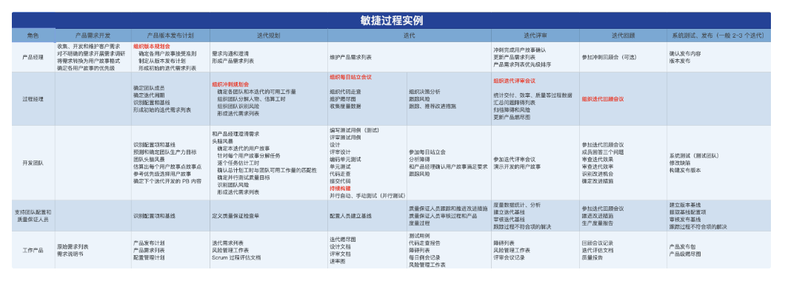
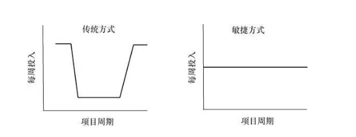
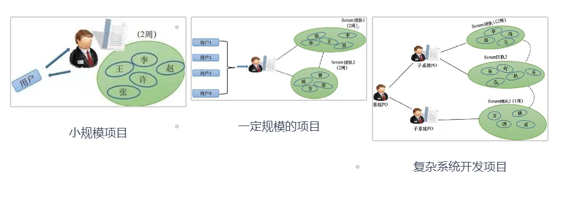
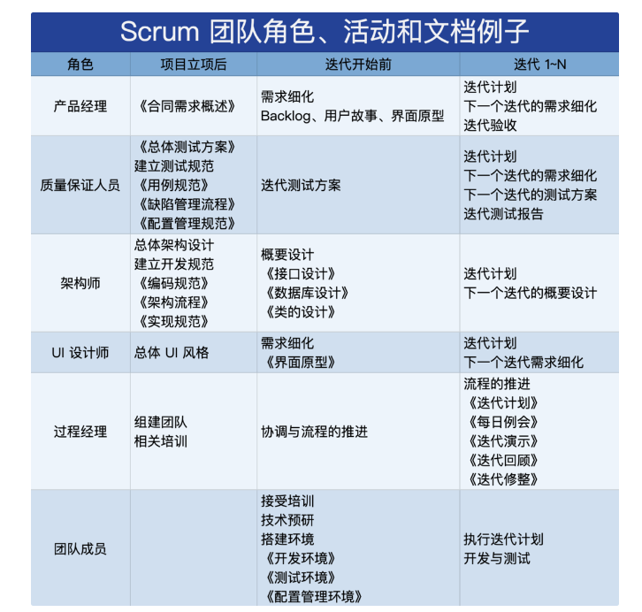
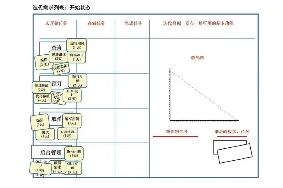
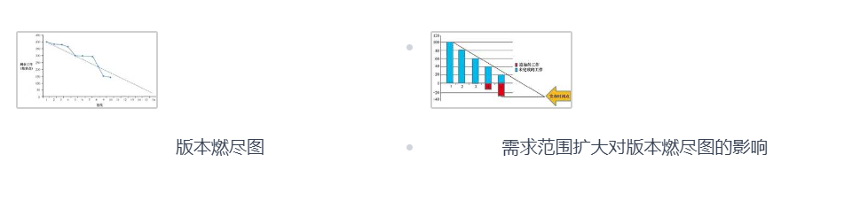
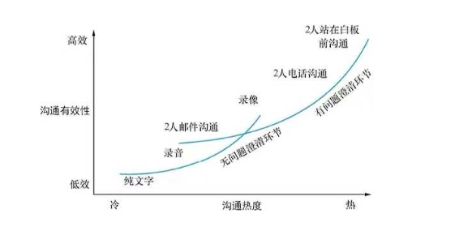
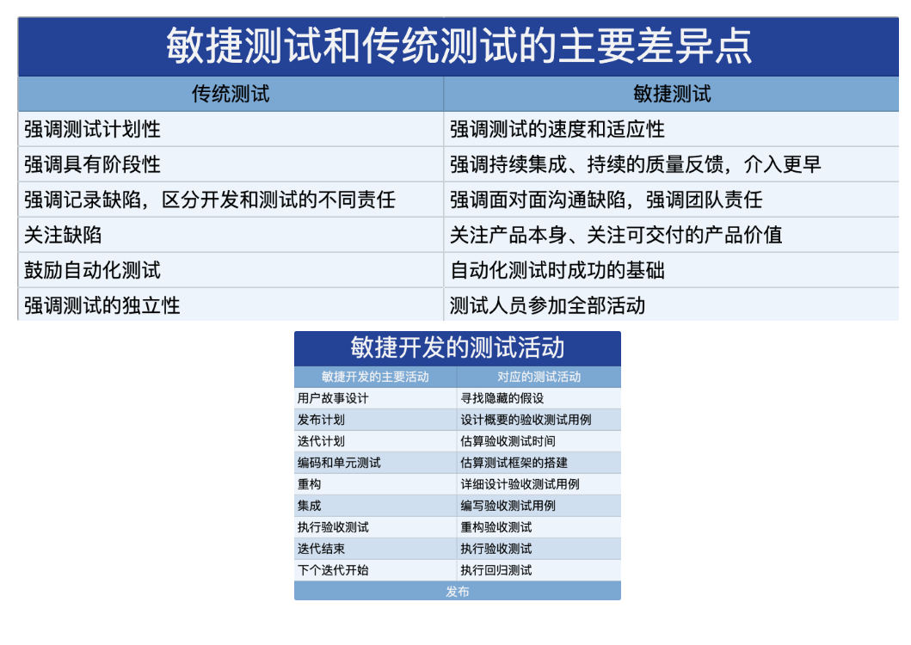

# 项目管理之敏捷开发-第二部分： Scrum 敏捷框架

敏捷开发不适用于所有的任何业务类型，它需要根据当前具体的项目及公司的理念，做复合型的调整及应用。在考虑之前必须思考清除敏捷的核心及当前环境急需解决的问题，两者是否会有相成之势态。敏捷转型的思考

## 敏捷转型的思考

根据具体情况，确定所需引入的“敏捷”活动。分析组织内的项目类型，建立相应的敏捷管理过程。确定 Scrum 中的角色和组织内的对应角色，以及各类橘色人员的比例。确定敏捷项目需要的工具支持、办公环境、开发测试环境等。确定所需的工程和管理文档。

## 建立适合的敏捷过程

一个完整的敏结过程应该是端到端的过程。敏捷的管理过程是一种增量开发产品功能的过程，迭代就是在搭好的骨架上“不断加肉”。

## 项目管理框架的 5 个阶段

**产品愿景（Envision）：**需要建立一个明确的愿景及大致范围，也就是这个产品存在的价值。可以通过三个问题，辅助找到产品定位：做什么？谁来做？如何做？

**推测（Speculate）：**根据产品愿景推测实际操作过程中的步骤及可预见的风险和环节策略等。让计划更加靠谱。

**探索（Explore）：**需要从两个方面来执行。一是开发产品的用户故事，营造一个与客户、产品经理、团队及其他利益相关人密切的合作关系。

二是团队的自我管理，通过各种适应本地环境的方法，不断促使团队形成良性成长的“飞轮效应”。

**调整（adopt）：**是对产品的评审及回顾，帮助产品不断的完善，寻找产品的真实价值所在。

**关闭（close）：**每一个项目的结束，都需要进行深度的复盘回顾。也是下一个项目成功的阶梯。

## 敏捷迭代及验证过程

敏捷开发需要做好迭代过程及验证的闭环。下面是一个敏结过程的实例参考。

在不多的实践中进行过程改进，所有过程改进一般都遵循 PDCA 循环。Scrum 过程中会更加聚焦PDCA ：

- **Plan：**产品经理有个业务计划，我们需要执行这个计划时努力将利益相关人的利益最大化。
- **DO：**过程经理推动团队按敏捷过程执行计划。
- **Check：**产品经理在每个迭代后检查团队的工作成果。
- **Act：**过程经理组织回顾，找出改进机会，争取下一迭代能做的更好。

## Scrum 中的角色及管理活动

每个团队都需要能啃硬骨头的人。项目中的 5W2H 问题可以帮助你更好的了解项目及适合的做事的人选

1. 谁决定做什么（What）
2. 谁决定为什么（What）
3. 谁决定什么时间做（When）
4. 谁决定由谁来做（Who）
5. 谁决定在哪里做（Where）
6. 谁决定如何做（How）
7. 谁决定做到什么程度（How much）

1~3一般由客户和产品经理来决定；4~5 一般由团队内管理者决定；6~7 一般由开发团队决定。

在团队中一般有两类角色。开发团队一般是生产角色，用户、客户、供应商、市场部、管理层等一般是决策角色。决策者和管理者应该为生产者提供任何支持，保障生产者的环境及资源等。

### Scrum 产品经理

传统模式下，产品经理的介入主要是项目开始和结束时频繁。敏捷模式下，产品经理在整个项目的开发周期中介入频率基本是一个常数。

敏捷的产品经理，必须能对产品的市场前景有很好的嗅觉，能够很好的梳理用户及市场反馈。

在组织中，适合担任产品经理的角色有：

- **产品线经理：**如果企业的组织架构已经按产品线来管理，那么产品线经理很可能就是很好的人选。
- **业务分析师：**他们对产品的洞察力使之能很好把控产品的大方向。
- **客户账目经理：**直接对行业客户负责，对负责的客户有比较好的了解，能够更好的领会客户反馈。
- **运维负责人/专家：**运维会直接面临用户在产品使用中的抱怨，从而升级反馈。这方面的专业知识及经验沉淀，也有可能对产品的前景有一定的理解。

一个 Scrum 团队一般不超过 9 个人。更多的人数一般会拆分多个 Scrum 敏捷小组，每个小组中都包含跨职能的人员组合。

一般一个需求列表对应一个图团队，一个产品经理可以对接多个 Scrum 团队，多个产品经理也可以对接多个 Scrum 团队。

### Scrum 过程经理

过程经理是实现“团队自组织”的重要岗位。项目成立前期或敏捷转型的前期，过程经理可以是全职。一个优秀的过程经理可以更好的完成团队的自组织，让团队形成一个整体，届时可以实现过程经理由团队成员轮岗制。

适合过程经理的最佳人选：

- **项目经理：**瀑布环境下的项目经理和敏捷中的过程经理是完全不同的两种类型，前者是控制命令型，后者是协调指导型。也不是每个项目经理都能成功的完成这个转型。
- **QA 人员：**对过程的熟悉和以往辅导项目组执行过程中积累的经验，加之高情商的 QA 人员是最好的选择。
- **开发经理：**适合于刚起步不久的小企业或刚开始敏捷转型时。
- **资深开发人员：**有很好的沟通能力和技术顶尖的人员。

根据项目的复杂度，一个过程经理也可以同时支持多个 Scrum 团队。主要职责除了很好的交付软件产品，还有实现团队的自组织。有如下方法可以参考：

- 需要和团队成员做 1v1 谈话，收集问题及看法等。让每个人都知道，我是为团队服务的，只要问题没有及时解决，我都会让问题升级。确保开发团队处于一个良好的环境中。
- 当产生分歧时，对事不对人。找出一条解决问题的办法，并达成共识。
- 当遇到外部挑战时，坚持团队决策，不推诿责任

### Scrum 团队成员

尽量做到团队具备的技能，覆盖产品所需的技能，同时需要考虑具备各类职能技术的人员比例。如果有不足，就应将职能技术作为迭代中的人物，放入产品需求列表中，迭代计划中包含培训活动。

能力的搭配与组合，是团队组建是考虑的因素：

- **设计、编程能力：**硬技术需求。包含设计人员、架构人员、编程人员等。
- **理解业务需求、软件规则的能力：**所有成员必须具备一定的业务背景知识，能够和产品经理沟通需求，正确理解需求的支持、设计、开发、测试等工作。同时也需要有行业及具体业务的知识沉淀。
- **理解模块间复杂调用关系的逻辑能力：**对复杂项目要有一定的接口设计能力，能理解复杂业务处理的逻辑。
- **识别软件中错误的能力：**对业务、设计、白盒和测试技术都熟悉的测试人员。
- **熟悉敏捷实践：**了解敏捷实践如何有效的在团队落地。
- **自驱力及沟通力：**具有项目管理能力

## 大型敏捷项目的管理

虽然没有大的敏捷团队，但是一定有大的敏捷项目。大型敏捷项目的重要工作就是解耦。在分配用户故事给多个 Scrum 团队时，尽可能让每个 Scrum 团队的迭代都不受其他团队的影响。这就要求各自的需求功能相对独立，迭代中的测试不需要调用其他团队的代码。

根据用户故事的需求，每个团队都需要有客户端、服务端和数据库的人才，降低团队内沟通成本，有助于提升团队协作效率。同时建议在大的版本发布点上，各团队完全同步，方能在版本发布前做统一的评审。

在团队成员的初次分组上，可以考虑优先通过指定各团队人员，然后允许不满意的个人申请加入其他团队，或在经历一个迭代后在做调整。再后期有大量支援时，可以采用“种子团队”的模式进行。通过培养“种子团队”，继而拆分到各小组去支持敏捷过程的实践工作控制。

建立支持多个应用团队的公共模块团队，在架构不成熟的情况下，不断完善设计架构，为应用团队提供公共架构。在测试资源紧张的情况下，可能被迫用一个测试小组，支持多个应用开发团队的测试。也是为了减少对开发的干扰以及应付紧急开发任务（如缺陷修复、紧急功能实现等）而建立的维护团队

### 敏捷过程对文档的要求

敏结过程关注 3 类文档：产品需求列表、迭代需求列表、版本计划表。敏捷提倡有价值的不重复的文档。文档的价值体现简述：

支持便利的就设计复用；支持需求的沟通；支持更有效的设计评审；支持独立的实现模块的集成；支持更有效的代码走查；支持更有效的测试；支持高校的产品功能升级、缺陷修复；支持有效的知识传递、项目交接；支持团队计划、软件开发过程；支持用户使用、管理和开发出软件系统等。

在文档制作时，让尽可能多的人员介入文档的编写过程；将以邮件形式、论坛形式的技术讨论、常见问题回答，转变成正式的产品技术支持文档，这些也可以看做是开发文档；用各种形式支持文档制作，如文字、多媒体视频、PPT 演示等，根据需要建立不同的文档形式；所有文档都应该是电子形式的，使用任何适合的工具对电子文档进行逻辑分类，管理阅读、编辑、发布等权限；允许文档增量扩展，规范文档质量；建立并强化文档维护的社区组织，文档的开发调整和迭代与产品开发同步；面对面沟通是文档使用过程中不可缺少的一部分；由专业技术协作人员对重要文档进行完善，如修改语法、改进可读性等；

### 敏捷过程的需求文档

**用户需求文档：**是站在用户角度对要解决的问题的描述或产品的愿景。问题领域的简介，希望软件产品提供的功能以及不希望软件产品提供的功能等。

它不应站在开发角度描述需求，不应包含具体实现的技术细节或大量的技术术语。如果用户没有要求，不要对开发语音或实现环境做描述，不应包含任何解决方案。

**需求分析文档：**设计者对需求的解释、分解，将需求分解到对应的子系统。对各子系统做深入分析，识别一些已有的解决方案、可选的技术方案。将方案和用户需求要解决的问题进行评审，给出一个整体的解决思路并做必要的分解，落实到具体可操作的步骤方法上。

它不应站在用户角度描述问题，不应包含具体的实现细节、算法、用户接口等。

**用户接口文档：**对用户接口需求的完整描述，是用户看到的接口形式，功能及作用。在图形用户界面（Graphical user interface，UGI）环境下给出详细的界面设置（各组件名称、鼠标、选择键、指令、接口位置等）。在命令行界面（Command line interface，CLI）环境下给出详细的使用说明以及所有参数和子命令的意义和说明。在应用程序编程接口（Application Programming interface，API）环境下，给出可能的授权、用户、文件、目录、操作等相关信息，同时给出功能、请求方法、参数等的说明。

它不应包含实现细节，接口后面的东西。

### 版本迭代规划

只有掌握了团队的速率，才能做出有效的版本迭代计划。影响团队速度的主要因素有：

- **团队的稳定性：**频繁的人员变更，会导致团队效率的低下。
- **迭代前的准备工作：**对项目的愿景及核心功能的理解、架构关键设计的完成、开发团队及相关利益人对 Scrum 工作模式的了解度、开发华景及工具的到位等。
- **团队在开发过程中质量意识：**是技术债务的控制及降低条件。
- **定义并遵循严格的完成标准：**是评审验收的控制。
- **团队成员能力的培养：**是长期发展的需要。

允许项目需求在一定范围内具有灵活性。关注功能及性能、优质的服务和可靠的品质，都需要时间和金钱的付出。

FQS/TC 公式可以计算。F 代表功能、性能；S 代表服务；Q 代表品质；T 代表时间；C 代表价格。

遵循“最有效市场价值（Minimum marketable feature，MMF）”原则制定产品版本计划。将项目分解成最有市场价值的功能特性集，每个小的子集都能实现独立的客户价值，依据这些价值，我们可以找出性价比最好的针对 MMF 的开发次序，最大限度地降低我们投入的风险。

MMF 主要目的有两个，一是减少工程人员的时间浪费，二是尽快让软件产品在有眼光的客户手中用起来。MMF 方法不是专门为敏捷提出的，但它为如何进行敏捷中的版本计划，提供了一个有效的实践原则。

### Scrum 过程中版本计划活动

**Scrum 的 3 个迭代列表：**

**产品需求列表：**客户产品愿望清单，按照客户的价值高低排列。允许随时调整。

**版本需求列表：**是产品需求列表的子集，包含不超过 6 个月的工作量。定义了本次版本希望实现的产品功能、性能。允许随时调整。

**迭代需求列表：**本次迭代需要实现的需求，一般稳定不变。

**迭代计划定制遵循的步骤原则：**

**建立产品及版本的需求列表：**和客户、用户沟通及其他渠道，建立初步的版本需求列表。如有可能，参照 MMF 原则。列表是动态的，随时可以由产品经理进行维护。

**估算需求列表的故事点数：**Mike Cohn 描述了常用的敏捷扑克牌估算法，估算出每个用户故事的点数。

**确定需求的优先级：**客户有决定权，Scrum 团队有责任提出自己的建议。对客户有重要价值同时能用来证明设计架构的合理性的用户故事，应该是我们的首选。

**估算团队的速率：**一般 4~6 次迭代后，团队速率会区域稳定。前提是较为稳定的团队。

**初步确定版本进度：**有 2 中应用场景：

1. 1. 版本交付是刚性的：MMF 方式，完成最有价值的功能。
   2. 版本需求是刚性的：通过燃尽图等方式，进行评估和控制。

### Scrum 过程中迭代管理

**Scrum 中包含 3 类计划：**

**版本计划：**本次产品需要实现的功能（范围）、进度和投入资源。项目初期会有一个初步版本计划，每次迭代后，根据需要进行必要的调整。

**迭代计划：**根据上一次迭代情况及需求列表优先级，选取本次迭代实现的功能。并识别出完成这些功能所需要的任务

**每日计划：**通过每日立会，协调每个团队当日要完成的工作。

**便于 3 个计划的实施，规定了 5 类会议的支持：**

**需求列表会议：**通过细化版本需求列表，准备好1~2 轮迭代要做的工作。

**迭代计划会议：**通过迭代计划，安排下轮迭代的工作。

**每日站立会议：**通过每日立会，共享信息。协调当天的工作，识别当天需要解决的问题。

**评审会议：**通过迭代评审，获取重要利益相关人员对上轮迭代完成的用户故事的反馈，完善产品、迭代需求列表。

**回顾会议：**通过迭代回顾，识别团队改进点，不断完善团队的迭代过程。

通过 5 个会议逐步找到团队的开发节奏和做事规则，细化版本需求列表中的用户故事，准备好下一轮迭代工作。

从产品角度描述需求功能，需求分解细化，需求规模评估。参考模板：作为“角色描述”，我希望完成“活动描述”，这样可以获取“业务价值描述”。

- **角色：**是这个活动的人或活动的收益人。
- **活动：**实现产品或系统完成的动作。
- **价值：**用户获取的价值。

产品需求列表的优先级中，高优先级的故事描述颗粒度细，低优先级的故事描述颗粒度粗。每次迭代实现最高优先级的用户故事，每个新的用户故事设定优先级后放入需求列表中。产品经理任何时间都可以调整用户故事的优先级，删除用户故事等。

团队和产品经理一起从版需求列表中，根据之前迭代进度判断下一次迭代需要调整和进行的内容。在迭代中，若发现某个功能实现的难度较大，超出预期时间，则本次迭代可以先完成其中重要的模块，其余模块推迟到后续迭代计划中。

##### 做好每日站立会

每日不超过 15 分钟的站立会议，实现迭代过程中不断的审查（inspect）和调整（adapt）。问题的发现是会议的主要内容，问题的解决是会后的点对点讨论。

通过 3 个问题可以帮助有效找到问题所在：昨天做了什么？今天准备做什么？有什么困难阻碍了正常的工作推进？

在执行过程中需要关注以下问题，有助于站立会的更好推进：

- 未能有效关注障碍的清除，提出了问题，没有确保问题的解决
- 缺乏足够测试的支持，不能提交工作的软件
- 产品需求列表中的优先级及用户故事描述不明确
- 对团队成员的各种干扰
- 跳不出瀑布思维
- 技术债务失控
- 过分依赖于个别核心人员
- 缺乏团队的场地支持
- 过多的组织级问题
- 客户做不到及时介入
- 说的多做的少的怀风气

找到问题所在，一般会有如下的后续会议进行：

**互助会议：**立会上提出了困难，其他成员有过类似的经验，可以提供帮助。

**障碍清除会议：**讨论如何清除或绕开当日立会发现的障碍。有时团队会需要外部的帮助，过程经理需要做些协调工作。如果障碍有可能影响本次迭代目标的实现，那么这个会议就变成迭代功能范围的调整会议了。

**迭代中的反省会议：**如果 Scrum 的过程经理注意到团队一些问题，而这些问题的解决需要团队改变一些固有的做事方式，那么立会后就需要开反省会议，讨论一下什么样的变化时必要的。做事方式的调整不一定要在迭代回顾会议上来做。

**产品实现的技术讨论或评审会：**通过几个团队成员一起完成一个故事的相关任务，立会后他们通常会有一些技术讨论或评审会，如设计架构、详细设计、接口、测试覆盖等。团队应该鼓励有兴趣的人都参加这些讨论会，将其作为学习提高的好机会。

**迭代功能范围调整会：**如果团队判断已经不太可能实现迭代计划承诺的用户故事集，就要尽快和产品经理沟通，做必要的调整。考虑下面几个因素：迭代目标、本次迭代所剩时间、还有多少没有开发的用户故事、人员变化等。

##### 做好迭代评审会

只演示通过测试的代码，部分完成或未经充分测试的代码一般不演示。鼓励用户和客户代表主导功能演示，观察他们如何使用已完成的产品功能。产品经理是唯一判断演示代码是否满足验收标准的人。统计团队本次迭代的效率，收集参加会议人员对产品的反馈，帮助产品经理调整产品需求列表。

##### 做好迭代回顾会议

遵循团队制定的行为规范。如果没有，可以参考极限编程的价值观：品质（Quality），简明（Simplicity），团队配合（teamwork），勇气（Courage）。

#### 建立和维护敏捷小岛

“敏捷小岛”是信息显示，用于管理迭代开发活动的展板。包含：本次迭代任务状况板块；本次迭代用户故事板块；版本发布板块；速率和燃尽图板块；团队章程板块；关键用语板块；关注问题板块等。

**也包含一些其他信息板块：**

**用户故事板块：**尚未开发的故事；正在开发中的故事；可以进行测试的故事；通过完成标准的故事；

**版本发布板块：**目前为止项目完成情况；每轮迭代用户故事完成情况；还没有完成开发的用户故事。

**速率和燃尽图板块：**稳定团队的速率，最终会落在一个可预测的区间。燃尽图是指导项目的发布计划和监控，和团队速率也有密切的关系。客户追加新需求时，需要调整燃尽图计划。

提到会议，不得不说沟通效率。MCCarthy 和 Monk 研究结果显示，两个人在一个白板前面对面的沟通是最有效的。

#### Scrum 中的风险管理

软件行业基本赞同 Demarco 和 Lister 提出的项目中需要关注的主要 5 类风险问题：进度的不确定；需求的蔓延；团队成员的变动；业务规范理解错误；低下的生产率。

考虑每个功能实现的成本及收益，是控制需求蔓延的有效手段。建立一个 T型能力团队，可以缓解团队不稳定风险。例如：建立鼓励多面手的激励机制；推广跨领域培训；安排工作任务时，将开阔团队成员能力作为一个重要考虑；

克服低效率时，频繁审视完成的工作，降低后期修改率。分布解决项目中遇见的困难，一次不一定可以很好的解决所有已发现的问题。形成良好的团队开发节奏和流程，以及管控好正在制作的产品规模，太大的规模不利于有效的推进。

#### 技术债务

技术债务是修复已上线程序中结构质量问题的成本，如果这些问题不解决，组织清楚其带来的后果：后续升级开发失控或用户操作失灵。

技术债务通常来源于生产关节中的个别问题，极少程度，主观很难发现。例如：

- **进度压力破事开发团队走“捷径”：**程序中不写注释，后期理解困难；测试不充分，存在操作隐患。
- **设计团队做了不恰当的设计决定：**过早选择某个通信模式，后期应用发现需要用不同协议。带来不必要的返工。
- **用户故事没得到足够的分解：**分解是解决复杂问题，减少隐患的有效方法。
- **没有对复杂的、有依赖关系的技术文档、代码进行互审或评审**。
- **缺少必要的系统文档支持：**代码和其他技术文档产生不一致，为以后的开发、维护、升级买下了隐患。
- **没有把不增加技术债务作为每次迭代“完成”的评审条件之一：**为团队走“捷径”开了绿灯。

Ward Cunningham 提出：为加快开发速度，产生些债务也是可以的，只要能及时优化坏债...

当这些债务没有被及时归还、处理时，风险就来了。花在那些没有写得太好的代码上的每一分钟都是这些债务的利息。

**减少技术债务可通过 3 个实践：**

- **识别技术债务的来源：**代码质量差；测试覆盖不足；缺少必要的文档支持。
- **技术债务的分类：**意识到的债务或没有意识到的债务；短期债务或是长期债务；慎重考虑的债务或是不顾及后果的债务；战略性的债务或是非战略性的站务。
- **技术债务的偿还：**代码重构；测试驱动开发；代码评审；结对编程；持续集成；编码规范；增量设计。

具体可通过以下 13 个步骤，减少技术债务：

1. **确定能投入到债务的时间：**计算每日花费在评审及代码重构上的时间。
2. **了解代码问题所在：**发觉代码的多余、不规范、隐患、...
3. **根因分析：**如何产生，如何避免。
4. **优化超前实施：**一定要避免仅仅由团队去假设客户将来的需求，仅由开发预测未来客户需求，这一般意味着后续的麻烦将会接踵而至。
5. **尽量寻求帮助：**鼓励相互沟通，很可能其他人有经历。问题一定要让大家知道。
6. **避免盲从：**问题了解清楚，兼听则明，旁听则暗。
7. **遵循最佳实践及编码规范：**监控检查工具，规范不能太多，但要重要。
8. **对超前代码做重构：**不要超前对多个模块重构。
9. **有效使用减债实践：**提前完成任务，用剩余实践做些还债工作。一定要规划好实践。
10. **自我管理技术债务：**团队的每个迭代都需要关注技术债务的积累情况，安排优化工作，落实到人、量等。
11. **关注效率提升：**持续跟踪迭代速率，洞察未发现的技术债务。
12. **学习使用重构技术：**所有开发人员都需要接受重构方法的技巧培训，并在开发中不断学习。
13. **持续学习，持续改进：**每个回顾会议上，技术债务管理应该是一个常态话题。

**技术债务的度量，可通过以下 3 中方式进行：**

- 可通过上线时发现的缺陷数；
- 维护中新功能开发的平均时间；
- 上线后修复缺陷的平均时间；

#### 需求开发及管理

Frederick Brooks 图灵奖获得者提出：软件系统开发最难的一件事（没有之一）就是准确决定开发什么。建立详细的技术需求，包括建立所有和人的接口、和机器的接口以及和其他软件系统的接口，是一个最难的概念梳理工作。他的错误对最终所建系统的破坏力以及后期修复难度的影响都是其他工作不能比的。

数据显示 37%的软件开发问题和需求有关，其中 13%源于无效的用户需求收集。12%源于需求遗漏。12%源于需求变更。需求问题带来的返工可能占整个返工的 75%~85%。

**需求分析的难点主要体现在：**

- 开发人员不懂应用及应用领域
- 客户和用户不懂软件能做什么，也不知如何表达他们的需求
- 开发替客户做需求决定，他们对客户的态度是“你不懂，那我替你决定”或“这些特性非常好，你一定喜欢”
- 开发和客户不理解对方，某个词汇在不同领域有不同的意思
- 软件需求不能明确表述出来，需求描述和实施无法分离（这种情况发生过吗？客户看了软件规格之后第一反应是：这是我要的系统吗？）
- 低估了需求分析获取的难度，没有投入必要的资源
- 没有识别出或真正理解肺功能需求
- 自始至终需求都可能会变，甚至上线后也会变

我们意识到永远不可能开发出完美的需求，我们只需要对下轮要开发的需求特性（可能只占整个产品需求的 1%）在价值点和所需投入上达成足够的共识，将风险尽可能控制在可接受的范围。没有足够的需求共识会导致大量不可预测的返工。

#### 用户需求的有效开发

通过全面识别用户，是开发用户故事的有效方法，是开发用户需求环节中不可忽略的活动。我们不应去猜测用户需要什么，而是和他们一起逐步理解产品要解决的问题。具体可以通过以下方法实践：

1. 用户的不同角色类型识别，头脑风暴：每个参会者把他认为是可能的所有用户类型写在不同的卡片上，写完后把卡片都放在桌子上。
2. 梳理角色，将相似类型放在一起。
3. 对用户类别进行整理、组合：讨论每张卡上所有用户的特点，将同类或有重叠的用户卡放在一起，合并同类用户。用更通用的名字替代内涵过窄的名字，删除对产品成功意义不大的用户。

#### 敏捷中的设计和开发

敏捷强调用最简单的设计实现当前的需求，而不是去预测后面的变化。只需预留扩展点即可。

**简明设计原则**

极限编程创始人 Kent Beck 提出 4 条简明设计，重要性分先后：

1. 不论设计的多么漂亮，如果需要用它的人不理解，那就说明还不够简明
2. 所有需要沟通的思路都在系统里面有所提现。就像词汇表单词一样，系统里的元素是为未来读者沟通准备的。
3. 复制的逻辑和结构都会让代码难读难改
4. 在满足前 3 条要求下，系统尽可能用最少的元素。意味着写得少、的的少、沟通少

简明意味着简洁优雅的设计，是每个软件工程师都应该努力做到的：

1. **不重复自己（DRY）原则：**Don't Repeat Yourself Principle，DRY。让每一个重要的概念在设计中都有一个唯一明确的体现。
2. **只发布必须发布的接口：**确定外部确实需要调用你的代码。尽量减少接口数量，同时不要急于发布。一旦发布，就是一个对外的承诺，变更就不那么容易了。
3. **高内聚，低耦合：**单一责任原则。让每个模块尽可能独立完成某个特定的子功能。注重代码分解，使其具有更好的复用性、维护性、扩展性。解耦：是降低模块间的依赖、提高复用的好办法。

#### 敏捷中的评审

技术评审是 CMMI 中的一个重要内容，是 CMMI 三级组织的一项制度化的质量控制活动。经典技评审的主要要求：

- 有明确的的入口标准：作者未发现，技术评审发现了。体现了评审的价值。
- 给所有评委足够的时间：没有准备的评审很难发现有价值的问题。
- 赋予评委不同的角色：评审包含 5 类重要角色。**评审组长：**保证整个过程的有效执行；**上游映射者：**关注评审产出物和其依据的上游文档的具体映射，发现遗漏、多余和不一致问题；**下游使用者：**从使用者角度发现被评审产出物的问题；**阅读者：**保证所评产出物的内容都被覆盖到了；**记录员：**在评审结束时记录效率相关数据；一个评委常常会担当多个角色。
- 指定评审计划：对于敏捷团队，迭代计划时需要将评审作为重要的人物来考虑。需要根据评审规模、依据评审速率（如设计，页数/小时、代码行数/小时等）安排评审的投入时间，并在结束时，收集简单数据。
- 使用检查单：有效的评审需要有针对性强的检查单。仅为每个评审产品类型建立一个通用检查单的做法对提高评审效率不会有大的帮助。
- 发现缺陷是第一目标：尽可能多的发现缺陷。
- 遵循定义的规范：适合团队的有效做法应该规范起来、文档化，只有这样我们才能对其改进。
- 收集评审效率数据并给出结论：收集缺陷、投入时间等效率数据，能够帮助我们更好的制定评审计划，也能指出评审短板。
- 明确出口准则：定义好明确的出口准则，包括对缺陷的修改确认。

#### 敏捷中的测试

让发现的缺陷价值最大化，是测试的核心内容：

- 为什么内部评审、测试未能发现这个缺陷？应该是那个环节发现？
- 提交的程序，还有哪那模块可能有类似的缺陷？
- 如何修复这个缺陷？
- 如何保证类似缺陷不在出现？

**敏捷与瀑布下的测试，3 个差异点：**

- 测试接入时机大大提前，测试和开发基本同步进行。
- 敏捷提倡，测试是个持续不断的过程，不要认为的中断。
- 敏捷更加痴迷的追求测试自动化

**测试驱动开发的价值：**

测试驱动开发，Test-Driven Development，TDD。先写自动执行的测试用例，再写能够通过测试用例的代码。可以大致通过以下步骤操作：

1. 根据开发语言选择测试架构，如 Java 语言用 Junit
2. 选择最简单的需求（可能对于某个方法）写出测试用例
3. 根据某个需求功能要求，选择一部分测试
4. 写出最少量能通过测试的代码
5. 如果通过测试，则继续这个方法里的新方法的另一个用例
6. 通过测试的代码做重构优化

**持续继承需遵循的原则：**

- 所有开发人员需要在本地做构建，确保变更不会导致持续集成的失败
- 开发人员每天至少向版本控制库中提交一次代码
- 开发人员每天至少从版本控制库中更新一次代码到本地机器
- 需要有专门的集成服务器，来执行集成构建，每天需要执行多次构建
- 每次构建都要 100% 通过
- 每次构建都可以生成可发布的产品
- 修复失败的构建是优先级最高的事情

