[TOC]


# 项目管理之敏捷开发


# 敏捷开发的常见框架

有一个新鲜的词语 VUCA 时代，中文叫“乌卡时代”。被应用于从盈利性公司到教育事业的各种组织战略中去。这与敏捷有着及其相似之处。

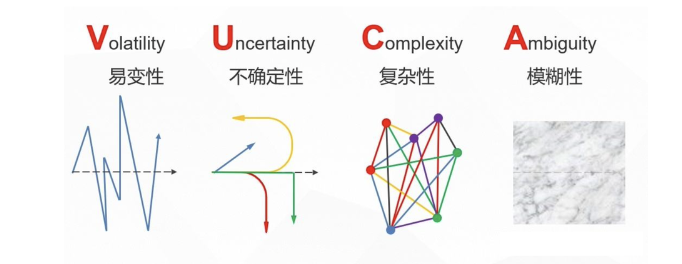


## 新产品的开发模式

敏捷开发中较为突出的是 Scrum 模式，这种开发模式有 6 个特点：内建不稳定、自组织团队、重叠开发阶段、多样化学习、微妙的控制和学习的组织内转移

**内建不稳定**

高层管理者往往只是指明战略方向，指定具有挑战性的目标，这种挑战性目标会传递压力给团队。团队体会到这种不确定性，从而激发团队的斗志。

**自组织团队**

像一家初创公司一样运营。具有三大特征：自治、自我超越和交流成长。自己制定计划和进度表，突破原来的惯性思维，每天都在渐进的改善、完善、不断提升

**重叠开发阶段**

开发的各个阶段重叠，交替进行。使得团队始终保持信息通道畅通，增强了合作意识

**多样化学习**

跨越多个层次（个人、团队和企业）、多个专业（不同领域）的学习

**微妙的控制**

强调“自我控制”，通过环境（同事）来增强内驱力

**学习的组织内转移**

定义开展将学习的知识转移给接下来的新产品开发项目或组织的活动，知识也可以通过项目活动作为标准实践，在组织中传播，甚至将成功的经验制度化。

这如同 PMI 中的 PMP 中所述，组织过程资产是需要沉淀的。

## 敏捷开发宣言和12原则

> 敏捷宣言和 12 原则是指导日常工作的价值观，需要根据**[组织的事业环境]**素进行裁剪，从而形成“本地化”的具体实践的**[组织过程资产]**

**《敏捷宣言》**

我们一直在实践中探寻更好的软件开发方法，身体力行的同时也帮助他人，由此我们建立了如下价值观：

**个体和互动** 高于 **流程和工具**

**工作的软件** 高于 **详尽的文档**

**客户合作** 高于 **合同谈判**

**响应变化** 高于 **遵循计划**

也就是说，尽管右项有其价值，我们更重视左项的价值

**敏捷开发 12 原则**

1. **我们最重要的目标是通过持续不断地交付有价值的软件使客户满意**
2. **欣然面对需求的变化，即使在开发后期也一样。为了客户的竞争优势，敏捷过程掌控变化**
3. **经常地交付可工作的软件，相隔几星期或一两个月，倾向于采取较短的周期**
4. **业务人员和开发人员必须相互合作，项目中的每一天都不例外**
5. **激发个体的斗志，以他们为核心搭建项目。提供所需的环境和支援，辅以信任，从而达成目标**
6. **不论团队内外，传递信息效果最好、效率最高的方式是面对面交谈**
7. **科工作的软件是进度的首要度量标准**
8. **敏捷过程倡导可持续开发。负责人、开发人员和用户要能够共同维持其步调稳定、延续**
9. **坚持不懈地努力追求技术卓越和良好的设计，敏捷能力由此增强**
10. **以简洁为本，它是极力减少不必要工作量的艺术**
11. **最好的架构，需求和设计出自自组织团队**
12. **团队定期地反思如何能提高成效，并以此调整自身的举止表现**


## 极限编程（eXtreme Programming，XP）12 个优秀实践

> **基本思想：**沟通、简单、反馈、勇气。
>
> 认为软件需求的不断变化是很自然的现象，是软件开发中不可避免的、应该被欣然接受的现象。
>
> **实践的价值观包含：**用户故事（User Story，US）、发布计划、迭代（Sprint）

**1、简单设计**

代码的设计只需要满足当前功能的需要，尽可能简单，不多也不少

**设计原则：**

- 成功执行所有的测试
- 不包含重复的代码
- 向所有的开发人员清晰地描述编码及其内在关系
- 尽可能包含最少的类与方法

简单的代码更易于工作，简单设计包括系统架构设计，简单的架构有利于设计的重构

 **2、代码规范（Code Standard）**

通过建立统一的代码规范，加强开发人员的沟通，同时为代码走查（代码评审）提供了一定标准，减少项目开发过程中的文档。极限编程认为代码是最好的文档。

**3、 测试驱动开发（test-driven development，TDD）**

强调测试在前、开发在后。再写产品代码之前先写测试用例（测试脚本），再运行测试用例通过，最后写产品代码让测试通过。这也是彻底的单元测试

**4、代码重构（Code Refactoring，CR）**

在不改变系统的行为的前提下，重新调整，优化系统的内部结构以减少复杂性，消除冗余，提高系统的灵活性和性能。是对“简单设计”的补充，改善即“有设计”，但不是代替设计。

**5、结对编程（Pair Programming，PP）**

是指两个（在技术上相当接近的）开发人员以交替方式共同完成软件的某个功能或组件的代码。即某个程序员再写代码同时，另一个程序员在旁边观察（代码评审），确保代码的正确性与可读性，并以 1~3 个小时的时间互相交换工作

**6、持续集成（Continuous Integration，CI）**

提倡每日构建一个以上的版本，并通过版本的特征，包括自动构建、自动部署和自动测试。持续集成能够提高代码重构的成功率和代码的质量，极大地减少回归缺陷。

**7、系统隐喻（System Metaphor）**

用通俗易懂的语言将原本晦涩难懂的概念或开发过程阐释出来，达到“一说就懂，一听就会”的效果。内容需要遵循以下原则：

- 一个隐喻只涉及一个过程
- 隐喻要得到特定范围内所有人的认可
- 隐喻要解决问题而不是产生更多问题

**8、可持续的节奏**

极限编程提倡健康工作、快乐工作。如实施每周 40 小时工作制，反对频繁加班，高效的构建高质量的代码

**9、代码集体所有（Collective Ownership）**

开发团队的每个成员都有更改代码的权力，所有的人对全部代码负责。整个团队的能力、灵活性和稳定性等都得到增强。

**10、现场客户（用户）**

理论上要求在整个软件开发过程中，客户一直和研发团队在一起，能随时回答团队的问题，及时获取客户的反馈。实施起来有些困难，一般产品经理或业务人员等扮演用户角色。

**11、小型发布（快速发布）**

快速发布是指每次发布的周期要短（2~3 周），每次发布的特性要少。从而容易评估每个迭代周期的进度，便于工作量和风险的控制，及时处理用户的反馈。若要做到快速发布，就需要测试驱动开发、代码重构、持续集成等实践的支持

**12、计划博弈（Planning Game）**

结合项目进展和技术，确定下一阶段与开发的系统范围。项目团队需要根据项目实际进展情况、需求变更、风险等及时进行项目评估，再根据资源、进度、质量状态、需求优先级等因素来调整和优化项目计划。具体做法如，每日立会。

**极限编程的特点：**

- **快速反馈：**开始接触一个事件和对这一事件做出反馈之间的时间，一般被用来掌握新情况以及做出修改
- **假设简单：**认为任何问题都可以用简单的方式解决
- **增量变化：**极限编程采用增量变化原则，使得整个开发进度及正在开发的系统更为可控
- **包容变化：**强调不要对变化采取反抗的态度，而是包容他们


## 行为驱动开发（Behavior-driven development，BDD）

**概述**

在敏捷开发中，一般推荐以用户故事来描述需求。

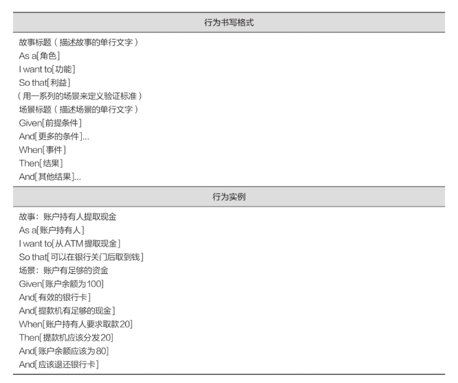

**行为驱动开发的根基是一种“通用语言”，同时被客户和开发者用来定义系统的行为，是一种敏捷开发的技术**。行为驱动开发可以看作是验收测试驱动开发（Acceptance Test-driven Development，ATDD）的延伸。在软件设计、编程前用场景来定义用户故事的验收标准，通过场景来澄清需求。

**BDD 的实践：**

- 确立不同利益相关者要实现的远景目标
- 使用特性注入方法绘制出达到这些目标所需要的特性
- 通过由外而内的软件开发方法，把涉及的利益相关者融入实现的过程中
- 使用例子来描述应用程序的行为或代码的每个单元
- 通过自动运行这些例子，提供快速反馈，进行回归测试
- 使用“应当（Should）”来描述软件的行为，帮助阐明代码的职责，以及回答对该软件的功能特性的质疑
- 使用“确保（Ensure）”来描述软件的职责，以把代码本身的效用从其他单元（Element）代码带来的边际效用中区分出来
- 使用“模拟（Mock）”作为还未编写的相关代码模块的“替身”


## 特性驱动开发（Feature-driven Development，FDD）

针对中小型软件开发项目的开发模式，强调简化、易用、易于被开发团队接受，适用于需求经常变化的项目。FDD 是一个以架构（Architecture）为中心，采用短迭代期，特性（Feature）驱动的开发过程。

**FDD 开发 4 个阶段**

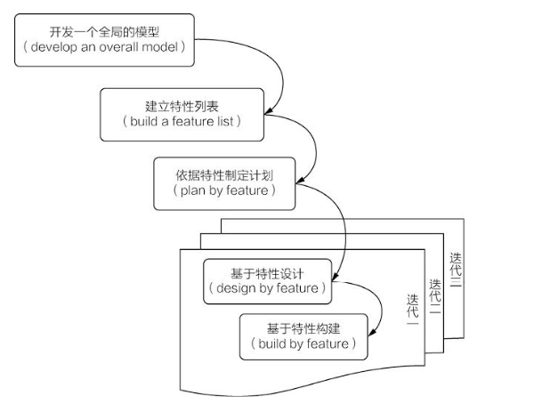

FDD 开发过程 4 个阶段

**1. 开发一个全局的模型**

在有经验的组件/对象建模专家（首席架构师）的指导下，业务领域需求人员与开发人员一起协调工作。业务领域需求人员提供一个初始的、具有一定高度的、可以覆盖整个系统和业务场景的介绍。业务人员和开发人员依此产生初始的模型，然后组成单独小组，进入详细讨论阶段。将模型描绘出来，最后丰富之前产生的初始模型

**2. 建立特性列表**

将这些特性进行分类、合并和整理。如功能需求中有用户注册、用户修改注册资料和用户用于登录功能，难么输入特性列表中之后就可能是围绕对象模型用户（User）的新增、修改、删除及查询等功能。

**3. 已经特性制定计划**

将这些特性排序和计划，然后分配相应的程序员组。

**4. 依据特性进行设计和架构**

程序员组针对自己的特性列表按迭代进行设计和构建

**每次迭代的内容**

- **工作包的启动会议：**详细描述包括的特性
- **设计：**创建必须的类、方法及相关文档
- **设计评审：**对提供的设计进行评审，接受或者拒绝
- **开发：**实现并进行单元测试
- **代码评审会：**执行代码同级评审
- **发布会：**将已实现的特性进行集成


# Scrum 开发框架

Scrum 是一种迭代式增量开发过程，包括一系列实践和预定义角色的过程骨架

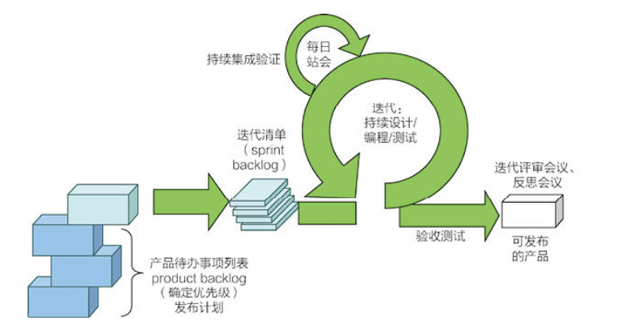

## Scrum 开发流程

### 5 大价值观

- **承诺（Commitment）：**鼓励承诺，并授予承诺者实现承诺的权力
- **专注（Focus）：**集中精力做好工作，关注并完成承诺
- **公开（Openness）：**Scrum 提倡公开、透明，确保大家及时地了解工作进度，如有问题随时采取行动来解决
- **尊重（Respect）：**团队是由不同个体组成的，成员之间相互尊重是很有必要的
- **勇气（Courage）：**有勇气对任务进行承诺，采取行动完成任务

### 3 种角色

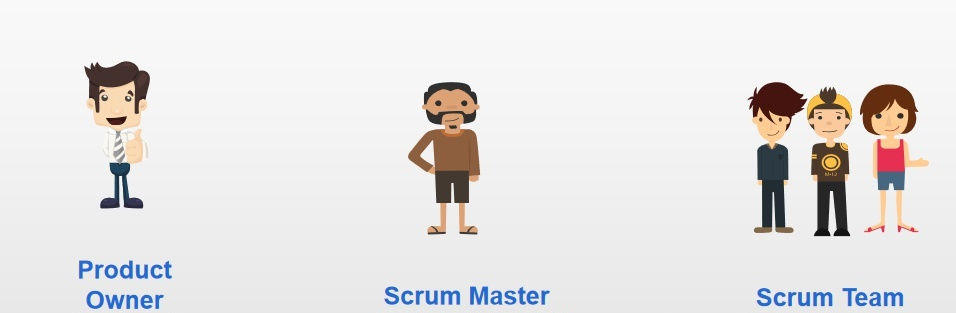

- **产品负责人（Product Owner）：**负责维护产品需求的人，代表利益相关者的利益

| 职责                                  | 诠释                                                         |
| ------------------------------------- | ------------------------------------------------------------ |
| 1. 对产品的ROI负责                    | ROI = profitability of the product，ROI即为产品的盈利负责，或考虑产品的投资回报率。 |
| 2. 梳理产品列表，确定产品功能         | PO负责梳理产品列表，包括PBI的建立、细化、估算和排列优先级顺序。在估算期间负责澄清需求。 |
| 3. 参与规划活动，决定发布的日期和内容 | PO做组合规划、产品规划、版本规划和Sprint规划的重要参与者。   |
| 4. 定义接收标准并验证工作成果         | PO负责为每一个PBI定义验收标准，只有达到这些条件才确信功能需求和非功能需求已经满足。 |
| 5. 与开发团队合作                     | PO必须经常与开发团队保持紧密合作，每天参与到团队活动中，产品负责人与开发团队一起确定Sprint目标。 |
| 6. 与利益干系人合作                   | 产品负责人与利益干系人一起制定产品愿景，以及确定下一个版本的内容。内部利益干系人：业务系统负责人、行政管理人员、项目管理人员等外部利益干系人：客户、用户、合 作伙伴等。 |


- **ScrumMaster：**Scrum 过程负责人，确保 Scrum 的正确使用并使得 Scrum 的收益最大化，负责解决一些阻碍项目进展的问题

| 职责          | 诠释                                                         |
| ------------- | ------------------------------------------------------------ |
| 1. 教练       | 关注每一个个体的思想和行为，并指导他们，让团队处于持续的提升，组织处于和Scrum团队真切合作的状态。 |
| 2. Scrum专家  | 搭建让团队合作的舞台，并提供清晰的边界。把敏捷的知识与经验传授给团队，确保团队理解并实践Scrum和其他相关的方法。 |
| 3. 推土机     | 移除团队障碍。在兼顾团队自组织能力的情况下，帮助团队解决影响团队工作进展的障碍。 |
| 4. 保护伞     | 保护开发团队免受外部的干扰，确保团队能集中精力完成冲刺。     |
| 5. 服务型领导 | 关注于团队成员的需求，以及通过实现组织的价值、原则和商业目标从而提供价值给顾客的人。 |


- **开发人员（Developers）：**Scrum 团队中致力于创建每个迭代可用增量的研发人员

| 职责                    | 诠释                                                         |
| ----------------------- | ------------------------------------------------------------ |
| 1. Sprint执行           | 开发团队的大部分时间都花在Sprint执行上。                     |
| 2. 每日检视和调整       | 每个开发团队成员都应该参与每日站会，一起检验Sprint目标的进展情况，跟进当天的工作情况调整计划。 |
| 3. 梳理产品列表         | 每个Sprint都需要花一些时间来准备下一个Sprint，主要用来梳理产品列表，包括PBI的创建和细化、估算和排列优先级顺序。 |
| 4. Sprint规划           | 在Sprint计划会议（Sprint Planning Meeting）上，在ScrumMaster的引导下，开发团队和PO合作合作为下一个Sprint建立目标。 |
| 5. 检视和调整产品与过程 | 每个Sprint结束后，开发团队都要参加两个检视和调整的活动，即Sprint评审会议（Sprint Review Meeting）和 Sprint回顾会议（Sprint Retrospective Meeting）。评审会议上所有人一起评审当前Sprint完成的特性，并讨论下一步改进措施。回顾会议上Scrum团队检视和调整自己的Scrum过程和技术实践，进一步改善团队使用Scrum来交付业务价值的方法。 |


### 3 个工作件

- **产品代办事项列表（Product Backlog）：**

  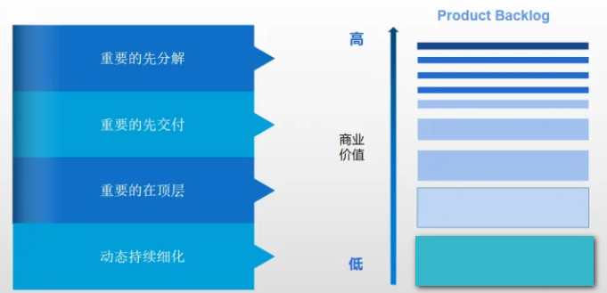

  - 是一个具有**优先级的需求列表**， 并对每个**需求进行了粗略的估算**。内容**包括未细化的产品功能要求、Bugs、缺陷、用户提出的改进、具竞争力的功能及技术升级等；**
  - Product Backlog就是一个积压的需求池。对于这个池中优先级排序、删除、添加等**只有PO才有权限操作**。对于池中的的需求来源不一定只是PO收集，可以是来自各个相关干系人如开发、客户、测试等。
  - 待办事项列表中的条目以用户故事的形式呈现；Product Backlog形成于项目规划阶段，需求的粒度可以渐进明细进行细化，发布计划时只需要确定前面的1个或是几个Sprnit故事粒度，后面的需求可以滚动式的方式来做拆分细化。

**注：Product Backlog由PO维护，但其估算是由团队来进行相关的粗略估算。**


- **迭代代办事项列表（Sprint Backlog）：**要在迭代中完成的任务清单
  - 是产品待办列表的子表，只记录当前迭代的工作；
  - 将用户故事拆分成任务，团队成员主动领取任务；
  - 团队成员可以添加、删除或者更改迭代中的任务；

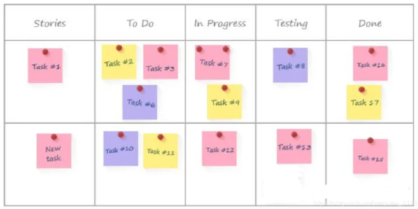

迭代燃尽图（Burndown Chart）：在迭代长度上显示所有剩余工作时间（逐日递减）的图

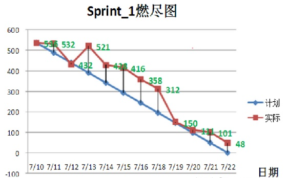

- 产品增量（Increment）
  - 团队在迭代内完成交付成果，集成到以往的迭代成果中，形成增量式交付；
  - 每次交付的用户故事必须符合验收条件；


### 5 个活动

- **冲刺计划会（Sprint Planning meeting）：**

  Sprint计划会，在每个Spring开始之时召开，由**Product Owner、Scrum Master和Scrum Team全体人员参加**。这个会议主要有两件事情要确定：

  - 要确定当前Sprint的目标
  - 选定当前Sprint要处理的最具价值的用户故事，创建Sprint Backlog

```
Sprint backlog的创建是团队协作的结果，而不是由Scrum Master单独完成。必要时候，技术分析和设计任务也可以被添加到Sprint Backlog。

Sprint计划会上，团队要：确定当前Sprint的目标（Goal）

- 从产品Backlog中选择他们承诺可以完成的工作项
- 对选定的用户故事进行估算
- 创建Sprint Backlog
- 识别任务，且每个任务都完成了估算
- 可以考虑概括设计
- 对每个选定的用户故事，如有问题，当场向PO进行咨询，请求进行澄清。
```


- **每日站会（Daily Standup）：**

Scrum 每日站会，是Scrum用来沟通、通报当前进展及后续计划的主要场合，因其提倡大家都站着开会而得名。每日站会`不是用来解决问题的会议`，会上不讨论具体的问题细节、解决方式等占用时间的细节内容。项目遇到的问题或障碍，应当`会后`通过专门的问题解决会议或其他方式进行解决。

每日站会通常不超过15分钟，提倡`每天`在`同一时间、同一地点`举行。

全体团队成员、有兴趣的项目干系人均可参加，但只有团队成员、产品负责人和Scrum Master可以发言。确保分清Scrum的“猪”类角色和“鸡”类角色对团队非常有帮助。

Scrum每日站会上，每个团队成员都要回答三个问题：

```
- 本次会议之前，自己做了什么？
- 本次会议之后，自己打算或计划做什么？
- 目前，是否遇到了阻碍自己的问题？
```

特别强调，**每日站会不是用来向 Scrum Master 或 Product Owner 汇报个人状态或进展的，它是用来在团队面前确认自己的个人承诺并展示当前进展和问题的。**


- **冲刺评审会（Review Meeting）：**迭代结束前向产品负责人演示并接受评价的会议

- **反思会(回顾会)（Retrospective Meeting）：**迭代结束后召开的关于自我持续改进的会议
- **迭代（Sprint）：**一个时间周期（通常 2~4 周），开发团队会再此期间完成所承诺的一组需求项的开发


  引入一个管理学的模型叫“PDCA循环（戴明环）”。PDCA的含义如下：P（PLAN）-计划；D（Do）-执行；C（Check）-反馈；A（Adjust）-调整。PDCA循环就是先制定计划，然后按照计划实施，最后通过检查和总结来反思从计划到实施的差距，最后把自己体会放到实施中去。

 

   **纵观Scrum框架中的流程分布，都可以归列到PDCA循环每一步：**

​    P（PLAN）：计划会

​    D（Do）：迭代

​    C（Check）：站会、评审会

​    A（Action）：反思会


## 精益软件开发实践

看板（Kanban）源自精益生产，成为精益软件开发的一种实践或工具，是一种可视化卡片。呈现生产工序中组件流动状态，从而改善协作、优化管理，显著提高交付速度，有效地控制生产过程，减少浪费。

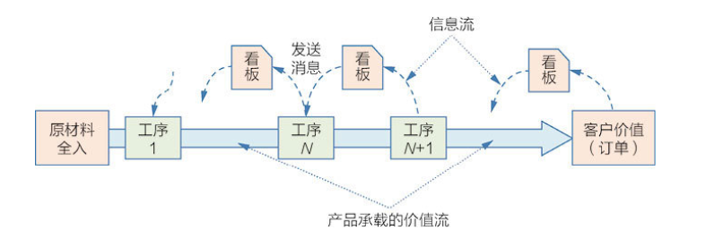

通过控制在制品（Work in Progress，WIP）数量，使“质量内建”在生产过程中

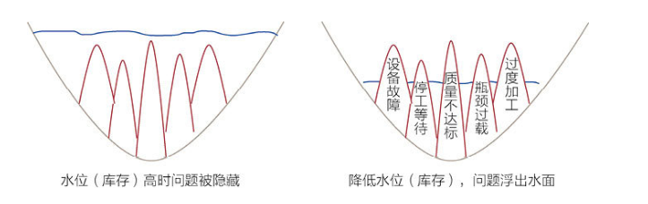


## 湖水岩石效应

**5 个核心实践**

**1. 可视化价值（工作）流**

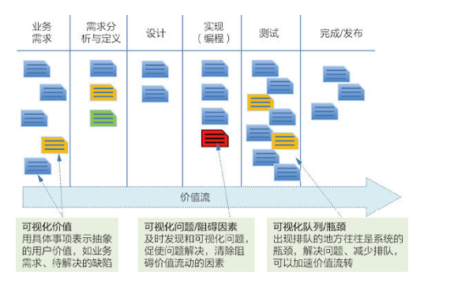

可视化价值（工作）流

图中的每个卡片代表一个价值项，如功能需求、缺陷、技术概念验证等，他们所在的列表示其所处的阶段。这些价值没经过一个阶段（图中的列）都会产生新的信息，价值得以增加。价值流是价值项从左至右的流程过程，是信息产出过程，也是价值增加的过程。把可视化价值流作为精益软件开发的基础实践，先让价值和价值流具体可见，再进行管理和优化。


**2. 显式化流程规则**

明确定义和沟通团队所遵循的流程规则，如团队协作规则、需求评审规则等。流程规则包含：

- 绘制了明确的业务流程图
- 为每个用户故事定义了验收标准
- 定义了不同组件之间的接口或数据结构
- 所有定义的内容通过了评审

流程规则的显式化让质量内建于各个阶段


**3. 限制在制品数量**

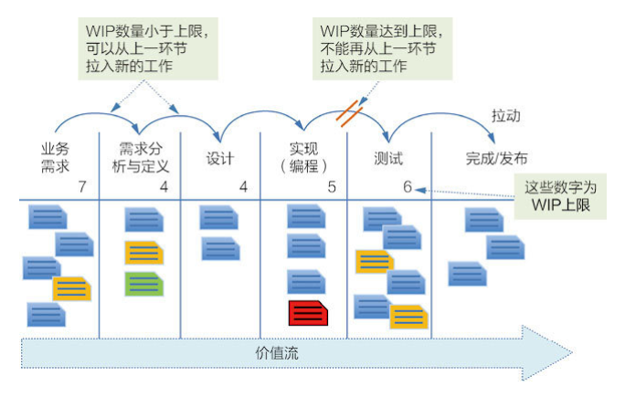

限制在制品（WIP）的数量

限制 WIP（在制品）数量形成一个更有效的拉动机制，减少了价值项在阶段间的排队等待。缩短了交付时间，加速了价值流动。让“湖水岩石效应”产生作用，更快地暴露问题，推进团队解决问题，提升研发效能。


**4. 质量和管理流动**

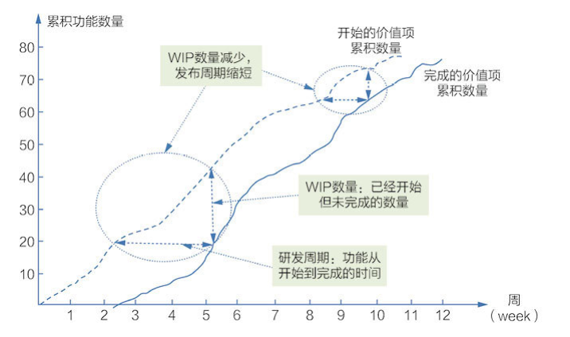

累计流量图

快速、顺畅的价值流动是看板开发方法的目标，以带来稳定和可预测的价值交付能力。以及快速的价值产出和快速反馈，确保具有很强的业务竞争力。

**5. 协同改进**

应用可视化、限制 WIP 数量和价值流度量，能够暴露产品开发中的问题和瓶颈。为了更好的解决问题，团队协作是必须的。我们需要系统性地分析问题和解决问题。

看板不是一个开发框架或流程，而是一种引导改革的方法或实践。


## 敏捷与 DevOps

DevOps 可以看作敏捷的延伸，将敏捷思维延伸到运维，从覆盖软件研发周期延伸到覆盖整个软件生命周期。让研发和运维贯通，更彻底地实现可靠的持续交付。

DevOps（Development 和 Operations）代表一种文化、运动或实践，旨在促进软件交付和基础设施变更中软件开发人员（Dev）和 IT 运维技术人员（Ops）之间的合作和互动。使软件发布更加快捷和可靠，真正做到持续交付、持续运维。

DevOps 是敏捷开发的自然延伸，从研发周期向右拓展到部署、运维，真正做到持续交付（Continuous Delivery，CD）。DevOps 适合“软件及服务（SaaS）”或“平台及服务（PaaS）”这样的应用。在软件架构、集成、测试、发布到部署和基础设施管理中，大力提倡自动化和监控，形成软件研发完整的生态。这很大程度上依赖于工具，在 DevOps 上现在已形成完整的工具链。

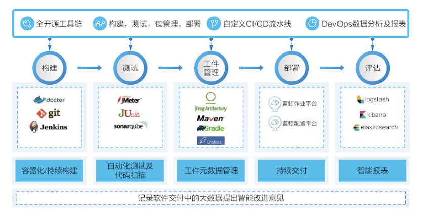

贯穿软件生命周期的 DevOps 工具链


